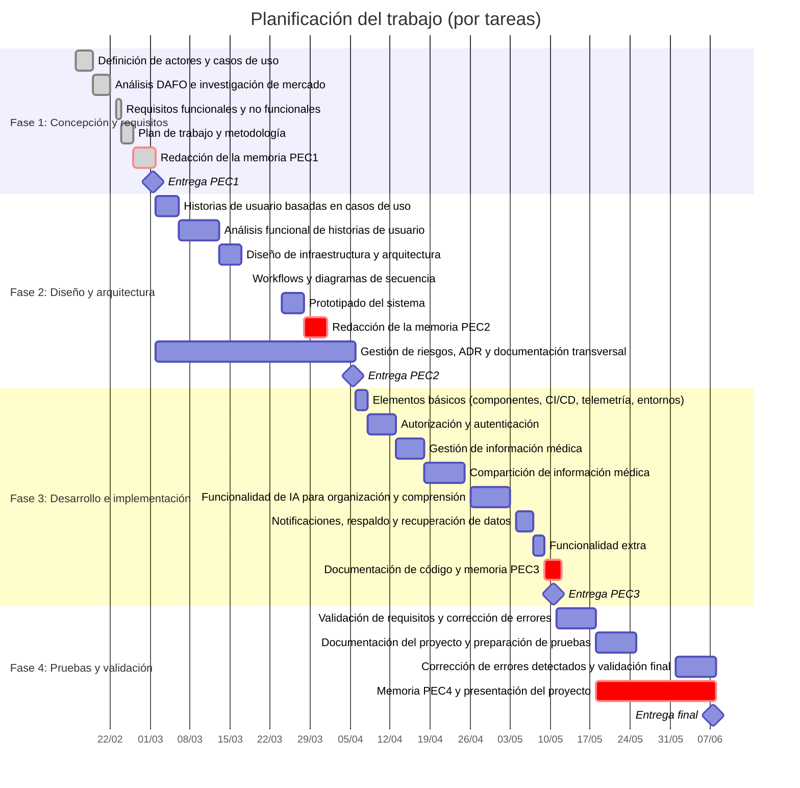
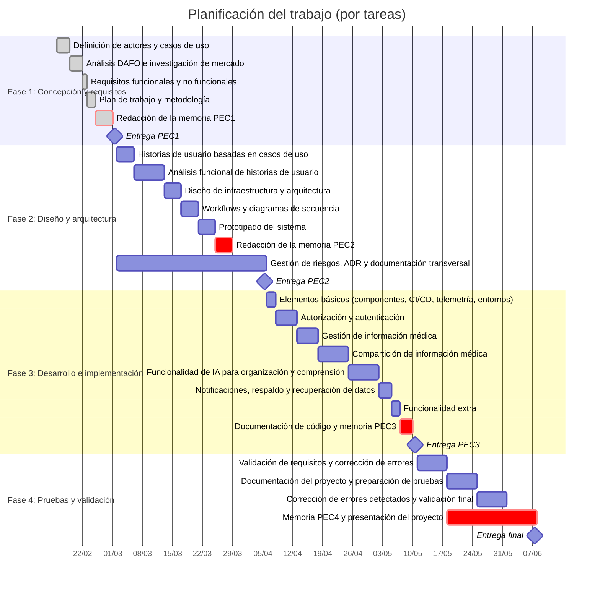

# PEC1

## 1. Plan de trabajo

### Context y justificatión del Trabajo

Durante mi vida he participado en el sistema sanitario de diferentes formas, desde paciente, familiar de paciente, trabajador del hospital (Zelador) y actualmente como desarrollador de software para el sector sanitario (Software Engineer en Picis Clinical Solutions) y a lo largo de estas experiencias he podido observar como el usuario iba perdiendo el control de su información y lo dificil que era poder consultar y compartirla con otros profesionales de la salud. Un ejemplo seria, como paciente estoy realizando un tratamiento con un especialista y me gustaria obtener una segunda opinion de otro especialista pero sin tener que volver a generar todo esa historia clínica desde cero.

Aqui es donde surge la idea de MedVault, como un sistema para integrar diferentes fuentes de información médica, idea que se volvio demasiado ambiciosa debido a que la integración con diferentes sistemas de salud es un gran desafio técnico (aunque existan estandares como HL7 FHIR, la realidad es que la adopción de estos estandares no es tan amplia como se desearia).

Reduciendo al minimo el alcance de la primera idea y con las herramientas actuales y los avances en IA, surge el objetivo de este proyecto.

MedVault es una aplicación móvil que tiene como objetivo proporcionar a los usuarios una plataforma segura y fácil de usar para almacenar y gestionar sus datos médicos. La idea surge de devolver el control de los datos médicos a los pacientes y permitirles compartir dicha información de manera rápida y segura con profesionales de la salud, familiares o amigos.

Cuando un paciente acude a un centro de salud, genera una hístoria clínica que muchas veces se queda en el centro de salud o en el sistema sanitario y si el paciente decide acudir a otro centro de salud fuera de la red del primero, el paciente se encuentra que tiene que volver a generar toda la historia clínica desde cero, haciendo que el proceso de atención médica sea más lento y menos eficiente.

Durante principios de los años 2000 trabaje en un Hospital y recuerdo que los pacientes transicionaban entre diferentes servicios del hospital con un sobre con toda su historia medico. Cuando un paciente necesitaba dicha información se dirigia a Archivos clinicos y podia pedir una copia de dicha historia para poder llevarla a otro centro.

El objetivo de MedVault es volver a ese sistema de carpeta pero en formato digital e interconectada con los diferentes sistemas de salud, permitiendo a los pacientes tener un control total sobre su información médica y compartirla de manera segura con quien deseen.

La relaidad, es que el objetivo es/era demaisado ambicioso y se encuentra con las barreras de la interoperabilidad entre sistemas de salud, la seguridad y privacidad de los datos médicos, y la adopción por parte de los usuarios. Sin embargo, una primera versión y el verdadero objetivo del proyecto es desarrollar esta primera versión que permita al usuario almacenar y gestionar su información médica de forma manual.

Otro de los objetivos criticos de esta aplicación y de cualquier aplicación de salud es garantizar la seguridad y privacidad de los datos médicos de los usuarios, implementando medidas robustas para proteger la información médica contra accesos no autorizados, pérdida o uso indebido. En este sentido, MedVault implementará medidas de seguridad avanzadas, como el cifrado de datos, la autenticación de dos factores y la auditoría de acceso a los datos médicos para garantizar la seguridad y privacidad de la información médica de los usuarios.

La investigación que realice durante el mes de noviembre analizando tanto las Stores de Google y Apple no dio como resultado algo similar, si que es cierto que existen aplicaciones de salud de centros de salud, pero no una aplicación que permita a los usuarios gestionar su información médica de forma manual.

Inicialmente, el proyecto se iba a llamar HealthPass, pero justamente la investigación previa hizo necesario cambiar el nombre a MedVault, ya que existía una aplicación con ese nombre.

**Aplicaciones similares:**

| Aplicación      | Descripción                                                                                          | Comentarios                                                                                                                                                |
| --------------- | ---------------------------------------------------------------------------------------------------- | ---------------------------------------------------------------------------------------------------------------------------------------------------------- | ------------------------------------------------------------------------ |
| MyHealth Wallet | Aplicación de Parkway Shenton que permite a los usuarios consultar su información médica             | Permite a los usuarios gestionar su información médica de forma manual                                                                                     | MedVault es general y no esta limitada a un sistema sanitario específico |
| La meva salud   | Aplicación de la Generalitat de Catalunya que permite a los usuarios consultar su información médica | Permite a los usuarios gestionar su información médica de forma manual                                                                                     | MedVault es general y no esta limitada a un sistema sanitario específico |
| MedicAL Wallet  | Aplicación con funciones si que ya ofrece MedVault aunque imposible de registrar un usuario          | No funciona                                                                                                                                                |
| MedVAULT HMS    | Aplicación para HMS                                                                                  | Es una aplicación para un sistema sanitario específico, no es una aplicación general para que los usuarios gestionen su información médica de forma manual |

**DAFO**
| | |
|-------------------|------------------|
| **Fortalezas** | **Debilidades** |
| Aplicación innovadora que devuelve el control de los datos médicos a los pacientes | Desafíos técnicos relacionados con la interoperabilidad, seguridad y privacidad de los datos médicos |
| **Oportunidades** | **Amenazas** |
| Mercado en crecimiento para aplicaciones de salud y gestión de datos médicos | Adopción por parte de los usuarios y competencia en el mercado de aplicaciones de salud |

Como objetivos de esta primera version se encuentran:

- Permitir a los usuarios almacenar y gestionar su información médica de forma manual.
- Proporcionar una interfaz de usuario intuitiva y fácil de usar.
- Garantizar la seguridad y privacidad de los datos médicos almacenados en la aplicación.
- El uso de la IA para ayudar a los usuarios a organizar y entender su información médica.
- Compartir la información médica de manera segura con profesionales de la salud, familiares o amigos.

MedVault - **_"Tu información médica. Protegida. Accesible. Tuya."_**

### Objetivos del Trabajo

El objetivo de este proyecto es el desarrollo de una aplicación móvil llamada MedVault que permita a los usuarios almacenar y gestionar su información médica de forma manual. La aplicación se dirigirá a dispositivos móviles con sistema operativo **Android**, aunque se considerará la posibilidad de iOS en el futuro pero debido a las limitaciones técnicas actuales, se centrará inicialmente en Android.

Por lo tanto, los objetivos que este proyecto se propone alcanzar son:

- Crear una aplicación móvil facil de usar, que permita a los usuarios almacenar y gestionar su información médica de forma manual.
- Ofrecer una plataforma para poder compartir la información médica de manera segura con profesionales de la salud, familiares o amigos.
- Garantizar la seguridad y privacidad de los datos médicos almacenados en la aplicación.
- Utilizar la IA para ayudar a los usuarios a organizar y entender su información médica.

Por tanto, los requisitos funcionales de la aplicación deben incluir:

- **RF001**: La aplicación debe permitir a los usuarios crear una cuenta y autenticarse de forma segura.
- **RF002**: La aplicación debe permitir a los usuarios almacenar y gestionar su información médica de forma manual.
- **RF003**: La aplicación debe permitir a los usuarios poder seguir accediendo a su información médica incluso sin conexión a internet o con conexión limitada.
- **RF004**: La aplicación debe permitir a los usuarios compartir su información médica de manera segura con profesionales de la salud, familiares o amigos.
- **RF005**: El sistema debe auditar y registrar todas las acciones relacionadas con la gestión de la información médica para garantizar la seguridad y privacidad de los datos.
- **RF006**: El sistema debe ofrcer herramientas de IA para ayudar y facilitar a los usuarios a organizar y entender su información médica.
- **RF007**: La aplicación debe ser compatible con dispositivos móviles con sistema operativo Android.
- **RF008**: La aplicación debe ser escalable y capaz de manejar un gran número de usuarios y datos médicos.
- **RF009**: La aplicació debe ofrecer un sistema de notificaciones para mantener a los usuarios informados sobre su información médica y cualquier actualización relevante.
- **RF010**: La aplicación debe ofrecer un sistema de respaldo y recuperación de datos para garantizar la disponibilidad de la información médica en caso de pérdida o daño del dispositivo.
- **RF011**: La aplicación debe ofrecer un sistema de busqueda y filtrado para facilitar a los usuarios la localización de información médica específica dentro de su cuenta.

Por otro lado, los requisitos no funcionales de la aplicación deben incluir:

- **RNF001**: La aplicación debe garantizar la seguridad y privacidad de los datos médicos almacenados en la aplicación.
- **RNF002**: La aplicación debe ser fácil de usar e intuitiva para los usuarios.
- **RNF003**: La aplicación debe ser rápida y eficiente en la gestión de la información médica.
- **RNF004**: La aplicación debe ser confiable y estar disponible en todo momento para los usuarios.
- **RNF005**: La aplicación debe ser compatible con diferentes versiones de Android para garantizar su accesibilidad a una amplia gama de usuarios.
- **RNF006**: La aplicación debe ser escalable para manejar un gran número de usuarios y datos médicos.
- **RNF007**: La aplicación debe cumplir con las regulaciones y normativas de privacidad y seguridad de datos médicos aplicables en la región donde se utilice.
- **RNF008**: La aplicación debe ofrecer un diseño atractivo y moderno para mejorar la experiencia del usuario.
- **RNF009**: La aplicación debe ser accesible para personas con discapacidades, cumpliendo con las pautas de accesibilidad para aplicaciones móviles.
- **RNF010**: La aplicación debe ser compatible con diferentes tamaños de pantalla y resoluciones para garantizar una experiencia de usuario óptima en una variedad de dispositivos móviles.
- **RNF011**: La aplicación debe asegurar la integridad de los datos médicos del usuario, implementando mecanismos de seguridad para prevenir el acceso no autorizado, la pérdida o la corrupción de los datos.

Por último, es importante destacar que el proyecto se centrará inicialmente en el desarrollo de la aplicación para dispositivos Android, pero se considerará la posibilidad de expandirse a otras plataformas en el futuro, dependiendo de la demanda y las necesidades del mercado.

Por ahora, el desarrollo en iOS no puede llevarse a cabo debido a limitaciones técnicas relacionadas con la falta de acceso a hardware específico para dispositivos iOS, lo que dificulta la implementación de ciertas funcionalidades clave de la aplicación. Sin embargo, se mantendrá abierta la posibilidad de desarrollar una versión para iOS en el futuro, una vez que se hayan superado estas limitaciones técnicas.

Por otro lado, el proyecto define 3 actores principales:

- **Usuarios**: Son los usuarios principales de la aplicación, los cuales podrán registrar su información médica de forma, gestionar dicha información y compartirla de manera segura con profesionales de la salud, familiares o amigos.
- **Profesionales de la salud y/o Usuario de consulta**: Son aquellos usuarios que reciben o son capaces de acceder a la información médica compartida por los usuarios, como profesionales de la salud, familiares o amigos.
- **Administradores**: Son aquellos usuarios encargados de gestionar y mantener la aplicación, asegurando su correcto funcionamiento y la seguridad de los datos médicos almacenados.

### Impacto en sostenibilidad, ético-social y de diversidad

En este apartado se analizará el impacto que el proyecto puede tener en términos de sostenibilidad, ética-social y diversidad, considerando tanto los aspectos positivos como los posibles desafíos o riesgos asociados con el desarrollo y uso de la aplicación MedVault.

#### Sostenibilidad

El desarrollo de MedVault puede contribuir a la sostenibilidad en el sector de la salud al proporcionar una plataforma digital para la gestión de la información médica, lo que puede reducir la necesidad de papel y otros recursos físicos asociados con la gestión tradicional de la información médica. Además, al permitir a los usuarios compartir su información médica de manera segura con profesionales de la salud, familiares o amigos, se puede mejorar la eficiencia en la atención médica y reducir la duplicación de pruebas y procedimientos médicos, lo que también puede contribuir a la sostenibilidad del sistema de salud. Sin embargo, es importante considerar el impacto ambiental asociado con el desarrollo y uso de la aplicación, como el consumo de energía de los servidores y dispositivos móviles, y buscar formas de minimizar este impacto a través de prácticas de desarrollo sostenible y eficiencia energética.

#### Ética-social

El desarrollo de MedVault plantea importantes consideraciones éticas relacionadas con la privacidad y seguridad de los datos médicos de los usuarios. Es fundamental garantizar que la aplicación implemente medidas robustas para proteger la información médica de los usuarios contra accesos no autorizados, pérdida o uso indebido. Además, es importante considerar el impacto social de la aplicación, asegurando que sea accesible para una amplia gama de usuarios, incluyendo aquellos con discapacidades, y que se promueva la equidad en el acceso a la atención médica a través de la aplicación.

### Enfoque y metodo elegido

```markdown
Indicar cuáles son las posibles estrategias para llevar a cabo el trabajo e indicar
cuál es la estrategia elegida (desarrollar un producto nuevo, adaptar un producto
existente, ...). Valorar por qué esta es la estrategia más apropiada para conseguir
los objetivos.
```

En esta sección hablaremos sobre como se va llevar a cabo el desarrollo de la aplicación móvil MedVault y cuales van a ser las estrategias y metodologías utilizadas para conseguir los objetivos del proyecto.

Siendo realistas y aunque en un equipo multidisciplinar y con mas recursos se podria llevar a cabo un desarrollo con metodologias Agile, en este caso, al ser un proyecto individual y con un Scope definido o practicamente cerrado, se va a optar por una metodología **Waterfall** o de cascada aunque ofreciendo cierta flexibilidad para adaptarse a posibles cambios o imprevistos que puedan surgir durante el desarrollo del proyecto.

El proyecto se ha dividido en 4 grandes fases:

- **Fase 1: Conception y definición de requisitos**: En esta fase se realiza la propuesta inicial del proyecto, se definen los objetivos, el alcance y los requisitos funcionales y no funcionales de la aplicación.
- **Fase 2: Diseño y arquitectura**: En esta fase se diseña la arquitectura de la aplicación, se definen los componentes, se establece la estructura general del proyecto, se realiza el diseño del sistema y se completa en analisis funcional y no funcional del sistema.
- **Fase 3: Desarrollo e implementación**: En esta fase se lleva a cabo el desarrollo de la aplicación móvil, implementando las funcionalidades definidas en los requisitos y siguiendo el diseño y la arquitectura establecidos en la fase anterior.
- **Fase 4: Pruebas y validación**: En esta fase se realizan pruebas exhaustivas de la aplicación para garantizar su correcto funcionamiento, se validan los requisitos y se corrigen posibles errores o problemas que puedan surgir durante las pruebas.

Hoy en dia, la metodología Agile es muy popular en el desarrollo de software, pero en este caso, debido a la naturaleza del proyecto y al hecho de que es un proyecto individual con un alcance definido, se ha optado por una metodología más tradicional como Waterfall, aunque se mantendrá cierta flexibilidad para adaptarse a posibles cambios o imprevistos que puedan surgir durante el desarrollo del proyecto.

El diseño de las fases viene marcado por la metdología escogida y ademas se ha tenido en cuenta que, es sumamaente necesario realizar un buen analisis de requisitos y un buen diseño de la arquitectura antes de comenzar con el desarrollo, para evitar problemas o cambios significativos durante el desarrollo que puedan afectar al alcance del proyecto o a los objetivos establecidos. Tener una buena definición de los objetivos, alcance y los requisitos desde el principio nos permitira asegurar el buen desarrollo del proyecto y poder detectar aquellas posibles areas criticas para poder tomar decisiones y ajustar las prioridades durante el desarrollo.

Como ya se ha mencionado anteriormente, aunque el proyecto siga una metodología en cascada, se mantendrá cierta flexibilidad para adaptarse y moverse de prioridad ciertas areas criticas, sobretodo durante la fase 3 de desarrollo e implementación, donde se puedan detectar posibles problemas o dificultades técnicas que puedan afectar al alcance del proyecto o a los objetivos establecidos, permitiendo así realizar ajustes y cambios necesarios para asegurar el éxito del proyecto.

### Planificación del trabajo

```markdown
Descripción de los recursos necesarios para realizar el proyecto, las tareas a
realizar y una planificación temporal de cada tarea utilizando un diagrama de Gantt
o similar. Importante: la duración de las tareas debe definirse en términos de horas
(no de días) y es necesario que indiquéis en la planificación el número de horas al
día que dedicaréis al trabajo final (p.ej. N horas en días laborables i M horas en
días festivos).
```

Se ha establecido una dedicación de 3 horas diarias de media durante la semana de lunes a viernes, y una dedicación de 2,5 horas diarias tanto el sábado como el domingo, lo que nos da un total de 20 horas semanales.

| Fase                                              | Tarea                                                                                                         | Duración  | Dia de inició | Dia de finalización |
| ------------------------------------------------- | ------------------------------------------------------------------------------------------------------------- | --------- | ------------- | ------------------- |
| **Fase 1: Concepción y definición de requisitos** | **Definición de objetivos, alcance y requisitos**                                                             | 39 horas  | 16/02/2026    | 01/03/2026          |
|                                                   | Definición de los actores y casos de uso                                                                      | 9 horas   | 16/02/2026    | 18/02/2026          |
|                                                   | Analisis DAFO y Investigación de mercado y análisis de aplicaciones similares                                 | 9 horas   | 19/02/2026    | 22/02/2026          |
|                                                   | Definición de los requisitos funcionales y no funcionales                                                     | 3 horas   | 23/02/2026    | 23/02/2026          |
|                                                   | Plan de trabajo y metodología                                                                                 | 6 horas   | 24/02/2026    | 25/02/2026          |
|                                                   | Preparación y redacción de la memoria de la PEC1                                                              | 12 horas  | 25/02/2026    | 01/03/2026          |
| **Fase 2: Diseño y arquitectura**                 | **Diseño de la arquitectura de la aplicación**                                                                | 100 horas | 02/03/2026    | 05/04/2026          |
|                                                   | Creación de Historia de usuario basado en casos de uso                                                        | 12 horas  | 02/03/2026    | 05/03/2026          |
|                                                   | Análisis funcional de cada historia de usuario                                                                | 20 horas  | 06/03/2026    | 12/03/2026          |
|                                                   | Diseño de la infraestructura/arquitectura del sistema                                                         | 12 horas  | 13/03/2026    | 17/03/2026          |
|                                                   | Definición de workflows y diagramas de secuencia para cada historia de usuario                                | 12 horas  | 18/03/2026    | 23/03/2026          |
|                                                   | Prototipado del sistema                                                                                       | 12 horas  | 24/03/2026    | 27/03/2026          |
|                                                   | Preparación y redacción de la memoria de la PEC2                                                              | 12 horas  | 28/03/2026    | 31/03/2026          |
|                                                   | Gestión de riesgos, decisiones técnicas (ADR) y documentación transversal\*\*                                 | 20 horas  | 02/03/2026    | 05/04/2026          |
| **Fase 3: Desarrollo e implementación**           | **Desarrollo del sistema**                                                                                    | 100 horas | 06/04/2026    | 10/05/2026          |
|                                                   | Desarrollo de los elementos básicos del sistema (Componentes, CI/CD, Telemetría, entornos de desarrollo, etc) | 6 horas   | 06/04/2026    | 07/04/2026          |
|                                                   | Desarrollo de la Authorización y Autenticación                                                                | 15 horas  | 08/04/2026    | 12/04/2026          |
|                                                   | Desarrollo de la gestión de la información médica                                                             | 15 horas  | 13/04/2026    | 17/04/2026          |
|                                                   | Desarrollo de la funcionalidad de compartir información médica                                                | 20 horas  | 18/04/2026    | 25/04/2026          |
|                                                   | Desarrollo de la funcionalidad de IA para organizar y entender la información médica                          | 20 horas  | 26/04/2026    | 03/05/2026          |
|                                                   | Desarrollo de la funcionalidad de notificaciones y sistema de respaldo y recuperación de datos                | 9 horas   | 04/05/2026    | 06/05/2026          |
|                                                   | Desarrollo de la funcionalidad extra                                                                          | 6 horas   | 07/05/2026    | 08/05/2026          |
|                                                   | Documentación del código y preparación de la memoria de la PEC3                                               | 9 horas   | 09/05/2026    | 10/05/2026          |
| **Fase 4: Pruebas y validación**                  | **Pruebas exhaustivas de la aplicación**                                                                      | 80 horas  | 11/05/2026    | 07/06/2026          |
|                                                   | Validación de los requisitos y corrección de errores o problemas que puedan surgir durante las pruebas        | 20 horas  | 11/05/2026    | 17/05/2026          |
|                                                   | Documentación del proyecto y preparación de pruebas en entornos de Testing y producción                       | 20 horas  | 18/05/2026    | 31/05/2026          |
|                                                   | Corrección de errores o problemas detectados durante las pruebas y validación de las correcciones realizadas  | 20 horas  | 01/06/2026    | 07/06/2026          |
|                                                   | Preparación de la memoria de la PEC4 y presentación del proyecto                                              | 20 horas  | 18/05/2026    | 07/06/2026          |

**Notas:**

- **Gestión de riesgos, decisiones técnicas (ADR) y documentación transversal** : Tarea transversal a lo largo de toda la fase 2, donde se identificaran los posibles riesgos del proyecto, se tomaran decisiones técnicas importantes y se documentaran de manera adecuada para asegurar la trazabilidad y el buen desarrollo del proyecto.

#### Diagrama de Gantt





### Breve sumario de los productos obtenidos

Conceptualmente, los componentes que deben integrar la primera versión de MedVault son:

- **Aplicación móvil**: La aplicación móvil será el componente principal de MedVault, permitiendo a los usuarios almacenar y gestionar su información médica de forma manual. La aplicación se desarrollará utilizando Flutter, un framework de desarrollo de aplicaciones móviles multiplataforma que permite crear aplicaciones para Android e iOS con una sola base de código.
- **MedVault API**: La API de MedVault será el componente encargado de gestionar la lógica de negocio y la comunicación entre la aplicación móvil y la base de datos. La API se desarrollará utilizando ASP.NET Core, un framework de desarrollo web que permite crear aplicaciones web y APIs RESTful de alto rendimiento.
  - **Base de datos**: Como parte de la API, se implementará una base de datos en 'Code-First' utilizando Entity Framework Core.
- **MedVault Document API/Service**: Este componente se encargará de la extracción de información médica de los documentos que los usuarios suban a la aplicación, alimentando la información médica de los usuarios. Esta API se desarrollará utilizando ASP.NET Core y se integrará con servicios de IA para la extracción de información médica, siendo una pasarela entre la aplicación móvil y los servicios de IA.
- **Servicios de Telemetría**: Como parte de las APIs, se implementarán servicios de telemetría para monitorizar el rendimiento y el uso de la aplicación.
- **Portal Web**: Se desarrollará un portal web para poder visualizar la información medica que los usuarios compartan con profesionales de la salud, familiares o amigos. El portal web se desarrollará utilizando Angular y se conectara con la API de MedVault para obtener la información médica de los usuarios.

Los componentes deberan estar acompañados de una documentación adecuada que permita entender su funcionamiento, su arquitectura y su integración con el resto de componentes del sistema, así como una memoria técnica que explique el proceso de desarrollo, las decisiones técnicas tomadas, los desafíos encontrados y las soluciones implementadas para superar dichos desafíos.

Igualmente, el proyecto se entregara junto con toda la documentación y la memoria técnica, así como con un conjunto de pruebas que permitan validar el correcto funcionamiento de la aplicación y la API, asegurando que se cumplen los requisitos funcionales y no funcionales establecidos en la fase de definición de requisitos.

### Breve descripción del resto de capitulos de la memoria.

```markdown
Explicación de los contenidos de cada capítulo y su relación con el
proyecto global.
```

- **Contexto y justificación del trabajo**: En este capítulo se explica el origen de la idea del proyecto, la motivación detrás de su desarrollo y los objetivos en alto nivel que se pretenden alcanzar con el proyecto.
- **Objetivos del trabajo**: En este capítulo se detallan los objetivos específicos que se pretenden alcanzar con el proyecto, así como los requisitos funcionales y no funcionales que la aplicación debe cumplir para alcanzar dichos objetivos.
- **Enfoque y método elegido**: En este capítulo se explica la metodología de desarrollo elegida para llevar a cabo el proyecto, así como las razones por las cuales se ha optado por dicha metodología y cómo se aplicará a lo largo del desarrollo del proyecto.
- **Planificación del trabajo**: En este capítulo se detalla la planificación temporal del proyecto, incluyendo las tareas a realizar en alto nivel, su duración estimada y un diagrama de Gantt que visualiza la planificación del proyecto.
- **Breve sumario de los productos obtenidos**: En este capítulo se describen los componentes que se esperan obtener al finalizar el proyecto, incluyendo la aplicación móvil, la API, el portal web y cualquier otro componente o servicio que forme parte del sistema.

### Glosario de términos técnicos

- **Flutter**: Framework de desarrollo de aplicaciones móviles multiplataforma desarrollado por Google, que permite crear aplicaciones para Android e iOS con una sola base de código.
- **ASP.NET Core**: Framework de desarrollo web desarrollado por Microsoft, que permite crear aplicaciones web y APIs RESTful de alto rendimiento.
- **Entity Framework Core**: Framework de mapeo objeto-relacional (ORM) desarrollado por Microsoft, que permite trabajar con bases de datos utilizando objetos en lugar de consultas SQL.
- **Angular**: Framework de desarrollo web desarrollado por Google, que permite crear aplicaciones web de una sola página (SPA) con una arquitectura basada en componentes.
- **IA (Inteligencia Artificial)**: Campo de la informática que se centra en la creación de sistemas capaces de realizar tareas que normalmente requieren inteligencia humana, como el aprendizaje, el razonamiento y la toma de decisiones.
- **Telemetría**: Proceso de recopilación, transmisión y análisis de datos para monitorizar el rendimiento y el uso de un sistema o aplicación.
- **CI/CD (Integración Continua/Despliegue Continuo)**: Prácticas de desarrollo de software que buscan automatizar el proceso de integración y despliegue de código, permitiendo una entrega más rápida y eficiente de las aplicaciones.

### Bibliografía

- **Flutter**(Febrero 2026): [https://flutter.dev/](https://flutter.dev/)
- **ASP.NET Core**(Febrero 2026): [https://dotnet.microsoft.com/apps/aspnet](https://dotnet.microsoft.com/apps/aspnet)
- **Entity Framework Core**(Febrero 2026): [https://docs.microsoft.com/en-us/ef/core/](https://docs.microsoft.com/en-us/ef/core/)
- **Angular**(Febrero 2026): [https://angular.io/](https://angular.io/)
- **IA (Inteligencia Artificial)**(Febrero 2026): [https://en.wikipedia.org/wiki/Artificial_intelligence](https://en.wikipedia.org/wiki/Artificial_intelligence)
- **Telemetría**(Febrero 2026): [https://en.wikipedia.org/wiki/Telemetry](https://en.wikipedia.org/wiki/Telemetry)
- **CI/CD (Integración Continua/Despliegue Continuo)**(Febrero 2026): [https://en.wikipedia.org/wiki/Continuous_integration](https://en.wikipedia.org/wiki/Continuous_integration)
- **Metodología Waterfall**(Febrero 2026): [https://en.wikipedia.org/wiki/Waterfall_model](https://en.wikipedia.org/wiki/Waterfall_model)
- **Metodología Agile**(Febrero 2026): [https://en.wikipedia.org/wiki/Agile_software](https://en.wikipedia.org/wiki/Agile_software)
- **DAFO**(Febrero 2026): [https://en.wikipedia.org/wiki/SWOT_analysis](https://en.wikipedia.org/wiki/SWOT_analysis)
- **Mermaid**(Febrero 2026): [https://mermaid-js.github.io/mermaid/#/](https://mermaid-js.github.io/mermaid/#/)
- **Github Copilot**(Febrero 2026): [https://copilot.github.com/](https://copilot.github.com/)
