# 2. Análisis y diseño

En esta sección se busca documentar el proceso de análisis y diseño de **MedVault**, desde la identificación de los usuarios y sus necesidades, hasta la definición de la arquitectura de la aplicación en alto nivel. Recordemos, que el objetivo de esta aplicación es ofrecer a los usuarios una forma sencilla y segura de gestionar su **información médica** personal, permitiéndoles acceder a sus registros médicos, resultados de pruebas, historial de vacunación y otra información relevante de salud en un solo lugar, por tanto, el analisis y la identificación de los usuarios y sus necesidades es un paso fundamental para el éxito del proyecto.

## 2.1. Análisis de Usuarios

Como ya se mencionó, la identificación de los usuarios y sus necesidades es un paso fundamental para el éxito del proyecto, por lo que se realizó un análisis de los posibles usuarios de la aplicación, sus características, necesidades y comportamientos.

En esta etapa, se pueden emplear diferentes técnicas de investigación, como entrevistas, encuestas, observación, análisis de tareas, entre otras.

Para el proyecto de **MedVault**, se van a realizar entrevistas a usuarios potenciales del sistema, con el objetivo de conocer sus necesidades, sus dificultades, así como las condiciones en que se utilizará el sistema.

### Análisis de usuarios potenciales

Principalmente, se van a entrevistar a:

- Personas de entre 30 y 70 años que sigan algun tipo de tratamiento médico, ya sea por una enfermedad crónica o por un tratamiento puntual.
  - Se busca un perfil de usuario que tenga un nivel de alfabetización digital medio, es decir, que tenga conocimientos básicos de informática y que utilice dispositivos móviles de forma habitual.
- **Profesionales de la salud**, como personal de emergencias, sanitarios y personal de atención al paciente.

Se realizaran 3 tipos de encuestas, cada una dirigida a un perfil de usuario diferente con el objetivo de conocer sus necesidades, sus dificultades, así como las condiciones en que se utilizará el sistema :

- Encuesta para **usuarios potenciales del sistema**.
- Encuesta para **profesionales de la salud**.
- Encuesta para **profesionales de emergencias**.

#### Encuesta para usuarios potenciales del sistema

**Objetivo:** Conocer las necesidades, hábitos y dificultades de los usuarios en relación con la gestión de su **información médica** personal.

**Datos demográficos:**

1. ¿Cuál es su tu de edad?
   - [ ] 18-29 años
   - [ ] 30-44 años
   - [ ] 45-59 años
   - [ ] 60-70 años
   - [ ] Más de 70 años

2. ¿Con qué frecuencia utiliza aplicaciones móviles en su día a día?
   - [ ] Varias veces al día
   - [ ] Una vez al día
   - [ ] Varias veces a la semana
   - [ ] Raramente
   - [ ] Nunca

**Gestión actual de la información médica:**

3. ¿Cómo guarda actualmente su **información médica** (informes, recetas, resultados de analíticas, etc.)?
   - [ ] En papel (carpetas, archivadores)
   - [ ] Fotos en el móvil
   - [ ] En alguna aplicación o servicio digital
   - [ ] No la guardo de forma organizada
   - [ ] Otro:

4. ¿Ha tenido alguna vez dificultades para encontrar o acceder a su **información médica** cuando la necesitaba (por ejemplo, en una consulta, urgencia o viaje)?
   - [ ] Sí, con frecuencia
   - [ ] Sí, alguna vez
   - [ ] No, nunca

5. ¿Qué tipo de **información médica** le resultaría más importante tener siempre accesible desde su móvil? (Seleccione todas las que apliquen)
   - [ ] Alergias e intolerancias
   - [ ] Medicación activa
   - [ ] Enfermedades crónicas
   - [ ] Grupo sanguíneo
   - [ ] Contactos de emergencia
   - [ ] Resultados de analíticas y pruebas
   - [ ] Informes médicos y diagnósticos
   - [ ] Vacunas
   - [ ] Directivas anticipadas (voluntades vitales, donación de órganos)
   - [ ] Otro: **\_\_\_**

**Compartición de **información médica**:**

6. ¿Ha necesitado alguna vez compartir su **información médica** con un profesional sanitario fuera de su centro habitual (por ejemplo, en urgencias, en otro hospital o durante un viaje)?
   - [ ] Sí
   - [ ] No

7. En caso afirmativo, ¿cómo lo hizo y qué dificultades encontró?

   > (Respuesta abierta)

8. ¿Se sentiría cómodo/a compartiendo su **información médica** esencial mediante un código QR o un enlace temporal protegido con contraseña?
   - [ ] Sí, me parece una buena idea
   - [ ] Depende de qué información se comparta
   - [ ] No, me preocupa la **seguridad**
   - [ ] No sé qué es un código QR

**Privacidad y confianza:**

9. ¿Qué nivel de importancia le da a que sus datos médicos estén cifrados y solo usted decida quién puede verlos?
   - [ ] Muy importante
   - [ ] Importante
   - [ ] Indiferente
   - [ ] Poco importante

10. ¿Confiaría en una **aplicación móvil** para almacenar su **información médica** si cumple con la normativa de protección de datos (RGPD)?
    - [ ] Sí, totalmente
    - [ ] Sí, con ciertas garantías
    - [ ] Tendría dudas
    - [ ] No confiaría

**Funcionalidades y usabilidad:**

11. ¿Le resultaría útil que la aplicación pudiera escanear un informe médico en papel y extraer automáticamente la información relevante (diagnósticos, fechas, medicación)?
    - [ ] Muy útil
    - [ ] Útil
    - [ ] Indiferente
    - [ ] No lo necesitaría

12. ¿Qué importancia tiene para usted poder acceder a la aplicación mediante huella dactilar o reconocimiento facial en lugar de una contraseña?
    - [ ] Muy importante, lo prefiero
    - [ ] Me es indiferente
    - [ ] Prefiero usar contraseña
    - [ ] No uso **autenticación** biométrica

13. Si pudiera tener toda su **información médica** en una sola aplicación en el móvil, ¿con qué frecuencia cree que la usaría?
    - [ ] A diario
    - [ ] Semanalmente
    - [ ] Solo cuando tenga una cita médica
    - [ ] Solo en emergencias
    - [ ] No creo que la usara

14. ¿Hay alguna funcionalidad o necesidad relacionada con la gestión de su salud que no se haya mencionado y que considere importante?
    > (Respuesta abierta)

[Link a la encuesta para usuarios potenciales](https://docs.google.com/forms/d/e/1FAIpQLSdxBJGIqp6f6GYpcbiDqiE4kiF3NLWyBb1Z3bHe2vadnM9XLg/viewform?usp=dialog)

#### Encuesta para profesionales de la salud

**Objetivo:** Conocer las necesidades y dificultades de los **profesionales sanitarios** al acceder a la **información médica** de los pacientes, y valorar la utilidad de una herramienta portátil gestionada por el propio paciente.

**Datos profesionales:**

1. ¿Cuál es su especialidad o área de trabajo?
   - [ ] Medicina general / Atención primaria
   - [ ] Especialista hospitalario
   - [ ] Enfermería
   - [ ] Farmacia
   - [ ] Otro: \***\*\_\_\_\*\***

2. ¿Cuántos años de experiencia profesional tiene?
   - [ ] Menos de 5 años
   - [ ] 5-15 años
   - [ ] 15-25 años
   - [ ] Más de 25 años

**Acceso a información del paciente:**

3. ¿Con qué frecuencia atiende a pacientes de los que no dispone de historial clínico previo en su sistema (pacientes de otros centros, desplazados, turistas, etc.)?
   - [ ] A diario
   - [ ] Varias veces a la semana
   - [ ] Varias veces al mes
   - [ ] Raramente

4. Cuando atiende a un paciente sin historial disponible, ¿cuáles son las principales dificultades que encuentra? (Seleccione todas las que apliquen)
   - [ ] Desconocer alergias e intolerancias
   - [ ] No saber la medicación activa del paciente
   - [ ] Falta de antecedentes de enfermedades crónicas
   - [ ] No disponer de resultados de pruebas recientes
   - [ ] Información proporcionada por el paciente incompleta o imprecisa
   - [ ] Dificultad para contactar con el centro de origen del paciente
   - [ ] Otro: \***\*\_\_\_\*\***

5. ¿Alguna vez la falta de **información médica** del paciente ha supuesto un riesgo o ha dificultado significativamente la toma de decisiones clínicas?
   - [ ] Sí, con frecuencia
   - [ ] Sí, en alguna ocasión
   - [ ] No, nunca

6. ¿Con que frecuencia los pacientes les proporcionan **información médica** relevante de forma espontánea durante la consulta?
   - [ ] A menudo
   - [ ] A veces
   - [ ] Raramente
   - [ ] Nunca

**Utilidad de una herramienta portátil del paciente:**

7. ¿Le resultaría útil que el paciente pudiera mostrarle un resumen estructurado de su **información médica** esencial (alergias, medicación, enfermedades crónicas, grupo sanguíneo) desde su móvil?
   - [ ] Muy útil
   - [ ] Útil
   - [ ] Indiferente
   - [ ] No lo veo necesario

8. ¿Qué información del paciente consideraría imprescindible tener disponible de forma inmediata durante una consulta? (Ordene por prioridad o seleccione las 5 más importantes)
   - [ ] Alergias medicamentosas
   - [ ] Medicación activa y posología
   - [ ] Enfermedades crónicas
   - [ ] Grupo sanguíneo
   - [ ] Resultados de analíticas recientes
   - [ ] Informes de especialistas
   - [ ] Historial de cirugías
   - [ ] Vacunaciones
   - [ ] Directivas anticipadas
   - [ ] Contactos de emergencia
   - [ ] Otro: \***\*\_\_\_\*\***

9. ¿Confiaría en la **información médica** proporcionada por el paciente a través de una **aplicación móvil** para tomar decisiones clínicas?
   - [ ] Sí, como referencia complementaria
   - [ ] Solo para información crítica (alergias, medicación)
   - [ ] Tendría reservas, prefiero verificar con fuentes oficiales
   - [ ] No, no confiaría

**Compartición y acceso temporal:**

10. ¿Cómo preferiría acceder a la **información médica** que un paciente quiere compartir con usted?

- [ ] Escaneando un código QR desde el móvil del paciente
- [ ] A través de un enlace web temporal con contraseña
- [ ] Que el paciente me muestre la pantalla de su móvil
- [ ] Integrado en el sistema informático del centro
- [ ] Otro: \***\*\_\_\_\*\***

11. ¿Qué tiempo de acceso le parecería adecuado para un enlace temporal de compartición de datos del paciente?
    - [ ] Solo durante la consulta (minutos)
    - [ ] 24 horas
    - [ ] Hasta que el paciente lo revoque
    - [ ] Depende del contexto clínico

12. ¿Consideraría útil que la aplicación generara un documento PDF estandarizado con el resumen médico del paciente que pudiera adjuntar al historial de su centro?
    - [ ] Muy útil
    - [ ] Útil
    - [ ] Indiferente
    - [ ] No lo necesitaría

**Tecnología y adopción:**

13. ¿Utiliza actualmente alguna herramienta digital para consultar **información médica** de pacientes fuera del sistema del centro?
    - [ ] Sí, ¿cuál? \***\*\_\_\_\*\***
    - [ ] No

14. ¿Qué barreras cree que podría tener la adopción de una herramienta de este tipo entre los **profesionales de la salud**? (Seleccione todas las que apliquen)
    - [ ] Falta de tiempo durante la consulta
    - [ ] Desconfianza en la fiabilidad de los datos
    - [ ] Problemas de compatibilidad con los sistemas actuales
    - [ ] Cuestiones legales o de responsabilidad
    - [ ] Resistencia al cambio tecnológico
    - [ ] Otro: \***\*\_\_\_\*\***

15. ¿Hay alguna funcionalidad que considere esencial para que esta herramienta fuera realmente útil en su práctica clínica?
    > (Respuesta abierta)

[Link a la encuesta para profesionales de la salud](https://docs.google.com/forms/d/e/1FAIpQLSeT0ilb9RGCtN805kuw0Dswcfw3ED3KZhPThXOamX-O_Tkafg/viewform?usp=dialog)

---

#### Encuesta para profesionales de emergencias

**Objetivo:** Conocer las necesidades específicas del personal de emergencias al acceder a la **información médica** de los pacientes en situaciones críticas, y valorar la utilidad de un sistema portátil de **información médica**.

**Datos profesionales:**

1. ¿Cuál es su rol dentro del ámbito de emergencias?
   - [ ] Médico/a de urgencias hospitalarias
   - [ ] Médico/a de emergencias extrahospitalarias (SAMUR, SEM, 061, etc.)
   - [ ] Técnico/a en emergencias sanitarias (TES)
   - [ ] Enfermero/a de urgencias
   - [ ] Otro: \***\*\_\_\_\*\***

2. ¿Cuántos años de experiencia tiene en servicios de emergencias?
   - [ ] Menos de 5 años
   - [ ] 5-15 años
   - [ ] Más de 15 años

**Acceso a información en emergencias:**

3. ¿Con qué frecuencia atiende a pacientes de los que no tiene ninguna **información médica** previa?
   - [ ] En la mayoría de las intervenciones
   - [ ] Frecuentemente
   - [ ] Ocasionalmente
   - [ ] Raramente

4. En una situación de emergencia, ¿cuál es la información del paciente que necesita conocer con mayor urgencia? (Ordene por prioridad o seleccione las 5 más críticas)
   - [ ] Alergias medicamentosas
   - [ ] Medicación activa
   - [ ] Enfermedades crónicas (diabetes, cardiopatías, epilepsia, etc.)
   - [ ] Grupo sanguíneo
   - [ ] Contactos de emergencia
   - [ ] Directivas anticipadas / voluntades vitales
   - [ ] Donación de órganos
   - [ ] Cirugías previas relevantes
   - [ ] Idioma del paciente (en caso de turistas o extranjeros)
   - [ ] Otro: \***\*\_\_\_\*\***

5. ¿Ha tenido situaciones en las que la falta de **información médica** del paciente (alergias, medicación, enfermedades previas) ha complicado la atención o puesto en riesgo su **seguridad**?
   - [ ] Sí, con frecuencia
   - [ ] Sí, en alguna ocasión
   - [ ] No, nunca

6. Cuando el paciente no puede comunicarse (inconsciente, barrera idiomática, etc.), ¿cómo intenta obtener su **información médica** actualmente?
   - [ ] Revisar documentación que lleve encima (tarjeta sanitaria, informes)
   - [ ] Preguntar a acompañantes o familiares
   - [ ] Buscar pulseras o colgantes médicos de alerta
   - [ ] Consultar bases de datos sanitarias (si hay acceso)
   - [ ] En muchos casos no es posible obtener información
   - [ ] Otro: \***\*\_\_\_\*\***

**Utilidad de una herramienta de acceso rápido:**

7. Si el paciente llevara en su móvil un código QR escaneable con su **información médica** esencial (sin necesidad de desbloquear el teléfono), ¿le resultaría útil en una emergencia?
   - [ ] Muy útil, podría salvar vidas
   - [ ] Útil, como información complementaria
   - [ ] Poco práctico en una emergencia real
   - [ ] No lo usaría

8. ¿Qué formato de presentación de la información preferiría en una emergencia?
   - [ ] Pantalla resumen con iconos grandes y datos clave (tipo ficha)
   - [ ] Lista estructurada con secciones colapsables
   - [ ] Documento PDF descargable
   - [ ] Datos legibles sin necesidad de dispositivo electrónico (tarjeta impresa)

9. ¿Cuánto tiempo máximo cree que podría dedicar a consultar la **información médica** del paciente a través de un dispositivo durante una emergencia?
   - [ ] Menos de 30 segundos
   - [ ] 30 segundos - 1 minuto
   - [ ] 1-3 minutos
   - [ ] No tendría tiempo para consultar un dispositivo

10. ¿Consideraría importante que la información de emergencia del paciente estuviera disponible incluso sin conexión a internet?
    - [ ] Imprescindible
    - [ ] Muy importante
    - [ ] Poco relevante, casi siempre hay cobertura
    - [ ] No es necesario

**Confianza y protocolos:**

11. ¿Confiaría en la **información médica** almacenada en el móvil del paciente para tomar decisiones clínicas urgentes?
    - [ ] Sí, como primera referencia mientras llega más información
    - [ ] Solo para información crítica (alergias, medicación)
    - [ ] Tendría reservas
    - [ ] No, seguiría los protocolos estándar sin datos previos

12. ¿Qué factores le darían más confianza en la información proporcionada por una aplicación de este tipo? (Seleccione todas las que apliquen)
    - [ ] Que mostrara la fecha de última actualización de los datos
    - [ ] Que indicara si la información fue verificada por un profesional
    - [ ] Que tuviera un formato estandarizado y reconocible
    - [ ] Que estuviera avalada por una institución sanitaria oficial
    - [ ] Que incluyera códigos médicos estándar (CIE-10, ATC, etc.)
    - [ ] Otro: \***\*\_\_\_\*\***

13. ¿Existen protocolos actuales en su servicio para consultar **información médica** digital portada por el paciente (apps, tarjetas NFC, pulseras inteligentes)?
    - [ ] Sí, está protocolizado
    - [ ] No, pero sería bienvenido
    - [ ] No, y creo que sería difícil de implementar

14. ¿Hay alguna necesidad específica del ámbito de emergencias que no se haya mencionado y que considere fundamental en una herramienta de este tipo?
    > (Respuesta abierta)

[Link a la encuesta para profesionales de emergencias](https://docs.google.com/forms/d/e/1FAIpQLSe-DUK2N4DF7ZkCo-jy2V7ig_rZh9uoQfgx4Fy12YzP1xM6pg/viewform?usp=dialog)

#### Resultados y análisis

**Resultados de la encuesta para usuarios potenciales**

Muestra analizada: **12 respuestas**.

Principales resultados:

- El grupo de edad predominante fue `30-44` (5/12, 41.7%), seguido de `45-59` (4/12, 33.3%).
- El 75.0% (9/12) indicó haber tenido dificultades para acceder a su **información médica** al menos alguna vez.
- El 66.7% (8/12) ha tenido que compartir **información médica** fuera de su centro habitual.
- Sobre compartir por QR/enlace temporal: 41.7% lo ve buena idea, 33.3% depende de la información y 25.0% expresa preocupación por **seguridad**.
- El 75.0% (9/12) considera **muy útil** escanear informes en papel y extraer datos automáticamente.
- Uso esperado de la app: 58.3% la usaría en citas médicas, 25.0% en emergencias y 16.7% semanalmente.

**Información médica** más demandada (multiselección):

- Contactos de emergencia: 7 menciones.
- Alergias e intolerancias: 6 menciones.
- Medicación activa: 6 menciones.
- Informes médicos y diagnósticos: 6 menciones.
- Grupo sanguíneo: 5 menciones.

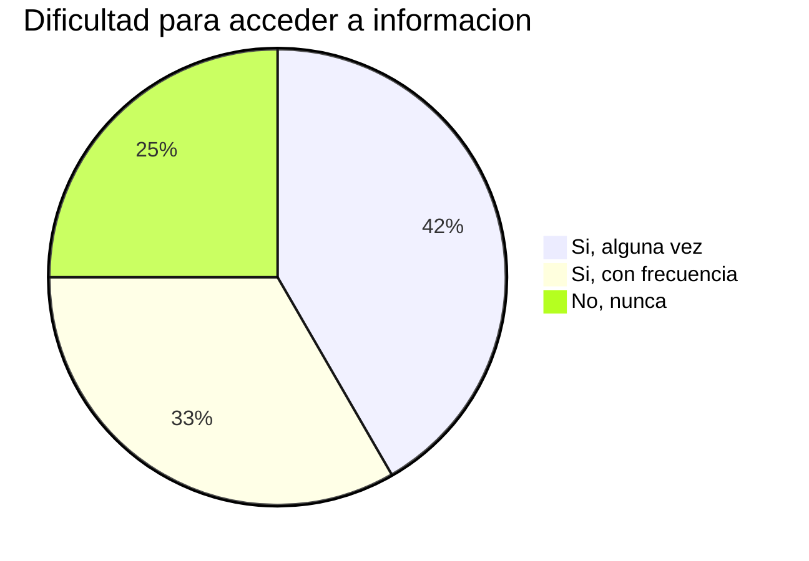
```mermaid
pie title Dificultad para acceder a informacion
   "Si, alguna vez" : 5
   "Si, con frecuencia" : 4
   "No, nunca" : 3
```

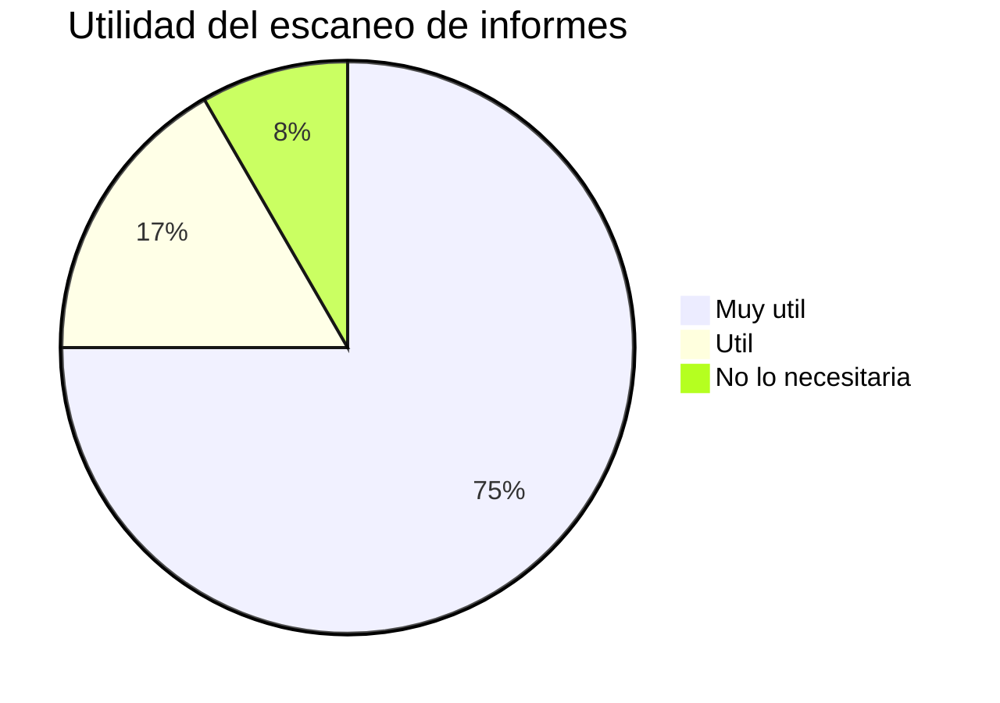
```mermaid
pie title Utilidad del escaneo de informes
   "Muy util" : 9
   "Util" : 2
   "No lo necesitaria" : 1
```

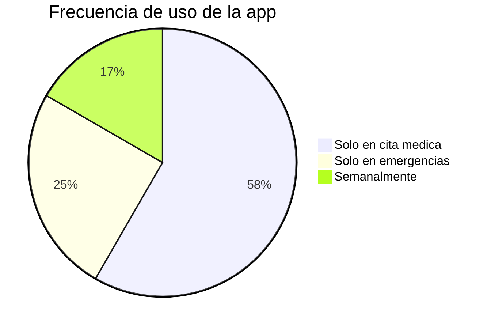
```mermaid
pie title Frecuencia de uso de la app
   "Solo en cita medica" : 7
   "Solo en emergencias" : 3
   "Semanalmente" : 2
```

**Resultados de la encuesta para profesionales de la salud**

Muestra analizada: **6 respuestas**.

Principales resultados:

- Frecuencia de atención sin historial previo: 33.3% varias veces/semana, 33.3% varias veces/mes, 16.7% a diario y 16.7% raramente.
- El 83.3% (5/6) reporta que la falta de información ha supuesto riesgo o dificultad clínica alguna vez o con frecuencia.
- El 66.7% (4/6) considera **muy útil** un resumen médico estructurado en móvil.
- El 66.7% (4/6) confiaría en la app como referencia complementaria.
- El 66.7% (4/6) prefiere enlaces temporales solo durante la consulta.
- El 66.7% (4/6) ve **muy útil** generar PDF estandarizado para adjuntar al historial clínico.

Dificultades más frecuentes sin historial (multiselección):

- No saber la medicación activa del paciente: 4 menciones.
- Desconocer alergias e intolerancias: 4 menciones.
- Información incompleta o imprecisa: 2 menciones.
- Falta de antecedentes de enfermedades crónicas: 2 menciones.

Barreras de adopción más citadas (multiselección):

- Falta de tiempo durante la consulta: 3 menciones.
- Problemas de compatibilidad con sistemas actuales: 2 menciones.
- Desconfianza en la fiabilidad de los datos: 2 menciones.

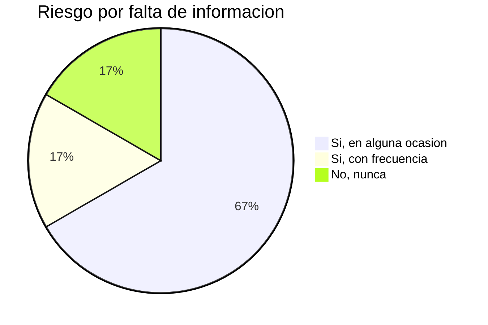
```mermaid
pie title Riesgo por falta de informacion
   "Si, en alguna ocasion" : 4
   "Si, con frecuencia" : 1
   "No, nunca" : 1
```

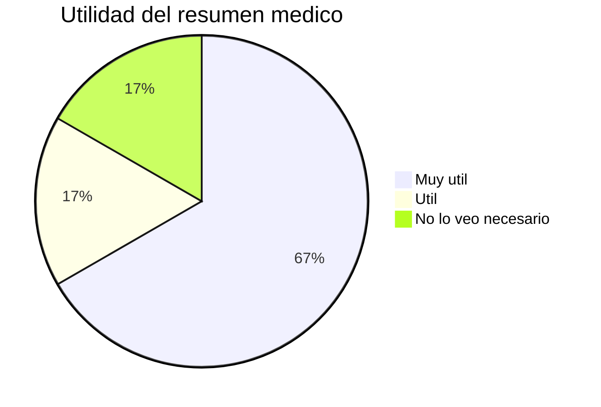
```mermaid
pie title Utilidad del resumen medico
   "Muy util" : 4
   "Util" : 1
   "No lo veo necesario" : 1
```

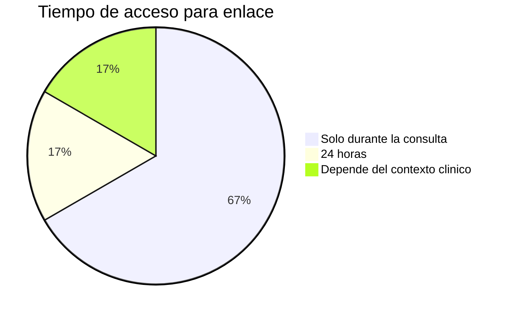
```mermaid
pie title Tiempo de acceso para enlace
   "Solo durante la consulta" : 4
   "24 horas" : 1
   "Depende del contexto clinico" : 1
```

**Resultados de la encuesta para profesionales de emergencias**

Muestra analizada: **4 respuestas**.

Principales resultados:

- El 75.0% (3/4) ha vivido situaciones donde la falta de información complicó la atención (alguna vez o con frecuencia).
- El 75.0% (3/4) considera útil o muy útil el QR médico (50.0% muy útil, 25.0% útil).
- El formato preferido es una pantalla resumen tipo ficha (2 menciones directas y 1 adicional en combinación).
- Restricción temporal alta: 50.0% dispone de menos de 1 minuto, 25.0% entre 1-3 minutos y 25.0% no tendría tiempo.
- Disponibilidad sin conexión: 75.0% la considera imprescindible o muy importante.
- Sobre protocolos actuales: 50.0% indica que no hay, pero sería bienvenido.

Información más crítica en emergencia (multiselección):

- Alergias medicamentosas: 4 menciones.
- Grupo sanguíneo: 4 menciones.
- Medicación activa: 2 menciones.
- Enfermedades crónicas: 2 menciones.
- Contactos de emergencia: 2 menciones.

Factores de confianza más valorados (multiselección):

- Fecha de última actualización visible: 3 menciones.
- Códigos médicos estándar (CIE-10, ATC): 2 menciones.

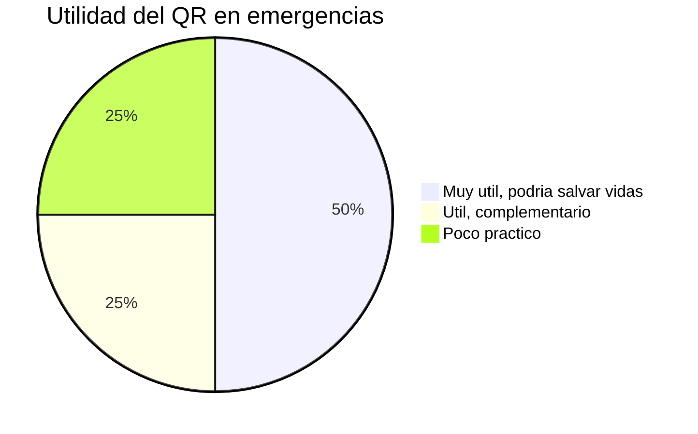
```mermaid
pie title Utilidad del QR en emergencias
   "Muy util, podria salvar vidas" : 2
   "Util, complementario" : 1
   "Poco practico" : 1
```

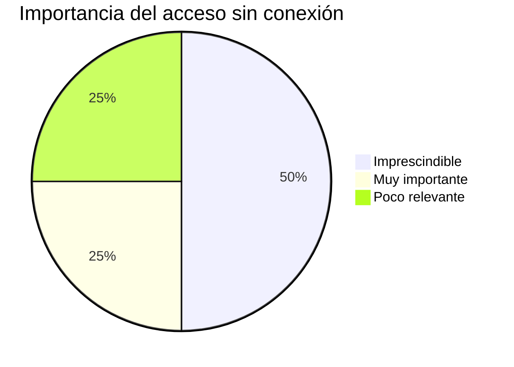
```mermaid
pie title Importancia del acceso sin conexión
   "Imprescindible" : 2
   "Muy importante" : 1
   "Poco relevante" : 1
```

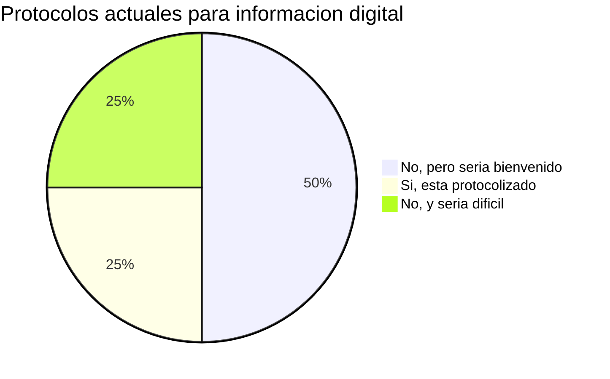
```mermaid
pie title Protocolos actuales para informacion digital
   "No, pero seria bienvenido" : 2
   "Si, esta protocolizado" : 1
   "No, y seria dificil" : 1
```

**Conclusiones**

- Existe una oportunidad clara para una herramienta que permita a los pacientes portar su **información médica** esencial en el móvil, con un formato accesible y seguro.
- La información más valorada por usuarios y profesionales incluye alergias, medicación activa, grupo sanguíneo y contactos de emergencia.
- Usar IA para extraer datos de informes en papel es percibido como una funcionalidad de alto valor.
- La utilidad percibida es alta, especialmente en situaciones de emergencia, aunque la confianza y la integración con sistemas clínicos son factores clave para la adopción.
- La mayoría de los profesionales de emergencias requieren acceso a la información en menos de 1 minuto, lo que resalta la necesidad de un diseño extremadamente ágil y directo.
- La **seguridad** y la **privacidad** son las principales preocupaciones, por lo que la aplicación debe cumplir con estándares de protección de datos y ofrecer transparencia sobre la actualización y verificación de la información.

### Perfiles de usuario (Protopersonas)

Usando la información obtenida en las encuestas, se han definido tres perfiles de usuario (protopersonas) que representan a los principales grupos de usuarios potenciales de **MedVault**:

**Protopersona: Usuario potencial del sistema**

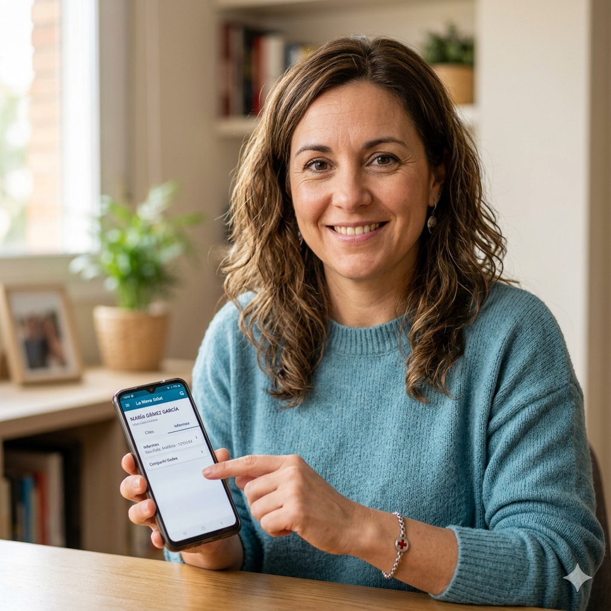

- Nombre: María
- Comportamientos:
  - Su dipositivo móvil es su principal herramienta para gestionar su vida diaria, incluyendo la salud.
  - Ha tenido dificultades para acceder a su **información médica**.
  - Utiliza su móvil para gestionar citas médicas y buscar información de salud.
- Características demográficas:
  - Mujer
  - 40 años
  - Nivel de alfabetización digital medio
  - Sigue o ha seguido algun tratamiento médico.
- Necesidades y objCetivos:
  - Le gustaria tener toda su **información médica** organizada y accesible desde su móvil.
  - Le gustaria poder compartir su **información médica** de forma rápida y segura en situaciones de emergencia o consultas médicas.
  - Le preocupa la **seguridad** de sus datos médicos y quiere tener control sobre quién puede acceder a ellos.

**Protopersona: Profesional de la salud**

- Nombre: Dra. López
- Comportamientos:
  - Atiende a pacientes de los que no dispone de historial clínico previo con cierta frecuencia.
  - Ha tenido situaciones donde la falta de **información médica** ha supuesto un riesgo o dificultad clínica.
  - Valora la utilidad de tener un resumen médico estructurado del paciente para obtener contexto de la situación del paciente.
- Características demográficas:
  - Mujer
  - 45 años
  - Médico de atención primaria
  - Más de 15 años de experiencia
- Necesidades y objetivos:
  - Tener toda la **información médica** relevante del paciente disponible de forma rápida y estructurada durante la consulta.
  - Confiar en la información proporcionada por el paciente a través de una **aplicación móvil** para tomar decisiones clínicas.
  - Poder integrar la **información médica** del paciente en el historial clínico del centro de forma sencilla.

**Protopersona: Profesional de emergencias**

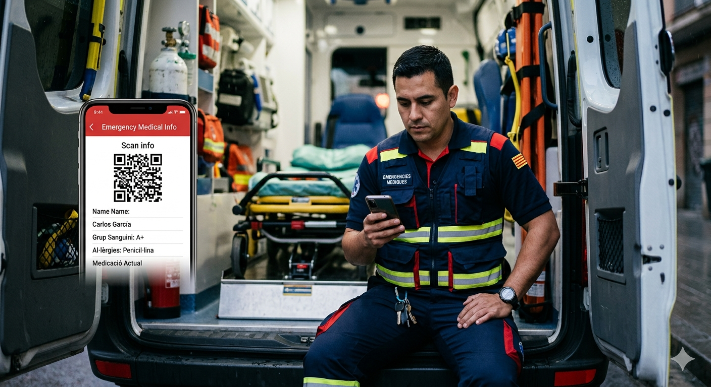

- Nombre: Carlos
- Comportamientos:
  - Atiende a pacientes sin **información médica** previa con mucha frecuencia.
  - Ha vivido situaciones donde la falta de **información médica** complicó la atención o puso en riesgo la **seguridad** del paciente.
  - Valora la utilidad de un código QR médico que permita acceder a información crítica del paciente en emergencias.
- Características demográficas:
  - Hombre
  - 35 años
  - Técnico en emergencias sanitarias (TES)
  - Más de 5 años de experiencia en servicios de emergencias
- Necesidades y objetivos:
  - Tener acceso inmediato a **información médica** crítica del paciente (alergias, medicación, grupo sanguíneo) durante una emergencia.
  - Confiar en la **información médica** proporcionada por el paciente a través de una aplicación de este tipo para tomar decisiones clínicas urgentes.
  - Que la información de emergencia del paciente esté disponible incluso sin conexión a internet.

## 2.2. Contexto de usos

Los contextos de uso de **MedVault** se han identificado a partir de las necesidades y comportamientos de los usuarios potenciales, así como de los **profesionales de la salud** y emergencias. Estos contextos representan las situaciones en las que la aplicación sería utilizada y las funcionalidades que serían más relevantes en cada caso.

Como ya se ha detallado anteriormente, tenemos 3 principales perfiles de usuario (protopersonas): el usuario potencial del sistema, el **profesional de la salud** y el profesional de emergencias y en consecuencia se nos presenten diferentes contextos de uso para cada uno de ellos:

**Contextos de uso para el usuario potencial del sistema:**

- María, quiere revisar el en global los datos de laboratorio obtenidos de diferentes analiticas realizadas durante el ultimo año para tener un seguimiento de su evolución y compartirlo con su médico de atención primaria en su próxima consulta.
- María tiene visita mañana con un nuevo especialista y le ha pedido que lleve un resumen de sus ultimas analiticas e informes médicos relacionados con su enfermedad crónica para que pueda tener un contexto completo de su situación médica.

**Contextos de uso para el **profesional de la salud**:**

- La Dra. López atiende a un paciente que no ha visitado antes y despues de la consulta, le solicita la **información médica** del centro que viene para evitar repetir pruebas o tratamientos innecesarios.
- La Dra. López quiere evitar procedimientos ya realizados por otros especialistas y abordar el problema desde un enfoque más integral, por lo que le pide al paciente que le muestre su **información médica** esencial desde su móvil.

**Contextos de uso para el profesional de emergencias:**

- Carlos atiende esta atiendiendo a un paciente inconsciente en una emergencia extrahospitalaria y necesita acceder rápidamente a su **información médica** crítica para tomar decisiones clínicas urgentes.
- Carlos atiende a un paciente extranjero que no habla el idioma local y necesita acceder a su **información médica** esencial para entender su situación y brindarle la atención adecuada.

## 2.3. Diseño conceptual

### Problem statements

Una vez definidos los diferentes perfiles de usuarios se busca definir los `problem statements` para cada unos de los usuarios tipo del sistema, con el objetivo de comprender quiénes son los usuarios, cuáles son sus necesidades y dificultades, así como analizar las condiciones en que se utilizará el sistema.

#### **Problem statement: Usuario potencial del sistema**

**Las personas en edad adulta acumulan a lo largo de su vida una gran cantidad de **información médica** relevante (diagnósticos, tratamientos, alergias, resultados de pruebas, etc.) que suele estar dispersa en diferentes formatos (papel, fotos en el móvil, aplicaciones diversas) y lugares (casa, centro de salud, hospital). Esta dispersión dificulta el acceso rápido a esta información cuando la necesitan, especialmente en situaciones de emergencia o durante consultas médicas**

**Las personas que buscan una segunda opinión médica o que acuden a un centro de salud diferente al habitual se enfrentan a la dificultad de compartir su **información médica** de forma rápida, segura y estructurada, lo que puede afectar la calidad de la atención que reciben**

**Las personas suelen estar interesadas en tener su **información médica** organizada y accesible desde su móvil, poder consultar el historico de cambios, poder realizar busquedas y filtrar su **información médica**, asi como poder sintentizar y entender dicha información almacenada**

### **Problem statement: Profesional de la salud**

**Los **profesionales de la salud** atienden a pacientes de los que no disponen de historial clínico previo con cierta frecuencia, lo que puede suponer un riesgo o dificultad clínica si la falta de **información médica** relevante (alergias, medicación activa, enfermedades crónicas) afecta la toma de decisiones clínicas**

**Los **profesionales de la salud** valoran la utilidad de tener un resumen médico estructurado del paciente para obtener contexto de la situación del paciente, pero pueden tener reservas sobre la fiabilidad de la información proporcionada por el paciente a través de una aplicación móvil**

### **Problem statement: Profesional de emergencias**

**Los profesionales de emergencias atienden a pacientes sin **información médica** previa con mucha frecuencia, lo que puede complicar la atención o poner en riesgo la **seguridad** del paciente si no se dispone de información crítica (alergias, medicación, grupo sanguíneo)**

**Los profesionales de emergencias trabajan en un entorno de alta presión en condiciones de trabajo limitadas, por lo que necesitan acceder a la **información médica** del paciente de forma inmediata y confiable para tomar decisiones clínicas urgentes**

### Flujos de interacción

Los flujos de interacción describen cómo los usuarios interactúan con el sistema para lograr sus objetivos. A continuación se describen los flujos de interacción para cada uno de los perfiles de usuario definidos.

#### 1. Autenticación (Login con Google)

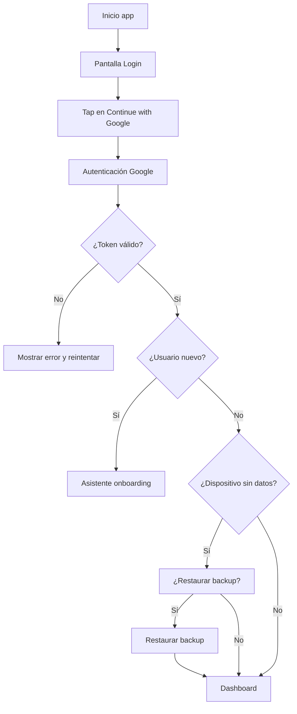
```mermaid
flowchart TB
    A[Inicio app] --> B[Pantalla Login]
    B --> C[Tap en Continue with Google]
    C --> D[Autenticación Google]
    D --> E{¿Token válido?}
    E -- No --> F[Mostrar error y reintentar]
    E -- Sí --> G{¿Usuario nuevo?}
    G -- Sí --> H[Asistente onboarding]
    G -- No --> I{¿Dispositivo sin datos?}
    I -- Sí --> J[¿Restaurar backup?]
    J -- Sí --> K[Restaurar backup]
    K --> L[Dashboard]
    J -- No --> L[Dashboard]
    I -- No --> L[Dashboard]
```

1. La persona abre la aplicación y ve la pantalla de login.
2. Pulsa `Continue with Google`.
3. Completa la **autenticación** en Google.
4. El sistema valida el token de sesión.
5. Si falla, se muestra error y se permite reintento.
6. Si el token es válido, el sistema decide si es usuario nuevo o existente.
7. Usuario nuevo: entra al onboarding.
8. Usuario existente: se verifica si el dispositivo tiene datos.
   - Si no hay datos, se pregunta si desea restaurar un backup.
   - Si hay datos o se restaura el backup, se accede al dashboard.

#### 2. Configuración inicial (Onboarding 1→5)

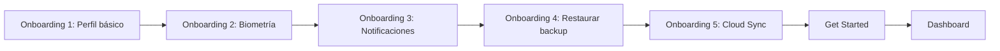
```mermaid
flowchart LR
    A[Onboarding 1: Perfil básico] --> B[Onboarding 2: Biometría]
    B --> C[Onboarding 3: Notificaciones]
    C --> D[Onboarding 4: Restaurar backup]
    D --> E[Onboarding 5: Cloud Sync]
    E --> F[Get Started]
    F --> G[Dashboard]
```

1. Se solicita completar datos básicos del perfil.
2. Se ofrece activar **autenticación** biométrica.
3. Se configuran preferencias de notificaciones.
4. Se propone restaurar backup (archivo o nube) o continuar manualmente.
5. Se ofrece activar sincronización en la nube.
6. La persona confirma con `Get Started`.
7. El sistema redirige al dashboard.

#### 3. Navegación principal desde Dashboard

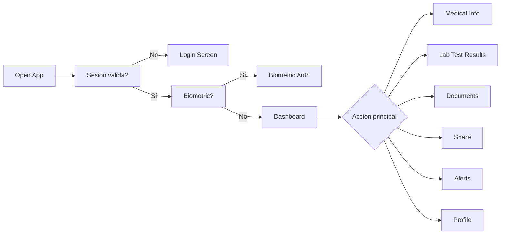
```mermaid
flowchart LR
    O[Open App] --> O1[Sesion valida?]
    O1 -- No --> O2[Login Screen]
    O1 -- Sí --> O3[Biometric?]
    O3 -- Sí --> O4[Biometric Auth]
    O3 -- No --> A[Dashboard]
    A[Dashboard] --> B{Acción principal}
    B --> C[Medical Info]
    B --> D[Lab Test Results]
    B --> E[Documents]
    B --> F[Share]
    B --> G[Alerts]
    B --> H[Profile]
```

1. La persona abre la app.
2. El sistema verifica si la sesión es válida.
3. Si no es válida, se muestra pantalla de login.
4. Si es válida, se verifica si la biometría está activada.
5. Si la biometría está activada, se solicita **autenticación** biométrica.
6. Si la biometría no está activada o se autentica correctamente, se accede al dashboard.
7. La persona llega al dashboard principal.
8. Revisa estado médico resumido y actividad reciente.
9. Usa tarjetas o barra inferior para navegar.
10. Puede entrar en `Medical Info` para **datos clínicos**.
11. Puede entrar en `Lab Test Results` para analíticas.
12. Puede entrar en `Documents` para documentación.
13. Puede entrar en `Share`, `Alerts` o `Profile` según objetivo.

#### 4. Gestión de información médica

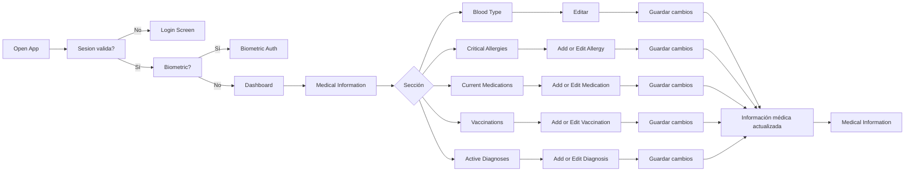
```mermaid
flowchart LR
    O[Open App] --> O1[Sesion valida?]
    O1 -- No --> O2[Login Screen]
    O1 -- Sí --> O3[Biometric?]
    O3 -- Sí --> O4[Biometric Auth]
    O3 -- No --> O5[Dashboard]
    O5[Dashboard] --> A[Medical Information]
    A[Medical Information] --> B{Sección}
    B --> C[Blood Type] --> C1[Editar] --> C2[Guardar cambios] --> M[Información médica actualizada]
    B --> D[Critical Allergies] --> D1[Add or Edit Allergy] --> D2[Guardar cambios] --> M[Información médica actualizada]
    B --> E[Current Medications] --> E1[Add or Edit Medication] --> E2[Guardar cambios] --> M[Información médica actualizada]
    B --> F[Vaccinations] --> F1[Add or Edit Vaccination] --> F2[Guardar cambios] --> M[Información médica actualizada]
    B --> G[Active Diagnoses] --> G1[Add or Edit Diagnosis] --> G2[Guardar cambios] --> M[Información médica actualizada]
    M[Información médica actualizada] --> M1[Medical Information]
```

1. La persona abre la app.
2. El sistema verifica si la sesión es válida.
3. Si no es válida, se muestra pantalla de login.
4. Si es válida, se verifica si la biometría está activada.
5. Si la biometría está activada, se solicita **autenticación** biométrica.
6. Si la biometría no está activada o se autentica correctamente, se accede al dashboard.
7. La persona llega al dashboard principal.
8. La persona entra en `Medical Information`.
9. Selecciona una sección: `Blood Type`, `Critical Allergies`, `Current Medications`, `Vaccinations` o `Active Diagnoses`.
10. En `Blood Type`, `Critical Allergies`, `Current Medications` o `Vaccinations`, edita la información y guarda cambios.
11. En `Active Diagnoses`, puede editar, borrar o añadir diagnóstico y luego guardar cambios.
12. El sistema muestra `Información médica actualizada`.
13. La vista vuelve a `Medical Information` con los datos actualizados.

#### 5. Gestión de resultados de pruebas

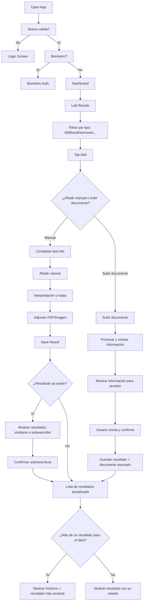
```mermaid
flowchart TB
    O[Open App] --> O1[Sesion valida?]
    O1 -- No --> O2[Login Screen]
    O1 -- Sí --> O3[Biometric?]
    O3 -- Sí --> O4[Biometric Auth]
    O3 -- No --> O5[Dashboard]
    O5[Dashboard] --> A[Lab Results]
    A[Lab Results] --> A1[Filtrar por tipo: All/Blood/Hormone/...]
    A1 --> B[Tap Add]
    B --> C{¿Añadir manual o subir documento?}

    C -- Manual --> D[Completar test info]
    D --> E[Añadir valores]
    E --> F[Interpretación y notas]
    F --> G[Adjuntar PDF/Imagen]
    G --> H[Save Result]
    H --> J{¿Resultado ya existe?}
    J -- Sí --> K[Mostrar resultados similares a sobreescribir]
    K --> L[Confirmar sobreescritura]
    L --> I[Lista de resultados actualizada]
    J -- No --> I[Lista de resultados actualizada]

    C -- Subir documento --> R[Subir documento]
    R --> S[Procesar y extraer información]
    S --> T[Mostrar información para revisión]
    T --> U[Usuario revisa y confirma]
    U --> V[Guardar resultado + documento asociado]
    V --> I[Lista de resultados actualizada]

    I --> N{¿Más de un resultado para el dato?}
    N -- Sí --> P[Mostrar histórico + resultado más reciente]
    N -- No --> Q[Mostrar resultado con su estado]
```

1. La persona abre la app.
2. El sistema verifica si la sesión es válida.
3. Si no es válida, se muestra pantalla de login.
4. Si es válida, se verifica si la biometría está activada.
5. Si la biometría está activada, se solicita **autenticación** biométrica.
6. Si la biometría no está activada o se autentica correctamente, se accede al dashboard.
7. La persona llega al dashboard principal.
8. La persona entra en `Lab Results`.
9. Puede filtrar por tipo (All/Blood/Hormone/...).
10. Pulsa `Add` para crear un nuevo resultado.
11. El usuario puede elgir entre añadir un resultado manualmente o subir un documento para extraer la información.
12. Si elige añadir manualmente
    1. Rellena nombre, fecha y categoría.
    2. Añade valores de laboratorio y unidades.
    3. Introduce interpretación/notas y adjunta documento.
    4. Guarda el resultado.
       - Si el resultado ya existe, se muestra opción de los resultados similares que se sobreescribiran.
13. Si elige subir un documento, el sistema extrae la información relevante y la muestra para revisión antes de guardar.
    1. El sistema procesa el documento, extra la información relevante y la muestra para revisión.
    2. El usuario revisa y confirma la información extraída.
    3. El sistema guarda el resultado y el documento asociado.
14. El sistema lo muestra en la lista con su estado.
15. Si el dato tiene mas de un resultado, se muestra el histórico y el resultado más reciente en la vista principal.

#### 6. Gestión documental

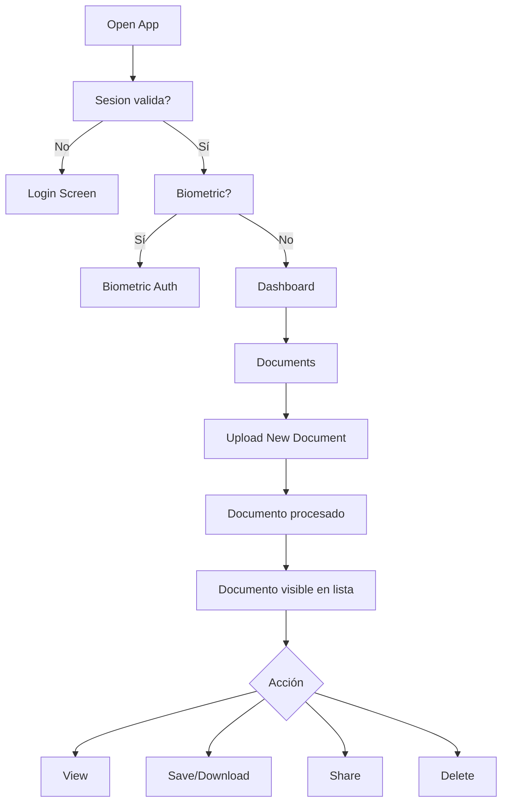
```mermaid
flowchart TB
    O[Open App] --> O1[Sesion valida?]
    O1 -- No --> O2[Login Screen]
    O1 -- Sí --> O3[Biometric?]
    O3 -- Sí --> O4[Biometric Auth]
    O3 -- No --> O5[Dashboard]
    O5 --> A[Documents]
    A --> B[Upload New Document]
    B --> C[Documento procesado]
    C --> D[Documento visible en lista]
    D --> E{Acción}
    E --> F[View]
    E --> G[Save/Download]
    E --> H[Share]
    E --> I[Delete]
```

1. La persona abre la app.
2. El sistema verifica si la sesión es válida.
3. Si no es válida, se muestra pantalla de login.
4. Si es válida, se verifica si la biometría está activada.
5. Si la biometría está activada, se solicita **autenticación** biométrica.
6. Si la biometría no está activada o se autentica correctamente, se accede al dashboard.
7. La persona llega al dashboard principal.
8. La persona abre `Documents`.
9. Sube un nuevo documento médico.
10. El sistema pregunta al usuario si desea procesar el documento para extrar información o simplemente subirlo como archivo.
    1. Si el usuario elige procesar el documento, el sistema lo indexa y extrae la información relevante para mostrarla en la vista de detalles del documento.
    2. El sistema ofrece al usuario la opción de añadir la información extraída a su perfil médico.
11. El sistema lo indexa y lo muestra en la lista.
12. Puede buscar por texto.
13. Sobre cada documento puede ver, descargar/guardar, compartir o eliminar.
14. Si elimina, el sistema confirma y retira el documento de la lista.

#### 7. Perfil y contactos de emergencia

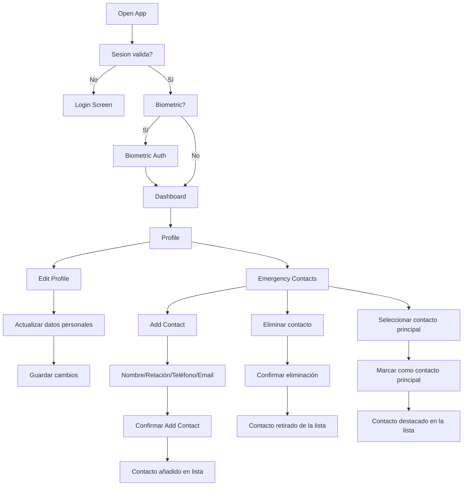
```mermaid
flowchart TB
    O[Open App] --> O1[Sesion valida?]
    O1 -- No --> O2[Login Screen]
    O1 -- Sí --> O3[Biometric?]
    O3 -- Sí --> O4[Biometric Auth]
    O4 --> O5[Dashboard]
    O3 -- No --> O5[Dashboard]
    O5 --> A[Profile]

    A --> B[Edit Profile]
    B --> C[Actualizar datos personales]
    C --> D[Guardar cambios]

    A --> E[Emergency Contacts]
    E --> F[Add Contact]
    F --> G[Nombre/Relación/Teléfono/Email]
    G --> H[Confirmar Add Contact]
    H --> I[Contacto añadido en lista]

    E --> J[Eliminar contacto]
    J --> K[Confirmar eliminación]
    K --> L[Contacto retirado de la lista]

    E --> M[Seleccionar contacto principal]
    M --> N[Marcar como contacto principal]
    N --> P[Contacto destacado en la lista]
```

1. La persona abre la app.
2. El sistema verifica si la sesión es válida.
3. Si no es válida, se muestra pantalla de login.
4. Si es válida, se verifica si la biometría está activada.
5. Si la biometría está activada, se solicita **autenticación** biométrica.
6. Si la biometría no está activada o se autentica correctamente, se accede al dashboard.
7. La persona llega al dashboard principal.
8. La persona entra a `Profile`.
9. Puede editar su información personal.
10. Guarda los cambios del perfil.
11. Dentro de la seccion `Profile`, puede consultar los contactos de emergencia.
12. El usuario puede añadir un contcto de emergencia pulsando `Add`.
13. Completa nombre, relación, teléfono y correo.
14. Confirma con `Add Contact`.
15. El nuevo contacto aparece en la lista.
16. El usuario puede eliminar contactos de emergencia desde la lista.
17. Si elimina un contacto, el sistema confirma y lo retira de la lista.
18. El usuario puede seleccionar un contacto de emergencia como contacto principal para emergencias, el sistema lo marca como contacto de emergencia principal y lo muestra destacado en la lista.

#### 8. Alertas y preferencias de notificación

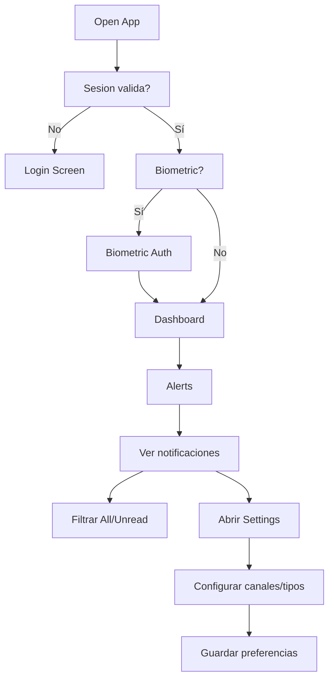
```mermaid
flowchart TB
    O[Open App] --> O1[Sesion valida?]
    O1 -- No --> O2[Login Screen]
    O1 -- Sí --> O3[Biometric?]
    O3 -- Sí --> O4[Biometric Auth]
    O4 --> O5[Dashboard]
    O3 -- No --> O5[Dashboard]
    O5 --> A[Alerts]
    A[Alerts] --> B[Ver notificaciones]
    B --> C[Filtrar All/Unread]
    B --> D[Abrir Settings]
    D --> E[Configurar canales/tipos]
    E --> F[Guardar preferencias]
```

1. La persona abre la app.
2. El sistema verifica si la sesión es válida.
3. Si no es válida, se muestra pantalla de login.
4. Si es válida, se verifica si la biometría está activada.
5. Si la biometría está activada, se solicita **autenticación** biométrica.
6. Si la biometría no está activada o se autentica correctamente, se accede al dashboard.
7. La persona llega al dashboard principal.
8. La persona accede a `Alerts`.
9. Consulta eventos de acceso y actividad.
10. Filtra por `All` o `Unread`.
11. Entra en ajustes de notificaciones.
12. Activa/desactiva preferencias de recepción.
13. El sistema guarda la configuración.

#### 9. Compartición con profesional sanitario (Regular Sharing)

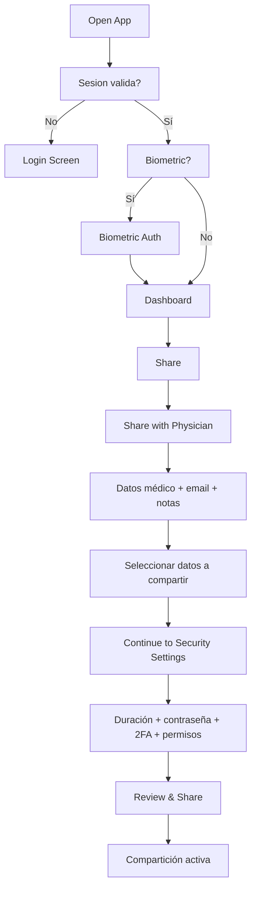
```mermaid
flowchart TB
    O[Open App] --> O1[Sesion valida?]
    O1 -- No --> O2[Login Screen]
    O1 -- Sí --> O3[Biometric?]
    O3 -- Sí --> O4[Biometric Auth]
    O4 --> O5[Dashboard]
    O3 -- No --> O5[Dashboard]
    O5 --> A[Share]
    A[Share] --> B[Share with Physician]
    B --> C[Datos médico + email + notas]
    C --> D[Seleccionar datos a compartir]
    D --> E[Continue to Security Settings]
    E --> F[Duración + contraseña + 2FA + permisos]
    F --> G[Review & Share]
    G --> H[Compartición activa]
```

1. La persona abre la app.
2. El sistema verifica si la sesión es válida.
3. Si no es válida, se muestra pantalla de login.
4. Si es válida, se verifica si la biometría está activada.
5. Si la biometría está activada, se solicita **autenticación** biométrica.
6. Si la biometría no está activada o se autentica correctamente, se accede al dashboard.
7. La persona llega al dashboard principal.
8. La persona entra en `Share` y selecciona `Share with Physician`.
9. Introduce datos del profesional (nombre, email, notas).
10. Elige qué **información médica** compartirá.
11. Pasa a `Security Settings`.
12. Configura duración, contraseña, 2FA y permiso de descarga.
13. Revisa y confirma la compartición.
14. El sistema crea acceso seguro temporal y lo registra en actividad.

#### 10. Flujo de acceso por parte del profesional sanitario

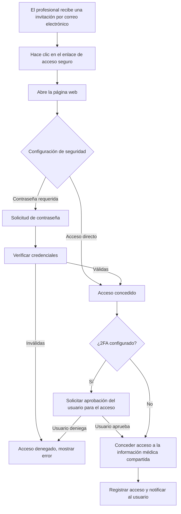
```mermaid
flowchart TB
    O[El profesional recibe una invitación por correo electrónico] --> O1[Hace clic en el enlace de acceso seguro]
    O1 --> O2[Abre la página web]
    O2 --> O3{Configuración de seguridad}
    O3 -- Acceso directo --> O4[Acceso concedido]
    O3 -- Contraseña requerida --> O5[Solicitud de contraseña]
    O5 --> O6[Verificar credenciales]
    O6 -- Válidas --> O4[Acceso concedido]
    O6 -- Inválidas --> O7[Acceso denegado, mostrar error]
    O4 --> O8{¿2FA configurado?}
    O8 -- Sí --> O9[Solicitar aprobación del usuario para el acceso]
    O9 -- Usuario aprueba --> O10[Conceder acceso a la información médica compartida]
    O9 -- Usuario deniega --> O7[Acceso denegado, mostrar error]
    O8 -- No --> O10[Conceder acceso a la información médica compartida]
    O10 --> O11[Registrar acceso y notificar al usuario]
```

1. El profesional sanitario recibe una invitación de acceso por email.
2. El profesional pulsa el enlace seguro de acceso.
3. El sistema mustra una web y dependiendo de la configuración de **seguridad** accede directamente o solicita una contraeña.
4. El sistema verifica las credenciales y permisos de acceso.
5. Si el sistema tiene 2FA configurado, solicita al usuario que acepte la solicitud de acceso por parte del profesional sanitario.
6. Una vez el usuario acepta, el sistema concede acceso a la **información médica** compartida.
7. El sistema registra el acceso y notifica a la persona usuaria.

#### 11. Compartición de emergencia (QR/Código)

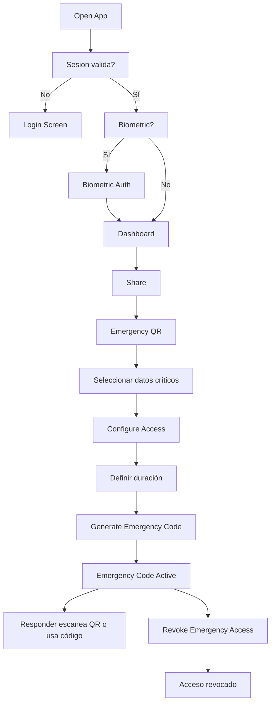
```mermaid
flowchart TB
    O[Open App] --> O1[Sesion valida?]
    O1 -- No --> O2[Login Screen]
    O1 -- Sí --> O3[Biometric?]
    O3 -- Sí --> O4[Biometric Auth]
    O4 --> O5[Dashboard]
    O3 -- No --> O5[Dashboard]
    O5 --> A[Share]
    A[Share] --> B[Emergency QR]
    B --> C[Seleccionar datos críticos]
    C --> D[Configure Access]
    D --> E[Definir duración]
    E --> F[Generate Emergency Code]
    F --> G[Emergency Code Active]
    G --> H[Responder escanea QR o usa código]
    G --> I[Revoke Emergency Access]
    I --> J[Acceso revocado]
```

1. La persona abre la app.
2. El sistema verifica si la sesión es válida.
3. Si no es válida, se muestra pantalla de login.
4. Si es válida, se verifica si la biometría está activada.
5. Si la biometría está activada, se solicita **autenticación** biométrica.
6. Si la biometría no está activada o se autentica correctamente, se accede al dashboard.
7. La persona llega al dashboard principal.
8. La persona entra en `Share` y elige `Emergency QR`.
9. Selecciona la información crítica para emergencias.
10. Configura duración del acceso y condiciones de **seguridad**.
11. Genera código/QR de emergencia.
12. El sistema muestra estado `Emergency Code Active`.
13. El profesional de emergencias accede por QR o código.
14. Se registran accesos y se notifica a la persona usuaria.
15. Si hace falta, la persona revoca el acceso inmediatamente.

#### 12. Flujo de acceso por código QR en emergencia

```mermaid
flowchart TB
    O[Profesional en el lugar de emergencia] --> O1[Escanear código QR]
    O1 --> O2[Abrir página de acceso temporal seguro]
    O2 --> O3[Solicitar introducción manual del código si el QR falla]
    O3 --> O4[El profesional introduce el código manualmente]
    O4 --> O5[El sistema verifica la validez del código y las condiciones de acceso]
    O5 -- Válido --> O6[Conceder acceso a la información crítica seleccionada]
    O5 -- Inválido --> O7[Denegar acceso y mostrar error]
    O6 --> O8[Registrar acceso y notificar al usuario]
    O8 --> O9[El usuario puede revocar el acceso, invalidando el código y eliminando el acceso para el profesional de emergencia]
```

1. El profesional de emergencias escanea el código QR
2. El sitema abre el navegador por defecto y redirige a una página segura de acceso temporal.
3. El sistema solicita al profesional que introduzca el código de emergencia manualmente (en caso de no poder escanear el QR).
4. El profesional introduce el código manualmente.
5. El sistema verifica la validez del código y las condiciones de acceso.
6. Si el código es válido, se concede acceso a la información crítica seleccionada.
7. El sistema registra el acceso y notifica a la persona usuaria.
8. La persona usuaria puede revocar el acceso en cualquier momento, lo que invalidará el código y retirará el acceso al profesional de emergencias.

#### 13. Configuración y privacidad (Settings)

```mermaid
flowchart TB
    O[Open App] --> O1[Sesion valida?]
    O1 -- No --> O2[Login Screen]
    O1 -- Sí --> O3[Biometric?]
    O3 -- Sí --> O4[Biometric Auth]
    O4 --> O5[Dashboard]
    O3 -- No --> O5[Dashboard]
    O5 --> O6[Profile]
    O6 --> A[Settings]
    A[Settings] --> B[Account]
    A --> C[Security & Privacy]
    A --> D[Notifications]
    A --> F[Legal & Support]
    A --> G[Borrado de cuenta]
    A --> H[Log Out]
```

1. La persona abre la app.
2. El sistema verifica si la sesión es válida.
3. Si no es válida, se muestra pantalla de login.
4. Si es válida, se verifica si la biometría está activada.
5. Si la biometría está activada, se solicita **autenticación** biométrica.
6. Si la biometría no está activada o se autentica correctamente, se accede al dashboard.
7. La persona llega al dashboard principal.
8. La persona entra en `Profile` y luego en `Settings`.
9. Gestiona opciones de cuenta y credenciales.
10. Ajusta **seguridad**, biometría, logs y gestión de accesos.
11. Revisa preferencias de notificación.
12. Consulta información legal y soporte.
13. Puede eliminar datos o cerrar sesión.

## 2.4. Casos de uso

Una vez definnidos los flujos de interacción junto con los requisitos, los perfiles de usuario y las funcionalidades esperadas por los usuarios, el siguiente paso es extrar los diferentes casos de uso que representaran las funcionalidades principales del sistema y ayudaran a confeccionar:

- El prototipado de la aplicación.
- La arquitectura de la aplicación.
- Las diferentes historia de usuario para el desarrollo de la aplicación.
- La estructura de la información.

Se han segregado los casos de uso por area funcional para tener una visión mas clara de las funcionalidades principales del sistema.

| Area funcional                                               | Prioridad | Estado                   |
| ------------------------------------------------------------ | --------- | ------------------------ |
| Gestión de usuarios                                          | 🔴 1      | Requerido                |
| Gestión de información básica                                | 🔴 1      | Requerido                |
| Compartir y colaborar                                        | 🟠 2      | Requerido pero ampliable |
| Notificaciones y alertas                                     | 🟠 2      | Requerido                |
| **Gestión de documentos**                                    | 🟠 2      | Requerido pero ampliable |
| Integración con proveedores de la salud                      | 🟢 4      | Out of the Scope         |
| Búsqueda y descubrimiento                                    | 🟡 3      | Requerido pero ampliable |
| Exportación de datos y copias de **seguridad**               | 🟡 3      | Out of the Scope         |
| Acceso sin conexión y sincronización                         | 🟡 3      | Out of the Scope         |
| Cumplimiento y **privacidad** en la salud                    | 🔴 1      | Requerido pero ampliable |
| Gestión de citas profesionales                               | 🔵 5      | Out of the Scope         |
| Gestión de seguros y cobertura                               | 🔵 5      | Out of the Scope         |
| Inteligencia y gestión de medicamentos                       | 🟢 4      | Out of the Scope         |
| Verificación de datos y confianza                            | 🔵 5      | Out of the Scope         |
| Capacidades de Importación e Integración                     | 🟢 4      | Out of the Scope         |
| Administración del sistema y **seguridad**                   | 🟠 2      | Requerido pero ampliable |
| Delegación de salud a profesionales / Acceso para cuidadores | 🔵 5      | Out of the Scope         |
| Ultimas voluntades y directivas anticipadas                  | 🔵 5      | Out of the Scope         |

### Casos de Uso 1: Gestión de usuarios (Requerido para el MVP)

```mermaid
graph LR
    User((Usuario))

    User --> UC1[Iniciar sesión con cuenta de Google]
    User --> UC2[Registrarse con cuenta de Google]
    User --> UC3[Cerrar sesión en la aplicación]
    User --> UC4[Ver información del perfil]
    User --> UC5[Inicio de sesión automático con Recuérdame]
    User --> UC6[Configurar autenticación biométrica]

    UC1 --> System
    UC2 --> System
    UC3 --> System
    UC4 --> System
    UC5 --> System
    UC6 --> System

    style User fill:#a8dadc
    style UC1 fill:#f1faee
    style UC2 fill:#f1faee
    style UC3 fill:#f1faee
    style UC4 fill:#f1faee
    style UC5 fill:#f1faee
    style UC6 fill:#f1faee
```

- El usuario puede iniciar sesión en la aplicación usando su cuenta de Google.
- El usuario puede registrarse en la aplicación usando su cuenta de Google.
- El usuario puede cerrar sesión en la aplicación.
- El usuario puede ver la información de su perfil.
- El usuario puede iniciar sesión automáticamente con la opción "recuérdame" y una sesión válida.
- El usuario puede configurar el inicio de sesión con **autenticación** biométrica (huella dactilar o reconocimiento facial) si su dispositivo lo admite.

### Casos de Uso 2: Gestión de información básica

```mermaid
graph LR
    User((Usuario))
    System((Sistema))

    subgraph Personal["Información Personal"]
        UC1[Ver Info Personal]
        UC2[Editar Info Personal]
        UC3[Subir Foto de Perfil]
        UC4[Marcar Campos como Privados]
    end

    subgraph Medical["Información Médica Principal"]
        UC6[Ver Info Médica]
        UC7[Añadir/Editar/Eliminar Entradas]
        UC8[Añadir Notas a las Entradas]
        UC9[Marcar como Crítico]
    end

    subgraph Tests["Resultados de Pruebas"]
        UC18[Ver Resultados de Pruebas]
        UC19[Añadir Nuevos Resultados]
        UC20[Editar Resultados]
        UC23[Ver Resultados Destacados]
    end


    User --> Personal
    User --> Medical
    User --> History
    User --> Tests
    User --> Family
    User --> Audit

    Personal --> System
    Medical --> System
    History --> System
    Tests --> System
    Family --> System

    style User fill:#a8dadc
    style System fill:#457b9d
```

#### Información Personal

- El usuario puede ver su información personal básica (Nombre, Correo electrónico, Foto de perfil, Fecha de nacimiento, Género, Dirección).
- El usuario puede editar su información personal básica con validación.
- El usuario puede subir y cambiar su foto de perfil.
- El usuario puede marcar ciertos campos de información personal como privados/ocultos del acceso compartido.

#### Información Médica Principal

- El usuario puede ver su **información médica** crítica (Tipo de sangre, Alergias, Enfermedades crónicas, Medicamentos, Vacunación).
- El usuario puede añadir, editar y eliminar entradas de **información médica** principal.
- El usuario puede añadir notas o detalles a cada entrada de **información médica** principal (ej. gravedad de la alergia, instrucciones de dosificación de medicamentos).
- El usuario puede marcar la información como crítica o de alta prioridad.
- El usuario puede subir documentos o imágenes de respaldo para cada entrada (ej. recetas médicas, resultados de pruebas de alergia).

#### Resultados de Pruebas

- El usuario puede ver todos los resultados de pruebas organizados por tipo y fecha.
- El usuario puede añadir nuevos resultados de pruebas con fecha, tipo de prueba, resultados y rangos de referencia.
- El usuario puede editar la información y las interpretaciones de los resultados de pruebas.
- El usuario puede eliminar o marcar resultados de pruebas como archivados.
- El usuario puede ver los resultados de las pruebas en detalle, incluyendo la interpretación médica.
- El usuario puede subir documentos con resultados de pruebas (PDF, imágenes).
- El usuario puede comparar resultados de pruebas a lo largo del tiempo para rastrear tendencias.
- El usuario puede ver destacados los resultados normales vs. anormales.
- El usuario puede enlazar resultados de pruebas con afecciones médicas o medicamentos relacionados.

#### Historial de Cambios y Registro de Auditoría

- El usuario puede ver el historial de cambios completo para todas las categorías de información.
- El usuario puede ver detalles de cada cambio que incluye (fecha, hora, campo modificado, valor antiguo, nuevo valor, quién realizó el cambio).
- El usuario puede filtrar el historial de cambios por categoría, rango de fechas o tipo de modificación.
- El usuario puede revertir cambios a versiones anteriores (con confirmación).
- El usuario puede ver qué proveedores compartidos han visto información específica y cuándo.
- El usuario puede exportar el historial de cambios con fines de registros médicos o cumplimiento normativo.

### Casos de Uso 3: Compartir y colaborar

```mermaid
graph LR
    User((Usuario))
    HCP((Profesional<br/>Salud))
    System((Sistema))

    subgraph QR["Compartir con Código QR"]
        UC1[Crear QR de Emergencia]
        UC2[Escanear QR para Ver Info]
        UC3[Configurar Expiración de QR]
        UC4[Revisar Logs de Acceso de QR]
        UC5[Revocar Acceso QR]
    end

    subgraph Provider["Compartir con Profesionales"]
        UC6[Compartir con Profesionales]
        UC7[Ver Lista de Compartidos]
        UC8[Revocar Acceso a Profesionales]
        UC9[Configurar Consentimiento Explícito]
        UC10[Ver Lista de Acceso a Profesionales]
    end

    subgraph Reports["Generación de Informes"]
        UC11[Generar Informe Médico]
        UC12[Compartir Informe con Profesionales]
    end

    User --> QR
    User --> Provider
    User --> Reports
    HCP --> UC2
    HCP --> Provider

    QR --> System
    Provider --> System
    Reports --> System

    style User fill:#a8dadc
    style HCP fill:#e63946
    style System fill:#457b9d
```

- El usuario puede crear un código QR para compartir en caso de emergencia.
- Un usuario con el código QR puede escanearlo para ver la **información médica** del usuario si tiene una cuenta válida.
- El usuario puede configurar el tiempo de expiración del código QR y la información a la que se puede acceder mediante este.
- El usuario puede consultar quién ha accedido a su **información médica** a través del código QR.
- El usuario puede revocar el acceso a su **información médica** mediante el código QR.

- El usuario puede compartir su **información médica** con médicos u otros **profesionales de la salud**.
- El usuario puede ver la lista de **información médica** compartida.
- El usuario puede revocar el acceso a la **información médica** compartida.
- El usuario puede configurar un consentimiento explícito al compartir **información médica** con médicos u otros **profesionales de la salud**.
- El usuario puede ver la lista de médicos u otros **profesionales de la salud** que tienen acceso a su **información médica**.

- El usuario puede compartir el informe generado con médicos u otros **profesionales de la salud**.

### Casos de Uso 4: Notificaciones y alertas

```mermaid
graph LR
    User((Usuario))
    System((Sistema))

    UC1[Recibir Notificaciones de Acceso]
    UC2[Recibir Alertas de Salud]
    UC3[Configurar Tipos de Notificación]
    UC4[Ver Historial de Notificaciones]

    User --> UC1
    User --> UC2
    User --> UC3
    User --> UC4

    UC1 --> System
    UC2 --> System
    UC3 --> System
    UC4 --> System

    style User fill:#a8dadc
    style System fill:#457b9d
    style UC1 fill:#f1faee
    style UC2 fill:#f1faee
    style UC3 fill:#f1faee
    style UC4 fill:#f1faee
```

- El usuario puede recibir notificaciones sobre quién está accediendo a su **información médica** a través del código QR o el acceso compartido.
- El usuario puede recibir alertas sobre próximas citas médicas, recordatorios de medicamentos o actualizaciones importantes de salud en función de su **información médica** (Fuera del alcance del MVP pero importante para el desarrollo futuro).
- El usuario puede configurar los tipos de notificaciones y alertas que quiere recibir y los canales a través de los cuales desea recibirlos (ej. correo electrónico, notificaciones push).
- El usuario puede ver el historial de las notificaciones y alertas recibidas.

### Casos de Uso 5: Gestión de documentos

```mermaid
graph LR
    User((Usuario))
    HCP((Profesional<br/>Salud))
    System((Sistema))

    UC1[Subir Documentos Médicos]
    UC2[Ver Lista de Documentos]
    UC3[Ver Detalles del Documento]
    UC4[Eliminar Documentos]
    UC5[Compartir Documentos con Profesionales]
    UC6[Extraer Metadatos del Documento]

    User --> UC1
    User --> UC2
    User --> UC3
    User --> UC4
    User --> UC5
    User --> UC6

    UC5 --> HCP

    UC1 --> System
    UC2 --> System
    UC3 --> System
    UC4 --> System
    UC5 --> System
    UC6 --> System

    style User fill:#a8dadc
    style HCP fill:#e63946
    style System fill:#457b9d
    style UC1 fill:#f1faee
    style UC2 fill:#f1faee
    style UC3 fill:#f1faee
    style UC4 fill:#f1faee
    style UC5 fill:#f1faee
    style UC6 fill:#f1faee
```

- El usuario puede subir documentos médicos (ej. recetas, resultados de pruebas, informes médicos).
- El usuario puede ver la lista de documentos médicos subidos.
- El usuario puede ver los detalles de cada documento médico subido.
- El usuario puede eliminar documentos médicos subidos.
- El usuario puede compartir documentos médicos subidos con médicos u otros **profesionales de la salud**.
- El sistema puede extraer metadatos de los documentos médicos subidos (ej. fecha, tipo de documento, **información médica** relevante) y mostrarlos en el perfil del usuario.

### Casos de Uso 6: Búsqueda y descubrimiento

```mermaid
graph LR
    User((Usuario))
    System((Sistema))

    UC1[Buscar por Palabras Clave]
    UC2[Buscar por Rango de Fechas]
    UC4[Filtrar por Categoría]
    UC5[Ordenar Registros]

    User --> UC1
    User --> UC2
    User --> UC4
    User --> UC5

    UC1 --> System
    UC2 --> System
    UC4 --> System
    UC5 --> System

    style User fill:#a8dadc
    style System fill:#457b9d
    style UC1 fill:#f1faee
    style UC2 fill:#f1faee
    style UC4 fill:#f1faee
    style UC5 fill:#f1faee
```

- El usuario puede buscar a través de los registros médicos utilizando palabras clave (ej., "diabético", "alergia").
- El usuario puede buscar por rango de fechas en los registros médicos.
- El usuario puede filtrar registros por categoría (medicamentos, alergias, resultados de pruebas, cirugías, etc.).
- El usuario puede ordenar registros por los más recientes, los más antiguos o por categoría.

### Casos de Uso 7: Cumplimiento y privacidad en la salud (Requerido para el MVP pero se puede ampliar en el futuro)

```mermaid
graph LR
    User((Usuario))
    System((Sistema))
    Admin((Administrador<br/>del Sistema))

    UC1[Cumplir con Estándares]
    UC2[Ver Registros de Actividad]
    UC4[Filtrar Registros de Acceso]
    UC5[Alertas de Acceso No Autorizado]
    UC6[Revocar Permisos de Acceso]
    UC7[Anonimizar Datos]
    UC8[Descargar Reporte GDPR]

    System --> UC1
    User --> UC2
    User --> UC4
    User --> UC5
    User --> UC6
    User --> UC7
    User --> UC8
    Admin --> UC1

    UC1 --> System
    UC2 --> System
    UC4 --> System
    UC5 --> System
    UC6 --> System
    UC7 --> System
    UC8 --> System

    style User fill:#a8dadc
    style System fill:#457b9d
    style Admin fill:#2a9d8f
```

- El sistema cumple con los estándares de protección de datos médicos (HIPAA, GDPR, normativas locales).
- El usuario puede ver registros detallados de actividad que muestran quién y cuándo accedió a su información.
- El usuario puede ver registros de acceso filtrados por fecha, profesional o tipo de acción.
- El usuario puede recibir notificaciones sobre cualquier intento de acceso no autorizado.
- El usuario puede revocar cualquier acceso concedido inmediatamente.
- El sistema puede anonimizar los datos para propósitos de investigación o estadísticas, previo consentimiento.
- El usuario puede visualizar y descargar un informe de portabilidad de datos compatible con GDPR.

### Casos de Uso 8: Administración del sistema y seguridad (Requerido para el MVP pero se puede ampliar en el desarrollo futuro)

```mermaid
graph LR
    Admin((Administrador<br/>del Sistema))
    System((Sistema))

    UC1[Gestionar Cuentas de Usuarios]
    UC2[Monitorizar Rendimiento del Sistema]
    UC3[Auditorías de Seguridad]
    UC4[Gestionar Copias de Seguridad]

    Admin --> UC1
    Admin --> UC2
    Admin --> UC3
    Admin --> UC4

    UC1 --> System
    UC2 --> System
    UC3 --> System
    UC4 --> System

    style Admin fill:#2a9d8f
    style System fill:#457b9d
    style UC1 fill:#f1faee
    style UC2 fill:#f1faee
    style UC3 fill:#f1faee
    style UC4 fill:#f1faee
```

- Los administradores de sistema pueden gestionar cuentas de usuarios, rebocando accesos o eliminando cuentas si es necesario.
- Los administradores de sistema deben vigilar al mismo tiempo su nivel general de desempeño garantizando un constante control sobre bitácoras operativas concernientes al mantenimiento funcional del proyecto por parte de terceros proveedores logísticos.
- Los administradores de sistemas pueden correr controles formales como chequeos continuos a estándares preventivos anti hackeo.
- Los administradores del sistema gestionan planes formales asegurando su continuidad.

### Casos de Uso fuera del alcance del MVP pero importantes para el desarrollo futuro

Aunque para una primera versión del producto los siguientes casos de uso no son estrictamente necesarios, se consideran importantes para el desarrollo futuro de la aplicación y su implementación se valorará en función de los recursos disponibles y las necesidades de los usuarios:

#### Casos de Uso 9: Gestión de información básica - Historial Médico Familiar

```mermaid
graph LR
    User((Usuario))
    System((Sistema))

    UC25[Ver Historial Familiar]
    UC26[Añadir Familiares]
    UC27[Añadir Info de Diagnóstico]
    UC28[Editar/Eliminar Entradas]
    UC29[Añadir Notas]
    UC30[Marcar Afecciones Relevantes]

    User --> UC25
    User --> UC26
    User --> UC27
    User --> UC28
    User --> UC29
    User --> UC30

    UC25 --> System
    UC26 --> System
    UC27 --> System
    UC28 --> System
    UC29 --> System
    UC30 --> System

    style User fill:#2a9d8f
    style System fill:#457b9d
    style UC25 fill:#f1faee
    style UC26 fill:#f1faee
    style UC27 fill:#f1faee
    style UC28 fill:#f1faee
    style UC29 fill:#f1faee
    style UC30 fill:#f1faee
```

**Historial Médico Familiar**

- El usuario puede ver el **historial médico** de su familia (Enfermedades de los padres, hermanos, abuelos).
- El usuario puede añadir familiares y sus afecciones médicas.
- El usuario puede añadir la edad de diagnóstico y el estado actual de las afecciones de sus familiares.
- El usuario puede editar la información de salud de sus familiares.
- El usuario puede eliminar familiares del **historial médico** familiar.
- El usuario puede añadir notas sobre patrones en el **historial médico** familiar.
- El usuario puede marcar afecciones médicas familiares relevantes para su propio estado de salud.

#### Casos de Uso 10: Integración con proveedores de la salud

```mermaid
graph LR
    User((Usuario))
    HCP((Profesional<br/>Salud))
    System((Sistema))

    UC1[Buscar Profesionales de Salud]
    UC2[Ver Perfiles de Profesionales]
    UC3[Vincular Profesionales a Registros]

    User --> UC1
    User --> UC2
    User --> UC3

    UC1 --> System
    UC2 --> System
    UC3 --> System
    System --> HCP

    style User fill:#a8dadc
    style HCP fill:#e63946
    style System fill:#457b9d
    style UC1 fill:#f1faee
    style UC2 fill:#f1faee
    style UC3 fill:#f1faee
```

- El usuario puede buscar y descubrir **profesionales de la salud** (médicos, hospitales, clínicas).
- El usuario puede ver los perfiles de los profesionales, incluyendo especialidades, calificaciones y valoraciones.
- El usuario puede vincular a profesionales a sus registros médicos.

#### Casos de Uso 11: Exportación de datos y copias de seguridad

```mermaid
graph TB
    User((Usuario))
    System((Sistema))
    Cloud[Almacenamiento<br/>en la Nube]

    UC1[Exportar a Formatos Estándar]
    UC2[Exportar Secciones Específicas]
    UC3[Crear Copias de Seguridad Cifradas]
    UC4[Descargar Registro Completo]
    UC5[Programar Copias de Seguridad Automáticas]
    UC6[Ver Historial de Copias de Seguridad]
    UC7[Exportar a Almacenamiento en la Nube]
    UC8[Importar Registros Previos]

    User --> UC1
    User --> UC2
    User --> UC3
    User --> UC4
    User --> UC5
    User --> UC6
    User --> UC7
    User --> UC8

    UC1 --> System
    UC2 --> System
    UC3 --> System
    UC4 --> System
    UC5 --> System
    UC6 --> System
    UC7 --> Cloud
    UC8 --> System

    style User fill:#a8dadc
    style System fill:#457b9d
    style Cloud fill:#f4a261
```

- El usuario puede exportar todos los registros médicos a formatos estándar (PDF, HL7, FHIR).
- El usuario puede exportar secciones específicas de los registros médicos (ej., solo medicamentos o resultados de pruebas).
- El usuario puede crear copias de **seguridad** cifradas de sus datos de salud completos.
- El usuario puede descargar una copia completa de su registro de salud en formato portátil.
- El usuario puede programar copias de **seguridad** automáticas en intervalos regulares.
- El usuario puede ver el historial de copias de **seguridad** y restaurar desde copias de **seguridad** previas.
- El usuario puede exportar registros a servicios de almacenamiento en la nube (Google Drive, OneDrive, Dropbox).
- El usuario puede importar registros previamente exportados nuevamente en la aplicación para restaurar o fusionar con los datos existentes.

#### Casos de Uso 12: Acceso sin conexión y sincronización

```mermaid
graph LR
    User((Usuario))
    System((Sistema))

    UC1[Acceder a Registros en Caché sin conexión]
    UC2[Ver Estado de Sincronización]
    UC3[Sincronización Manual]
    UC4[Configurar Caché sin conexión]
    UC5[Ver Última Marca de Tiempo]
    UC6[Recibir Notificaciones de Sincronización]
    UC7[Resolver Conflictos de Sincronización]

    User --> UC1
    User --> UC2
    User --> UC3
    User --> UC4
    User --> UC5
    User --> UC6
    User --> UC7

    UC1 -.offline.-> System
    UC2 --> System
    UC3 --> System
    UC4 --> System
    UC5 --> System
    UC6 --> System
    UC7 --> System

    style User fill:#a8dadc
    style System fill:#457b9d
    style UC1 fill:#f1faee
    style UC2 fill:#f1faee
    style UC3 fill:#f1faee
    style UC4 fill:#f1faee
    style UC5 fill:#f1faee
    style UC6 fill:#f1faee
    style UC7 fill:#f1faee
```

- El usuario puede acceder a registros médicos previamente guardados en caché cuando está sin conexión.
- El usuario puede ver los registros disponibles y el estado de la sincronización al estar sin conexión.
- El usuario puede iniciar la sincronización manual cuando haya conexión.
- El usuario puede configurar qué registros se deben guardar en caché para el acceso sin conexión.
- El usuario puede ver la última marca de tiempo de sincronización y los indicadores del estado de la misma.
- El usuario puede ser notificado cuando haya nuevos registros disponibles para sincronizar.
- El sistema puede resolver conflictos cuando los registros se modifican tanto sin conexión como en línea.

#### Casos de Uso 13: Gestión de citas profesionales

```mermaid
graph LR
    User((Usuario))
    HCP((Profesional<br/>Salud))
    System((Sistema))
    Calendar[Calendario<br/>Externo]

    UC1[Programar Citas]
    UC2[Ver Calendario de Citas]
    UC3[Establecer Recordatorios de Citas]
    UC4[Vincular Registros a Citas]
    UC5[Guardar Notas de la Cita]
    UC6[Sincronizar con Calendario Personal]
    UC7[Cancelar/Reprogramar]
    UC8[Ver Info de Contacto de Profesionales]
    UC9[Solicitar Acceso a Registros]

    User --> UC1
    User --> UC2
    User --> UC3
    User --> UC4
    User --> UC5
    User --> UC6
    User --> UC7
    User --> UC8
    HCP --> UC9

    UC1 --> System
    UC2 --> System
    UC3 --> System
    UC4 --> System
    UC5 --> System
    UC6 --> Calendar
    UC7 --> System
    UC8 --> System
    UC9 --> System

    style User fill:#a8dadc
    style HCP fill:#e63946
    style System fill:#457b9d
    style Calendar fill:#f4a261
```

- El usuario puede programar y gestionar citas médicas con **profesionales de la salud**.
- El usuario puede ver su calendario con todas las citas programadas.
- El usuario puede configurar recordatorios para las citas (email, SMS, notificación push).
- El usuario puede vincular registros médicos a citas específicas.
- El usuario puede almacenar notas de las citas y diagnósticos resultantes.
- El usuario puede sincronizar citas en su calendario personal (Google Calendar, Outlook, Apple Calendar).
- El usuario puede cancelar o reprogramar citas dentro de la aplicación.
- El usuario puede ver la información de contacto y horarios de los **profesionales de la salud**.
- Los **profesionales de la salud** pueden solicitar acceso a registros médicos específicos para una cita.

#### Casos de Uso 14: Gestión de seguros y cobertura

```mermaid
graph LR
    User((Usuario))
    System((Sistema))
    Insurance[Aseguradora]

    UC1[Añadir/Gestionar Pólizas de Seguro]
    UC2[Guardar Info de Tarjeta de Seguro]
    UC3[Rastrear Estado de Reclamaciones]
    UC4[Ver Detalles de Cobertura]
    UC5[Calcular Gastos de Bolsillo]
    UC6[Subir Documentos del Seguro]
    UC7[Ver Contacto de Aseguradora]
    UC8[Recibir Notificaciones de Reclamaciones]

    User --> UC1
    User --> UC2
    User --> UC3
    User --> UC4
    User --> UC5
    User --> UC6
    User --> UC7
    User --> UC8

    UC1 --> System
    UC2 --> System
    UC3 --> Insurance
    UC4 --> System
    UC5 --> System
    UC6 --> System
    UC7 --> System
    UC8 --> System

    style User fill:#a8dadc
    style System fill:#457b9d
    style Insurance fill:#f4a261
```

- El usuario puede añadir y gestionar múltiples pólizas de seguro.
- El usuario puede guardar la información de su tarjeta de seguro (número de póliza, número de grupo, contacto del proveedor).
- El usuario puede hacer seguimiento a sus reclamaciones de seguros y a su estado.
- El usuario puede ver los detalles de cobertura para registros médicos y tratamientos.
- El usuario puede calcular los costos compartidos o gastos de bolsillo previstos para los procedimientos.
- El usuario puede subir documentos del seguro para facilitar la referencia.
- El usuario puede ver la información de contacto del proveedor de seguro.
- El usuario puede configurar las notificaciones correspondientes a actualizaciones en reclamaciones de seguros.

#### Casos de Uso 15: Inteligencia y gestión de medicamentos

```mermaid
graph LR
    User((Usuario))
    System((Sistema))
    HCP((Profesional<br/>Salud))

    UC1[Advertir Interacciones de Medicamentos]
    UC2[Alertas de Contraindicación]
    UC3[Recordatorios de Resurtido]
    UC4[Ver Lista de Medicamentos]
    UC5[Registro de Ingesta]
    UC6[Información sobre Medicamentos]
    UC7[Sugerir Alternativas]
    UC8[Alerta de Recetas Vencidas]

    System --> UC1
    System --> UC2
    System --> UC3
    User --> UC4
    User --> UC5
    User --> UC6
    User --> UC7
    System --> UC8

    UC1 --> User
    UC2 --> User
    UC3 --> User
    UC4 --> System
    UC5 --> System
    UC6 --> System
    UC7 --> HCP
    UC8 --> User

    style User fill:#a8dadc
    style System fill:#457b9d
    style HCP fill:#e63946
```

- El sistema advierte al usuario de posibles interacciones de medicamentos cuando se añaden otros nuevos.
- El sistema alerta al usuario de contraindicaciones en función de sus alergias.
- El usuario recibe recordatorios de cuándo resurtir un medicamento, según la fecha de su receta.
- El usuario puede ver una lista comprensiva de todos sus medicamentos actuales teniendo en cuenta las dosis y la frecuencia.
- El usuario puede configurar el seguimiento de medicamentos y registrar o confirmar las dosis tomadas.
- El sistema proporciona información de la medicación, incluyendo efectos secundarios e interacciones comunes.
- El usuario puede ver alternativas de medicamentos sujetas a aprobación de su especialista.
- El sistema advierte al usuario si tiene recetas que han prescrito y necesitan actualizarse.

#### Casos de Uso 16: Verificación de datos y confianza

```mermaid
graph LR
    User((Usuario))
    HCP((Profesional<br/>Salud))
    System((Sistema))

    UC1[Marcar Registros como Verificados]
    UC2[Especificar Fuente de Información]
    UC3[Calificar la Confiabilidad de la Fuente]
    UC4[Visualizar Estado de Verificación]
    UC5[Reportar Información Inexacta]
    UC6[Profesionales Añaden Verificación]
    UC7[Recibir Notificaciones de Edición]
    UC8[Mantener Historial de Versiones]

    User --> UC1
    User --> UC2
    User --> UC3
    System --> UC4
    User --> UC5
    HCP --> UC6
    System --> UC7
    System --> UC8

    UC1 --> System
    UC2 --> System
    UC3 --> System
    UC4 --> User
    UC5 --> System
    UC6 --> System
    UC7 --> User
    UC8 --> System

    style User fill:#a8dadc
    style HCP fill:#e63946
    style System fill:#457b9d
```

- El usuario puede marcar sus registros como verificados o con un nivel de confianza alto.
- El usuario puede especificar el origen de la información de su registro (introducida por el usuario, proveída por el sistema, proveniente de un documento oficial).
- El usuario puede calificar los orígenes de información según su confiabilidad.
- El sistema muestra el estado de verificación y la información de la fuente para cada registro.
- El usuario puede marcar/etiquetar registros médicos por ser imprecisos o estar desactualizados.
- Los **profesionales de la salud** pueden certificar o añadir marcas de verificados en registros que suben directamente a la aplicación.
- El usuario recibe notificaciones si datos sin verificar sufren ediciones.
- El sistema conserva el historial de versiones con cambios sobre las fuentes a lo largo del tiempo.

#### Casos de Uso 17: Capacidades de Importación e Integración

```mermaid
graph LR
    User((Usuario))
    System((Sistema))
    EHR[Sistemas de Salud<br/>Externos]
    Wearable[Dispositivos<br/>Portátiles]
    Apps[Aplicaciones de Salud<br/>Terceros]
    Pharmacy[Sistemas de<br/>Farmacias]
    Lab[Sistemas de<br/>Laboratorios]

    UC1[Importar de Profesionales de Salud]
    UC2[Solicitar desde Instalaciones Médicas]
    UC3[Integrar con Dispositivos Portátiles]
    UC4[Sincronizar con Aplicaciones Terceras]
    UC5[Importar Datos de Recetas]
    UC6[Importar Resultados de Laboratorio]
    UC7[Seleccionar Puntos de Datos a Importar]
    UC8[Consolidar y Deduplicar]
    UC9[Recibir Resumen de Importación]

    User --> UC1
    User --> UC2
    User --> UC3
    User --> UC4
    User --> UC5
    User --> UC6
    User --> UC7
    User --> UC8
    System --> UC9

    UC1 --> EHR
    UC2 --> EHR
    UC3 --> Wearable
    UC4 --> Apps
    UC5 --> Pharmacy
    UC6 --> Lab
    UC7 --> System
    UC8 --> System
    UC9 --> User

    style User fill:#a8dadc
    style System fill:#457b9d
    style EHR fill:#f4a261
    style Wearable fill:#f4a261
    style Apps fill:#f4a261
    style Pharmacy fill:#f4a261
    style Lab fill:#f4a261
```

- El usuario puede importar registros de salud desde proveedores o sistemas de atención médica externos.
- El usuario puede solicitar e importar registros de las instalaciones de atención médica que ha visitado.
- El usuario puede integrarse con dispositivos portátiles y wearables (relojes inteligentes, rastreadores de fitness).
- El usuario puede sincronizar datos de salud desde aplicaciones de terceros (Apple Health, Google Fit, Fitbit).
- El usuario puede importar datos de prescripciones y recetas desde sistemas de farmacias.
- El usuario puede importar resultados de laboratorio introduciéndolos desde sistemas de información de laboratorios.
- El usuario puede seleccionar qué puntos de datos importar, configurar prioridades y establecer cada cuánto se debe sincronizar esta información.
- El sistema puede consolidar y evitar la duplicación de datos (deduplicar) entre registros médicos de fuentes distintas.
- El usuario recibe resúmenes confirmando la veracidad e información a partir de cada lote de datos importado hacia el sistema.

### Casos de Uso 18: Delegación de salud a profesionales / Acceso para cuidadores (Fuera del alcance del MVP pero puede expandirse en el futuro)

```mermaid

graph LR
    User((Usuario))
    Caregiver((Cuidador/Profesional de Salud))
    System((Sistema))

    UC1[Delegar Acceso a Profesional/Cuidador]
    UC2[Establecer Permisos de Acceso]
    UC3[Recibir Notificaciones de Acceso Delegado]
    UC4[Gestionar Información Médica Delegada]
    UC5[Comunicar con Usuario]
    UC6[Revocar Acceso Delegado]
    UC7[Configurar Notificaciones para Familia/Delegados]
    UC8[Emitir Pase Temporal en Emergencias]

    User --> UC1
    User --> UC2
    User --> UC3
    User --> UC6
    User --> UC7

    Caregiver --> UC4
    Caregiver --> UC5
    Caregiver --> UC8

    UC1 --> System
    UC2 --> System
    UC3 --> System
    UC4 --> System
    UC5 --> System
    UC6 --> System
    UC7 --> System
    UC8 --> System

    style User fill:#a8dadc
    style Caregiver fill:#e63946
    style System fill:#457b9d
```

- Como usuario, quiero delegar el acceso a mi **información médica** en un profesional sanitario de confianza (p. ej., médico de familia, especialista) o un cuidador (p. ej., un familiar, un asistente personal) para que puedan administrar mi salud en mi nombre cuando sea necesario.
- Como usuario, quiero establecer permisos específicos para los **profesionales sanitarios** o cuidadores delegados (p. ej., acceso de solo visualización, acceso de edición) de modo que pueda controlar cómo interactúan con mi **información médica**.
- Como usuario, quiero recibir notificaciones cuando un profesional sanitario delegado acceda a o modifique mi **información médica**, con el fin de mantenerme informado sobre sus actividades.
- Como cuidador/Profesional sanitario, si un usuario me ha delegado el acceso a la gestión de su **información médica**, quiero poder ver y gestionar dicha **información médica** en nombre del usuario para brindarle un mejor manejo o apoyo médico.
- Como cuidador/Profesional sanitario, si un usuario me ha delegado el acceso a la gestión de su **información médica**, quiero comunicarme de forma segura mediante la aplicación con el fin de discutir los diferentes enfoques al estado clínico.
- Como usuario, quiero poder revocar el acceso delegado a mi información en todo momento a fin de poder resguardar el control de mis datos y dictaminar quién sí puede accesar a ellos.
- Como usuario, quiero configurar notificaciones orientadas hacia miembros de mi familia y delegados frente a intervenciones hechas que modifiquen partes clave pertinentes a mis registros.
- Como cuidador/Profesional de salud, en una situación de emergencia en la que el usuario es incapaz de dar su acceso legalmente o conceder su visualización explícita, pretendo emitir de forma paralela un pase temporal para así proveer respuesta rápida médica salvaguardando integralmente en retrospectiva su estatus como titular de esos derechos frente a sus datos compartidos.

#### Casos de Uso 19: Ultimas voluntades y directivas anticipadas (Fuera del alcance del MVP pero puede expandirse en el futuro)

```mermaid
graph LR
    User((Usuario))
    System((Sistema))

    UC1[Crear Directivas Anticipadas]
    UC2[Especificar Últimas Voluntades]
    UC3[Compartir con Familia/Profesionales]
    UC4[Recibir Recordatorios de Revisión]
    UC5[Actualizar Directivas]
    UC6[Revocar Directivas]

    User --> UC1
    User --> UC2
    User --> UC3
    User --> UC4
    User --> UC5
    User --> UC6

    UC1 --> System
    UC2 --> System
    UC3 --> System
    UC4 --> System
    UC5 --> System
    UC6 --> System

    style User fill:#a8dadc
    style System fill:#457b9d
```

- Como usuario, quiero crear directivas anticipadas para especificar mis deseos y preferencias sobre tratamientos médicos futuros en caso de que no pueda tomar decisiones por mí mismo.
- Como usuario, quiero especificar mis últimas voluntades en relación con mi atención médica, incluyendo mis deseos sobre resucitación, ventilación mecánica, alimentación por sonda, etc.
- Como usuario, quiero compartir mis directivas anticipadas y últimas voluntades con miembros de mi familia y profesionales de la salud para asegurar que se respeten mis deseos.
- Como usuario, quiero recibir recordatorios periódicos para revisar y actualizar mis directivas anticipadas
- Como usuario, quiero poder actualizar mis directivas anticipadas y últimas voluntades en cualquier momento para reflejar cambios en mis deseos o circunstancias.
- Como usuario, quiero poder revocar mis directivas anticipadas si decido que ya no son aplicables o si quiero cambiar completamente mis deseos.

## 2.5. Prototipado

Una vez realizado y acotado el alcance del proyecto, es necesario realizar un prototipado de la aplicación para visualizar como se verá la aplicación, cómo se organizará la información y cómo será la experiencia de usuario.

Este diseño de prototipado nos ayudara a validar con usuarios potenciales la experiencia de usuario y la organización de la información, así como a identificar posibles mejoras antes de comenzar con el desarrollo de la aplicación e incluso posibles funcionalidades que se podrían eliminar.

Como nota, el prototipado solo es una representación inicial de la aplicación y no representa en su totalidad el diseño final de la aplicación, por lo que es importante mantener una mentalidad abierta a cambios y mejoras durante el proceso de desarrollo.

En cuanto a **MedVault**, el prototipado se realizó utilizando Figma, una herramienta de diseño de interfaces y prototipos. El prototipo incluye las pantallas principales de la aplicación, la navegación entre ellas y la organización de la información.

Principalmente se diseñaron las siguientes areas del proyecto:

- Pantalla de inicio y registro
- Pantalla de perfil del usuario
- Pantalla de principal o Dashboard
- Pantalla de **información médica**
- Pantalla de resultados de pruebas
- Pantalla de **gestión de documentos**
- Pantalla de notificaciones y alertas
- Pantalla de compartir **información médica**

Seguidamente se muestra dicha representación inicial de la aplicación junto con una breve descripción de cada pantalla, su funcionalidad y la razón detrás de su diseño.

### Login, Registro y Onboarding

La pantalla de login se ha diseñado para ofrecer un acceso rápido y familiar mediante **autenticación** con Google, minimizando fricción en el primer uso y reforzando la percepción de **seguridad** desde el inicio. Esto hace que la primera toma de contacto con la aplicación sea fluida y confiable, lo cual es crucial para una app que maneja **información médica** sensible.

Si el usuario no tiene una cuenta, se le redirige a la pantalla de registro, que mantiene la misma estética y simplicidad que el login para asegurar una experiencia coherente. El proceso de registro se centra en recopilar solo la información esencial para crear la cuenta, evitando pasos innecesarios que puedan generar abandono.

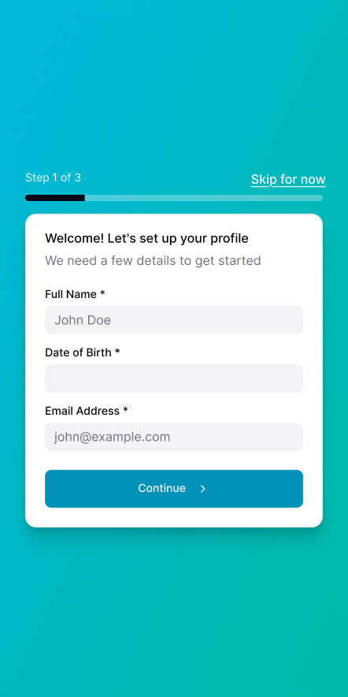

Aunque el usuario ya tenga una cuenta creada, si es la primera vez que se registra en el dispositivo, la app le debe guiar para activar las funciones de **seguridad** y **privacidad**, así como para configurar sus preferencias de notificaciones. Esto se logra a través de un onboarding que se divide en tres pantallas, cada una enfocada en un aspecto clave de la experiencia del usuario.

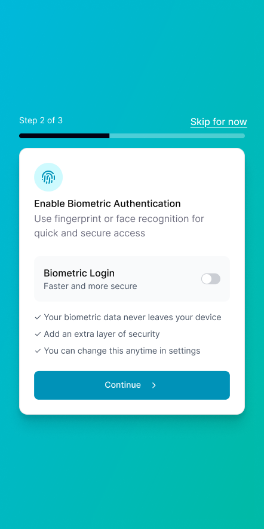

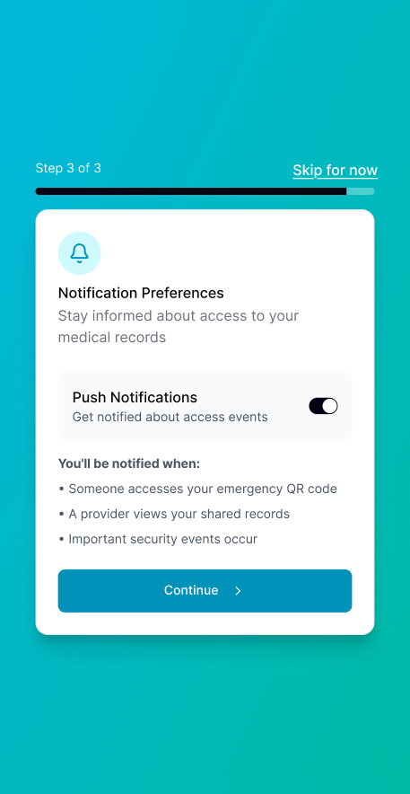

### Dashboard

El Dashboard es el punto de entrada principal de la aplicación y por tanto, es la pantalla mas importante de la aplicación. Contiene la información más relevante para el usuario y le permite acceder rápidamente a las diferentes secciones de la aplicación. El diseño del Dashboard se ha centrado en la claridad y la facilidad de navegación, utilizando bloques claramente diferenciados para cada sección (**Información Médica**, Resultados de Laboratorio, Documentos, Compartir Información, Alertas y Perfil). Esto permite al usuario encontrar rápidamente lo que necesita sin sentirse abrumado por la cantidad de información disponible.

Además, se ha intentando resaltar la información más relevante para el usuario mediante colores naturales que resalten los diferentes bloques y tipos de información.

Por ultimo, cuenta con un menú de navegación accesible con una sola mano, haciendo la navegación más cómoda y eficiente y un botón de acceso rápido a la función de añadir nueva **información médica**, fomentando la actualización constante de los datos del usuario.

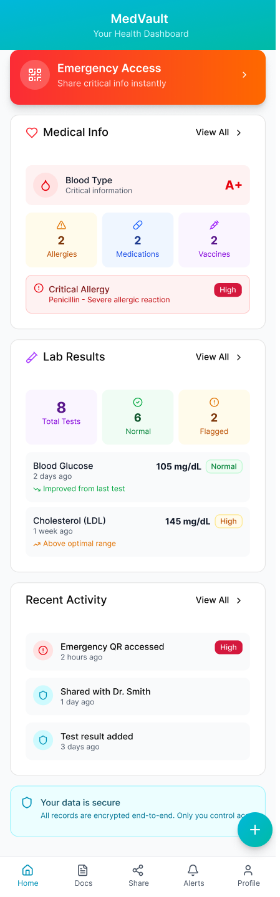

### Gestión de Información Médica

Similar al Dasboard, la pantalla tiene como objetivo mostrar de forma clara, ordenada y entendible toda la **información médica** relevante para el usuario, pudiendo acceder a cada sección de manera visual y rápida usando gestos de navegación intuitivos. La información general permite visualizar de un vistazo los datos más relevantes, mientras que cada sección específica (alergias, medicamentos, cirugías, etc.) se organiza en bloques para facilitar su consulta y actualización. Se ha priorizado la legibilidad y la jerarquía visual para que el usuario pueda encontrar rápidamente la información que necesita sin sentirse abrumado.

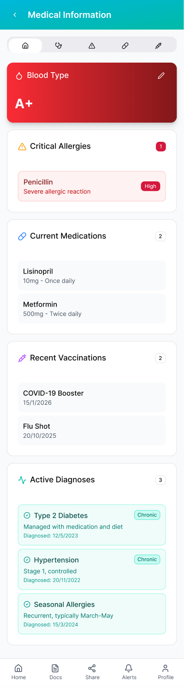

Las vistas de detalle (Diagnósticos, Alergias, Medicamentos, Vacunas) permiten al usuario gestionar cada uno de estos aspectos de su **historial médico** de forma específica, con opciones claras para añadir, editar o eliminar información. La estructura de cada sección se ha diseñado para ser coherente entre sí, facilitando la navegación y el aprendizaje del sistema. Además, se han incluido elementos visuales como iconos y colores para diferenciar cada tipo de información y mejorar la experiencia de usuario.

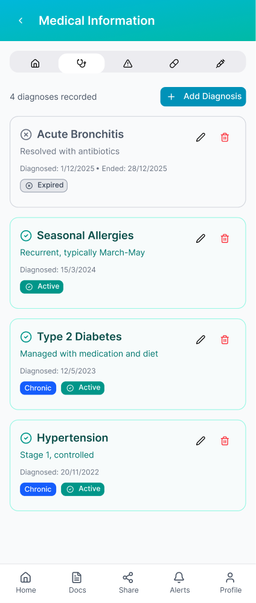

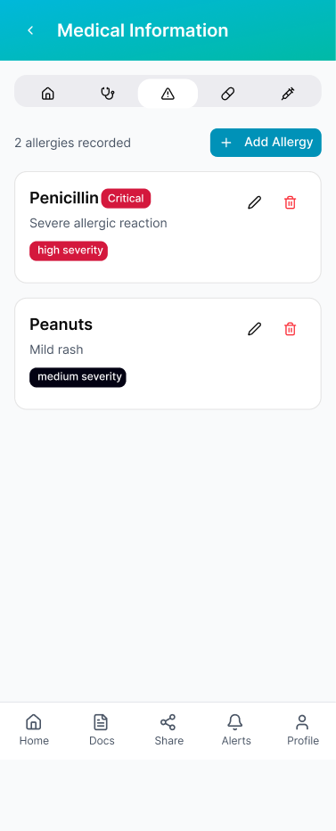

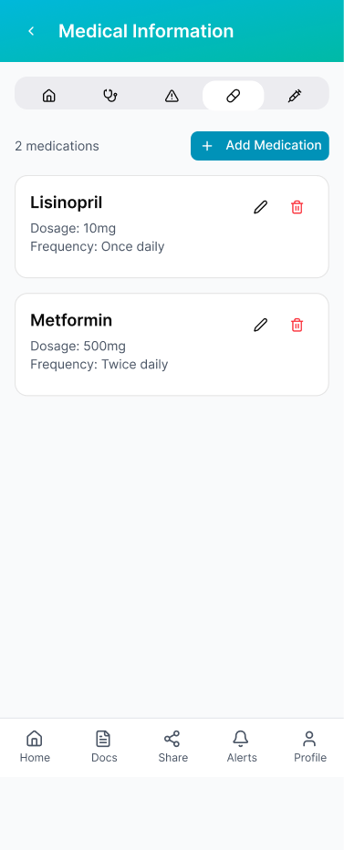

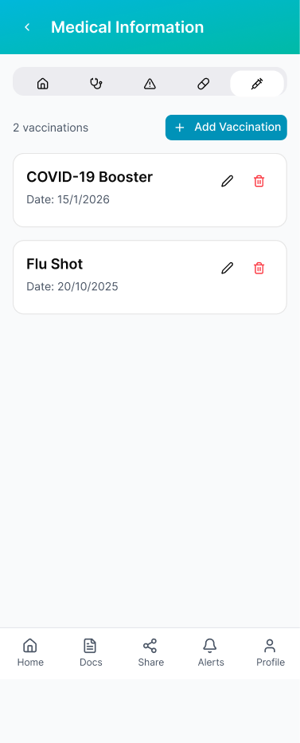

### Resultados de Laboratorio

La pantalla principal de resultados prioriza la visualización cronológica y el estado de cada dato analítico, con el objetivo de apoyar el seguimiento de evolución clínica. Esta estructura facilita detectar tendencias y cambios relevantes en el tiempo, que son clave para la preparación de consultas médicas.

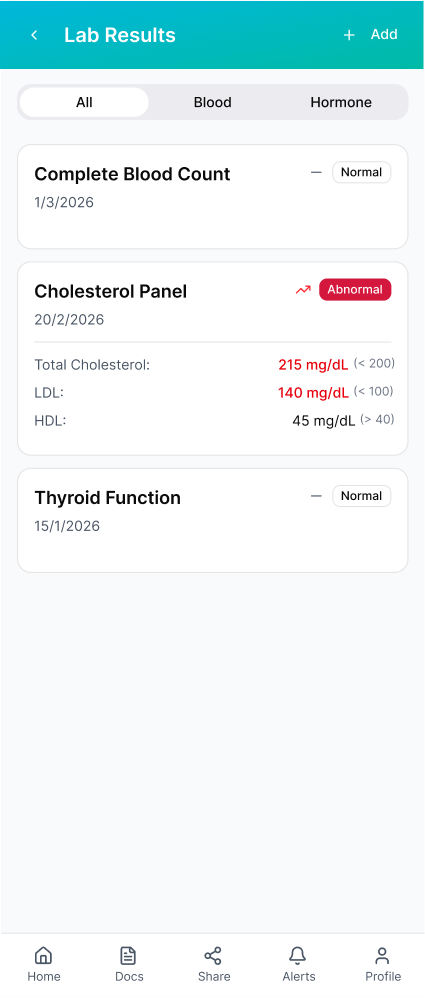

La selección de fuente de carga se incluyó para separar claramente los dos caminos de entrada de datos (manual y documento), mejorando comprensión del flujo y reduciendo ambigüedad. De este modo, el sistema adapta la experiencia a distintos perfiles de usuario según disponibilidad de documentación o preferencia de captura.

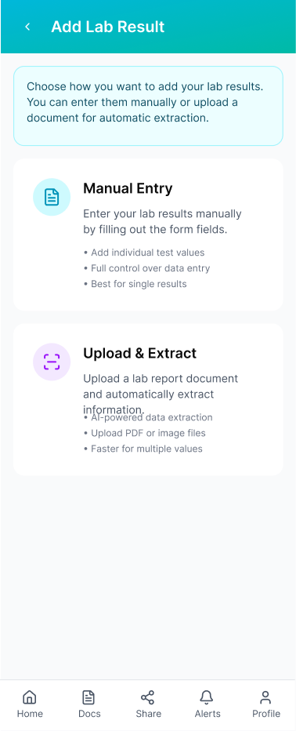

La pantalla de carga manual se diseñó para capturar valores, unidades e interpretación en un único flujo guiado, equilibrando detalle clínico y simplicidad de uso. También se planteó para minimizar errores de entrada mediante una secuencia ordenada de campos que replica la lógica habitual de un informe analítico.

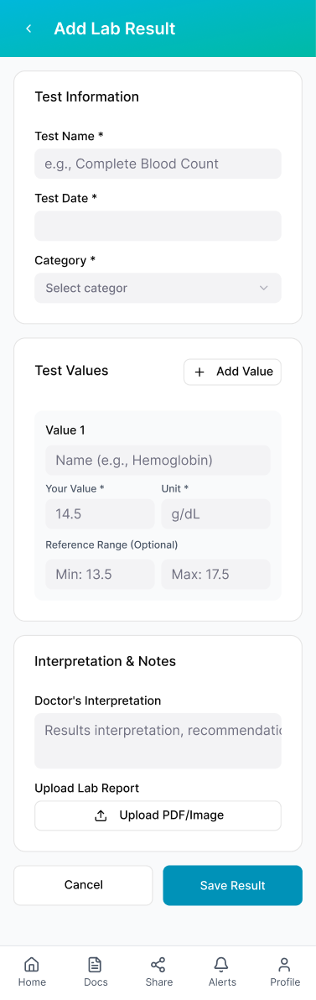

### Compartir Información Médica

Aparte del acceso rápido a la función de compartir desde el Dashboard, el usuario tambien podra acceder a esta función desde la sección de compartir. En este caso, se busca ofrecer una clara visualización de las opciones de compartición disponibles, las diferentes comparticiones activas y un acceso rapido para una mejor gestión de las mismas.

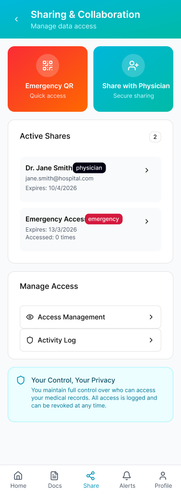

Aunque las funciones de compartir son muy similares entre sí, se han diseñado de forma diferenciada para enfatizar su uso en contextos distintos. La **compartición de emergencia** se ha diseñado para ser lo más rápida e intuitiva posible, con un enfoque en la activación inmediata y la selección de información crítica para situaciones de urgencia. En cambio, la compartición regular se ha diseñado para ofrecer un mayor control y personalización, permitiendo al usuario seleccionar con precisión qué información compartir y con quién.

Ademas, cabe destacar el acceso de ambas funciones es muy diferente. El sistema de emergencia busca agilidad pero **seguridad**, mientras que el sistema regular busca control y precisión, lo que se refleja en la estructura y diseño de cada pantalla.

Como podemos observar, los flujos difieren bastante entre sí cuando se configura el acceso:

- El sistema de emergencia se centra en la rapídez y poder compartir la información en cualquier momento, por eso, se ideo la opción del QR con contraseña, que permite compartir la información con una simple lectura del códico QR, pero a su vez, se ha incluido una capa de **seguridad** adicional con la contraseña para evitar accesos no autorizados.
- El sistema regular se centra en el control y la personalización, por eso, se ha diseñado para evitar accesos indebidos y siempre con una doble factor de verificación.

Otra gran diferencia entre ambos sistemas es alertar al usuario sobre como se comparte la información para evitar que compartan información sensible sin darse cuenta. En el caso de la **compartición de emergencia**, se ha incluido un mensaje claro que indica que la información compartida será accesible para cualquier persona que tenga el código QR y la contraseña, lo que refuerza la importancia de compartir esta información solo en situaciones de emergencia. En el caso de la compartición regular, se ha incluido un mensaje que indica que la información compartida solo será accesible para las personas específicas con las que se ha compartido, lo que refuerza la idea de control y personalización.

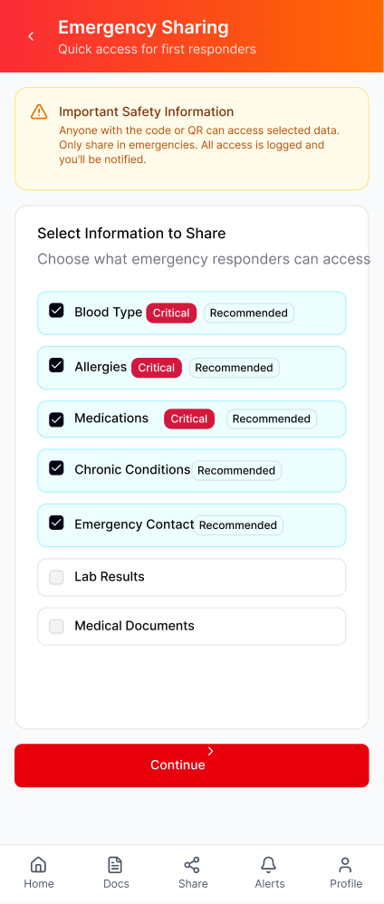

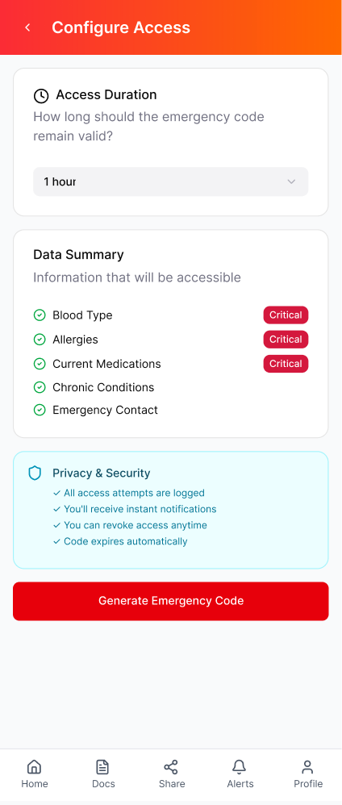

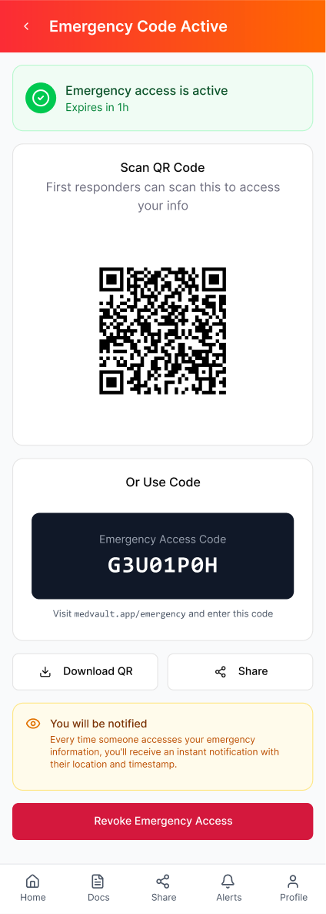

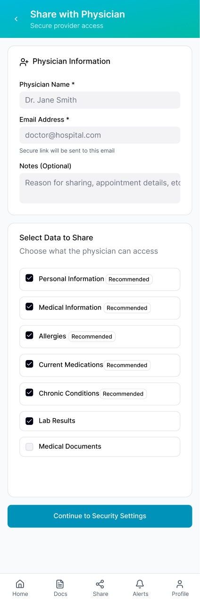

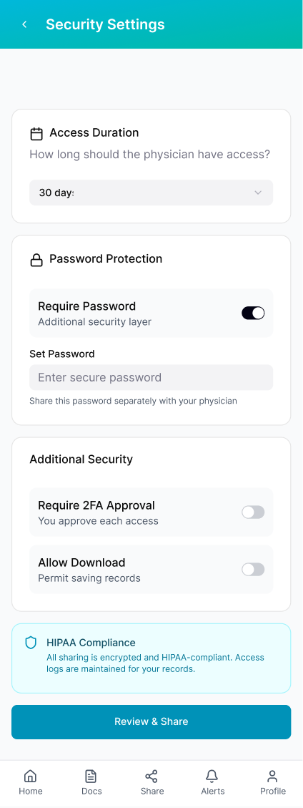

### Gestión de Documentos

Una base muy importante de la infomación médica hoy en dia, es la gestión documental, ya que muchos de los datos médicos se encuentran en documentos como informes médicos, resultados de pruebas, recetas, etc. Por eso, se ha diseñado una sección específica para la **gestión de documentos**, con el objetivo de facilitar la organización y acceso a estos documentos. La pantalla de **gestión de documentos** se ha diseñado para ofrecer una visualización clara y ordenada de los documentos, con opciones para añadir, editar o eliminar documentos de forma sencilla. Además, se ha incluido una función de búsqueda para facilitar la localización de documentos específicos, lo que mejora la experiencia de usuario.

Por otro lado, la **gestión de documentos** esconde una función innovadora que es la capacidad de extraer información relevante de los documentos mediante **inteligencia artificial**, permitiendo al usuario obtener un resumen de la información contenida en el documento (que a su vez permite hacer busquedas) y añadir esta información a su **historial médico** de forma rápida y sencilla, lo que mejora la utilidad de la aplicación y facilita la actualización constante de los datos del usuario.

Sobre la función de extracción de información y su complemento de añadir dicha información al **historial médico**, el sistema siempre debera mostrar un mensaje claro al usuario indicando que la información extraída es solo una interpretación de la **inteligencia artificial** y que el usuario debe revisar y confirmar la información antes de añadirla a su **historial médico**, para evitar errores o malentendidos.

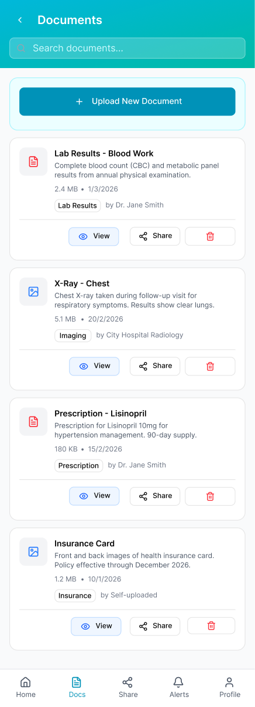

### Notificaciones y Alertas

Notificaciones y alertas son parte fundamental del desarrollo móvil y en el caso de **MedVault** son especialmente importantes para mantener al usuario siempre informado sobre el acceso a sus **información médica**. **MedVault** busca siempre la transparencia y que el usuario sepa en todo momento quien y porque se accede a su información aunque haya sido el o ella mismo quien ha compartido la información.

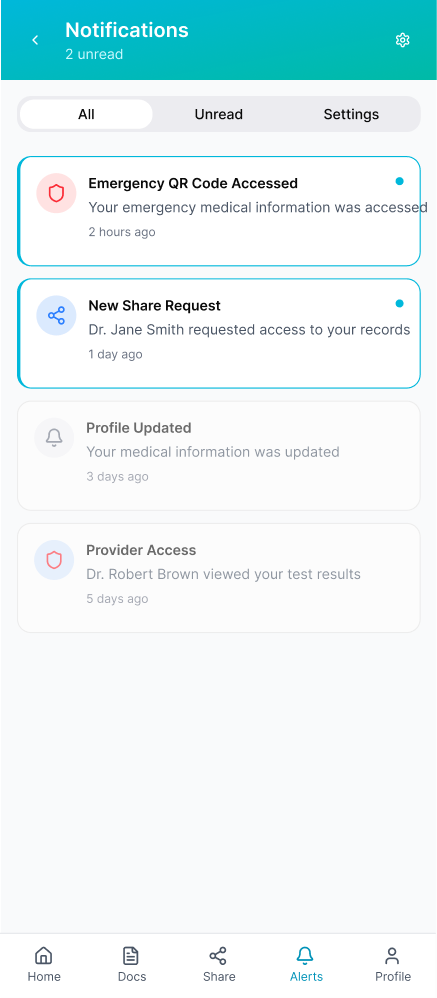

### Perfil, Contactos de Emergencia y Configuración

La pantalla de perfil concentra la información personal y accesos a configuración para simplificar la administración de identidad dentro de la aplicación. La intención es reducir dispersión de opciones y mantener en un único punto las acciones más habituales relacionadas con cuenta y datos personales.

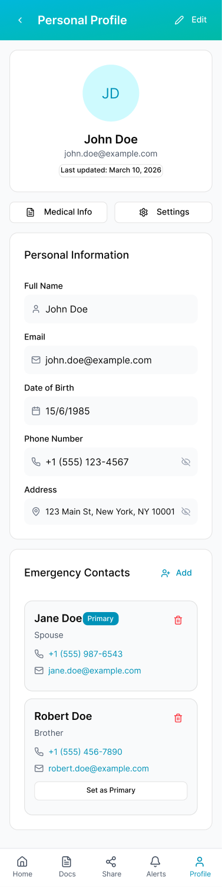

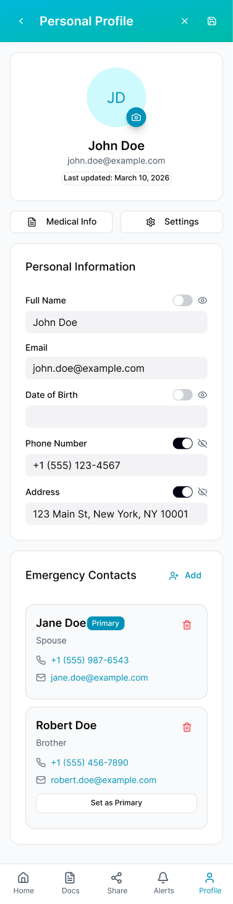

Los contactos de emergencia se han integrado dentro del perfil para facilitar su gestión y acceso, ya que es una información crítica que el usuario debe tener siempre a mano. La pantalla de contactos de emergencia se ha diseñado para ofrecer una visualización clara y ordenada de los contactos, con opciones para añadir, editar o eliminar contactos de forma sencilla. Además, se ha incluido una función de búsqueda para facilitar la localización de contactos específicos, lo que mejora la experiencia de usuario.

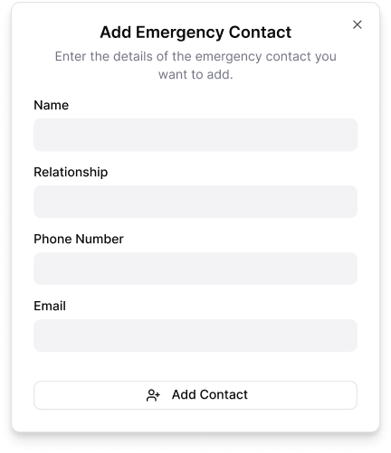

La pantalla de ajustes agrupa preferencias de cuenta, **privacidad** y **seguridad** para ofrecer una gestión centralizada de configuración y cumplimiento. Este enfoque reduce complejidad operativa y facilita que la persona usuaria revise periódicamente sus parámetros de protección y notificación.

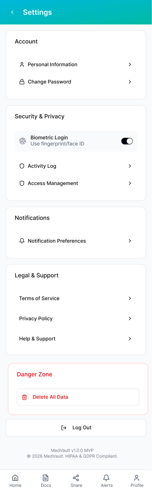

### Visíon General del Diseño

El siguiente diagrama muestra una visión general del diseño de la aplicación y la interconexión entre las diferentes pantallas y secciones de la aplicación, lo que permite visualizar de forma clara y ordenada la estructura de la aplicación y la navegación entre las diferentes secciones.

```mermaid
graph LR
    Login[Login] --> Onboarding
    Onboarding --> Dashboard
    Dashboard --> MedicalInfo[Medical Information]
    Dashboard --> LabResults[Lab Results]
    Dashboard --> Documents
    Dashboard --> Share
    Dashboard --> Alerts
    Dashboard --> Profile


    Share --> EmergencyShare[Emergency Sharing]
    Share --> RegularShare[Regular Sharing]

    MedicalInfo --> Diagnoses
    MedicalInfo --> Allergies
    MedicalInfo --> Medication
    MedicalInfo --> Vaccinations

    Profile --> EditProfile[Edit Profile]
    Profile --> EmergencyContacts[Emergency Contacts]
    Profile --> Settings[Settings]
    Profile --> MedicalInfo[Medical Information]

    style Login fill:#a8dadc
    style Onboarding fill:#a8dadc
    style Dashboard fill:#457b9d
    style MedicalInfo fill:#f1faee
    style LabResults fill:#f1faee
    style Documents fill:#f1faee
    style Share fill:#f1faee
    style Alerts fill:#f1faee
    style Profile fill:#f1faee
    style EmergencyShare fill:#f4a261
    style RegularShare fill:#f4a261
    style Diagnoses fill:#f1faee
    style Allergies fill:#f1faee
    style Medication fill:#f1faee
    style Vaccinations fill:#f1faee
    style EditProfile fill:#f1faee
    style EmergencyContacts fill:#f1faee
    style Settings fill:#f1faee

```

## 2.6. Arquitectura de la aplicación

Una vez vistos los casos de uso, el prototipado y la experiencia de usuario, es necesario definir la arquitectura de la aplicación, es decir, que componentes son necesarios para desarrollar la aplicación, como se comunican entre ellos y que tecnologías se van a utilizar para cada uno de ellos.

En este apartado vamos a profundizar en la arquitectura de la aplicación, definiendo los diferentes componentes y su función dentro de la aplicación, así como las tecnologías que se van a utilizar para cada uno de ellos.

A tener en cuenta, que la arquitectura de la aplicación es un aspecto fundamental para el desarrollo de la misma, ya que una buena arquitectura permite un desarrollo más eficiente, una mejor mantenibilidad y escalabilidad de la aplicación, así como una mejor experiencia de usuario y un mejor rendimiento de la aplicación. A su vez, es importante tener en cuenta que la arquitectura de la aplicación puede evolucionar a lo largo del tiempo, por lo que es importante mantener una mentalidad abierta a cambios y mejoras durante el proceso de desarrollo.

El sistema debe contar con los siguientes componentes:

**Aplicación móvil**

Es la interfaz de usuario de la aplicación y el principal punto de interacción del usuario, en este caso, principalmente sirve para alamacenar, gestionar y compartir la **información médica** del usuario, así como para recibir notificaciones y alertas. Su diseño es sumamente critico y debe ser intuitiva, facil de usuar, accesible y atractiva para el usuario, ya que es la cara visible de la aplicación y lo que va a determinar en gran medida la experiencia de usuario. Otro aspecto critico de la **aplicación móvil** es la **seguridad**, ya que se maneja **información médica** sensible, por lo que es fundamental implementar medidas de **seguridad** robustas para proteger los datos del usuario.

El desarrollo de la **aplicación móvil** se realizará mediante **Flutter**, un framework de desarrollo de aplicaciones móviles multiplataforma que permite desarrollar aplicaciones para iOS y Android con una sola base de código. **Flutter** se ha elegido por su capacidad para crear interfaces de usuario atractivas y personalizables, su rendimiento nativo y su amplia comunidad de desarrolladores. Además, **Flutter** es un framework de Google, lo que facilita la integración con servicios de Google y garantiza el buen rendimiento en dispositivos Android.

Por ultimo, cabe destacar, que esta primera versión de la **aplicación móvil** se desarrollará principalmente para Android, ya que el equipo presenta limitzaciones tecnicas que impiden el desarrollo para iOS, pero se tiene previsto que el desarrollo sea multiplataforma desde el inicio, por lo que se espera que en un futuro cercano se pueda lanzar una versión para iOS sin necesidad de realizar cambios significativos en la base de código.

Desde el punto de vista de arquitectura interna, se recomienda estructurar la app **Flutter** en capas (`presentation`, `domain`, `data`) para desacoplar la interfaz de usuario de la lógica de negocio y de las fuentes de datos. Esta separación facilita pruebas unitarias, reduce el impacto de cambios y permite evolucionar el producto por módulos funcionales (**autenticación**, perfil, **información médica**, documentos, compartición y alertas).

En términos de experiencia y disponibilidad, la aplicación debe seguir un enfoque `offline-first` para la información crítica del usuario:

- Caché local cifrada para datos esenciales (alergias, medicación, diagnósticos activos, grupo sanguíneo y contactos de emergencia).
- El dispositivo debe ser el principal almacén de la **información médica** del usuario y solo en caso autorizado se debe sincronizar con el backend, manteniendo la información accesible incluso sin conexión.
- Cola local de cambios pendientes cuando no hay conectividad, con sincronización automática al recuperar red.
- Estrategia de resolución de conflictos simple y explícita (prioridad al dato más reciente confirmado por el usuario).
- Indicadores de estado de sincronización visibles para mantener transparencia y confianza.

La **seguridad** en dispositivo es un pilar de la arquitectura móvil y debe contemplar:

- Almacenamiento seguro de credenciales y tokens (`Keychain`/`Keystore`) mediante librerías seguras de **Flutter**.
- Bloqueo de sesión por inactividad y reautenticación biométrica en acciones sensibles.
- Protección contra capturas de pantalla en vistas de alta sensibilidad, cuando el sistema operativo lo permita.
- Evitar persistir **datos clínicos** en logs locales o mensajes de error visibles.
- Cifrado de datos sensibles a nivel de aplicación, incluso en caché local, para mitigar riesgos en caso de acceso no autorizado al dispositivo.
- Uso de SQLCipher o similar para cifrar la base de datos local, garantizando que los **datos clínicos** almacenados en el dispositivo estén protegidos incluso si el dispositivo es comprometido.

Para garantizar mantenibilidad y calidad, se propone una pirámide de pruebas móvil:

- Pruebas unitarias de casos de uso y validaciones de dominio.
- Pruebas de widget para estados críticos de interfaz (carga, vacío, error, éxito).
- Pruebas de integración sobre flujos clave: login, alta/edición de datos médicos, carga de documentos y **compartición de emergencia**.

**MedVault API Rest para la gestión de usuarios, **autenticación** y gestión de datos**

Esta API será el backend principal del sistema y se implementará con **ASP.NET Core Web API** (preferiblemente en **.NET** 10 LTS o superior), siguiendo una arquitectura por capas (`API`, `Application`, `Domain`, `Infrastructure`) para separar responsabilidades y facilitar pruebas, mantenimiento y evolución.

Responsabilidades principales:

- Gestión de identidad y sesión: login con Google, emisión de `JWT access token` y `refresh token`, revocación de sesión y cierre de sesión remoto.
- Gestión de perfil y **datos clínicos** estructurados: alergias, medicación, diagnósticos, vacunas, analíticas y contactos de emergencia.
- Gestión de compartición segura: enlaces temporales, compartición por profesional y control de permisos por alcance.
- Trazabilidad y auditoría: registro de accesos, cambios de datos y eventos de **seguridad** para cumplimiento normativo.

Decisiones arquitectónicas recomendadas:

- `DDD` para organizar el dominió funcional y CQS para separar comandos de consultas.
- **Autenticación** federada con Google + **autorización** basada en `claims` y políticas.
- Validación de entrada robusta (`FluentValidation`) y control de versiones de API (`/api/v1`).
- Persistencia con `Entity Framework Core` y patrón repositorio solo cuando aporte valor real.
- Hardening de **seguridad**: cifrado en tránsito (`TLS`), secretos fuera de código y limitación de tasa en endpoints sensibles.
- Identity Service para gestión de usuarios y **autenticación**, con integración de Google Sign-In y emisión de tokens JWT.

**API Rest para la extracción de información de documentos médicos mediante inteligencia artificial**

Dado que el procesamiento documental tiene cargas y ciclos distintos al core transaccional, se recomienda una **API desacoplada** (servicio independiente) especializada en ingesta y extracción de información clínica.

Flujo propuesto:

1. El usuario sube un PDF/imagen desde la app.
2. El servicio de IA ejecuta OCR y extracción semántica de entidades médicas (medicación, diagnósticos, fechas, valores analíticos).
3. Se genera un resultado estructurado con nivel de confianza por campo.
4. El cliente muestra propuesta de datos para revisión humana antes de consolidar en historial clínico.

Implementación recomendada:

- API en **.NET** Core.
- Integración con servicios de OCR/documentos e interpretación médica asistida por IA.
- Versionado del esquema de extracción para poder re-procesar documentos sin romper compatibilidad.
- Regla de negocio obligatoria: **nunca** persistir automáticamente información clínica extraída sin confirmación explícita del usuario.

**Base de datos para el almacenamiento de la **información médica** del usuario**

Para el MVP, se recomienda una base de datos relacional robusta como **PostgreSQL** (o SQL Server equivalente), por consistencia transaccional, facilidad de auditoría y modelado de relaciones clínicas.

Modelo lógico mínimo:

- `users`, `profiles`, `emergency_contacts`
- `Sharing Configurations` and `Sharing Access Logs` para trazabilidad de compartición.
- `Encrypted Sharing Medical Information` para almacenar **datos clínicos** sensibles con cifrado a nivel de aplicación.

Prácticas clave de **seguridad** y cumplimiento:

- Cifrado en reposo y en tránsito.
- Separación entre datos identificativos y **datos clínicos** para reducir exposición.
- Campos sensibles cifrados a nivel de aplicación cuando aplique.
- Estrategia de copias de **seguridad**, retención y restauración probada periódicamente.
- Política de trazabilidad de cambios para cumplir requisitos de auditoría.

**Firebase para la gestión de notificaciones push**

El canal push se implementará mediante **Firebase Cloud Messaging (FCM)**, con backend **.NET** como emisor central de eventos. **Flutter** integrará SDK de **Firebase** para recibir notificaciones y gestionar permisos.

Eventos de notificación prioritarios del MVP:

- Acceso a información compartida.
- Apertura de enlaces de compartición temporal.
- Revocación o expiración de permisos.
- Alertas de **seguridad** (intentos fallidos de acceso).

Buenas prácticas de implementación:

- Registro y rotación de `device tokens` por usuario/dispositivo.
- Envío idempotente y trazabilidad de notificaciones emitidas.
- Segmentación por tipo de evento y preferencias del usuario.
- Contenido mínimo en push (sin exponer **datos clínicos** sensibles en texto plano).

**ASP.NET Core para el acceso a la compartición de **información médica** a través de la web**

La experiencia web orientada a **profesionales sanitarios** se implementará con **ASP.NET Core** (Razor Pages/MVC con renderizado del lado servidor), consumiendo endpoints específicos de compartición (scope limitado y expiración temporal). El objetivo no es replicar toda la app móvil, sino ofrecer una vista rápida, segura y contextual para consulta clínica.

Decisión arquitectónica frente a un framework cliente como Angular:

- Se prioriza el `server-side rendering` para reducir el tiempo de primera visualización en contextos críticos (consulta y emergencias).
- Se reduce complejidad operativa al evitar un runtime adicional de frontend y la capa de hidratación cliente para el MVP.
- Se mejora la trazabilidad y el control de **seguridad** al resolver **autenticación**, **autorización** y expiración de acceso principalmente en servidor.
- Se mantiene la opción de evolucionar a un frontend cliente más rico (Angular) en fases futuras si la interacción web aumenta de forma significativa.

Características principales:

- Acceso por enlace temporal seguro o QR con validación adicional según configuración.
- Interfaz de lectura optimizada para consulta en menos de 1 minuto (prioridad emergencias).
- Visualización de datos críticos en primer nivel: alergias, medicación activa, diagnósticos relevantes, grupo sanguíneo y contactos de emergencia.
- Registro automático de accesos y notificación al titular.

Controles de **seguridad** recomendados:

- Políticas de **autorización** por enlace/token, expiración estricta de sesión web y protección de sesiones.
- Descarga de PDF bajo permiso explícito del enlace.
- Marca visible de fecha/hora de última actualización para mejorar confianza clínica.

**Docker para contenerización y despliegue de servicios**

Docker se utilizará como base para estandarizar el ciclo de desarrollo, pruebas y despliegue, garantizando que los servicios se ejecuten de forma consistente en cualquier entorno (local, integración y producción).

Estrategia propuesta:

- Contenedores independientes por componente: `MedVault.API`, `MedVault.Document.API` y web de compartición en **ASP.NET Core**.
- Construcción mediante `multi-stage builds` en imágenes **.NET** para reducir tamaño final y superficie de ataque.
- Uso de `docker-compose` para orquestación local de servicios y dependencias.
- Separación de configuración por entorno usando variables de entorno y archivos `.env` (sin secretos en repositorio).

Aplicación al estado actual del proyecto:

- Se aprovecha la estructura existente en `devops/docker/`, incluyendo `docker-compose.yml` y Dockerfiles específicos para API principal, API documental y web compartida.
- Se recomienda mantener una convención homogénea de puertos, nombres de servicio y redes internas para facilitar observabilidad y troubleshooting.
- El `docker-compose` de desarrollo debe incluir perfiles para ejecutar solo los servicios necesarios según el flujo (por ejemplo, solo backend o backend + web).

Buenas prácticas de **seguridad** y operación:

- Ejecutar contenedores con usuario no root siempre que sea viable.
- Definir `healthchecks` para que la orquestación detecte servicios no saludables.
- Minimizar dependencias del sistema base y aplicar actualización periódica de imágenes.
- Publicar imágenes versionadas (tag semántico + hash de commit) para trazabilidad de despliegues.

Integración con CI/CD:

- Pipeline automatizado para construir, analizar vulnerabilidades y publicar imágenes en registro de contenedores.
- Promoción de la misma imagen entre `dev`, `staging` y `prod`, cambiando únicamente configuración externa.
- Rollback rápido usando tags inmutables.

Con esta estrategia, Docker actúa como capa de portabilidad y control operativo, facilitando una evolución progresiva desde ejecución local con `docker-compose` hasta despliegue gestionado en Azure Container Apps o App Service for Containers.

**Azure o similar para el alojamiento de la aplicación**

Para una primera versión profesional y escalable, se propone **Azure** como plataforma principal de despliegue:

- **Backend APIs (**.NET**):** Azure App Service o Azure Container Apps.
- **Base de datos:** Azure Database for **PostgreSQL** (Flexible Server).
- **Documentos médicos:** Azure Blob Storage con acceso privado por `SAS` de corta duración.
- **Gestión de secretos:** Azure Key Vault.
- **Monitorización:** Application Insights + Log Analytics.
- **Entrega web de compartición (**ASP.NET Core**):** Azure App Service o Azure Container Apps.

Arquitectura operativa recomendada:

- Entornos separados (`dev`, `staging`, `prod`) con configuración independiente.
- `CI/CD` automatizado (GitHub Actions o Azure DevOps) con despliegues trazables.

Alternativa equivalente fuera de Azure: `AWS` o `GCP` manteniendo la misma separación de servicios (API transaccional, API IA, almacenamiento seguro, observabilidad y gestión de secretos).

**Github Actions para la integración continua y despliegue continuo (CI/CD)**

Se recomienda utilizar **GitHub Actions** para automatizar el ciclo de vida de desarrollo, pruebas y despliegue, garantizando que cada cambio en el código pase por un proceso riguroso de validación antes de llegar a producción.

Flujos de trabajo propuestos:

- `build-and-test`: se ejecuta en cada push o pull request, compilando el código, ejecutando pruebas unitarias y de integración, y analizando la calidad del código.
- `docker-build-and-push`: se ejecuta tras un merge a `main` o al crear una release, construyendo las imágenes Docker y publicándolas en un registro de contenedores (Docker Hub, Azure Container Registry, etc.).
- `deploy-to-azure`: se ejecuta tras la publicación de imágenes, desplegando automáticamente a Azure App Service o Container Apps según el entorno (staging o producción).

Buenas prácticas:

- Uso de secretos de GitHub para almacenar credenciales de despliegue y acceso a servicios.
- Versionado semántico de imágenes Docker para trazabilidad.
- Notificaciones en caso de fallos en el pipeline para rápida respuesta del equipo.
- Revisión de pull requests para asegurar calidad y cumplimiento de estándares antes de mergear a `main`.
- Conveciones de nomenclatura de ramas y commits para facilitar seguimiento de cambios y generación de changelogs.

### Resumen de la arquitectura propuesta

Diagrama de arquitectura de alto nivel:

```mermaid
flowchart LR

%% =======================
%% GROUPS
%% =======================

subgraph USERS["Usuarios (Internet)"]
    patient[Paciente / Titular]
    hcp[Profesional sanitario]
end

subgraph CLIENT[Cliente]
    mobile[App móvil Flutter]
    cache[(Cache local cifrada SQLCipher)]
    fcm[Firebase Cloud Messaging]
end

subgraph BACKEND[Backend MedVault en Azure]
    api[MedVault.API ASP.NET Core]
    docapi[MedVault.Document.API ASP.NET Core]
    web[Web ASP Net de compartición]
end

subgraph OPS[Operación, observabilidad y entrega]
    docker[Docker / Docker Compose]
    cicd[GitHub Actions CI/CD]
    monitor[Application Insights + Log Analytics]
    env[Entornos: dev / staging / prod]
    alt[Alternativa: AWS o GCP]
end

subgraph DATASEC[Datos y seguridad]
    db[(PostgreSQL / SQL Server)]
    kv[Key Vault]
    audit[Logs de acceso y auditoría]
end


%% =======================
%% RELATIONSHIPS
%% =======================

patient --> mobile
hcp --> web

mobile --> api
mobile --> docapi
web --> api
api --> docapi

mobile --> cache

api --> db
docapi --> db

api --> audit
docapi --> audit

api --> kv
docapi --> kv

api --> fcm
fcm --> mobile
fcm --> web

cicd --> docker
docker --> env
cicd --> env

api --> monitor
docapi --> monitor
web --> monitor

env --> alt

style USERS fill:#a8dadc,stroke:#333,stroke-width:1px
style CLIENT fill:#f1faee,stroke:#333,stroke-width:1px
style BACKEND fill:#457b9d,stroke:#333,stroke-width:1px
style OPS fill:#f4a261,stroke:#333,stroke-width:1px
style DATASEC fill:#e76f51,stroke:#333,stroke-width:1px

```

### ADR (Architectural Decision Records)

| ADR     | Decisión                                                  | Justificación                                                                                                                                                                                              |
| ------- | --------------------------------------------------------- | ---------------------------------------------------------------------------------------------------------------------------------------------------------------------------------------------------------- |
| ADR-001 | Uso de **Flutter** para desarrollo móvil                  | Permite desarrollo multiplataforma con una sola base de código, excelente rendimiento nativo y amplia comunidad.                                                                                           |
| ADR-002 | **.Net** Core para backend                                | Framework robusto, maduro y con buenas prácticas para APIs REST, además de integración nativa con Azure y con alta experiencia por parte del equipo de desarrollo.                                         |
| ADR-003 | API separada para extracción de información de documentos | Permite desacoplar el procesamiento documental (cargas y ciclos distintos) del core transaccional, facilitando escalabilidad y mantenimiento.                                                              |
| ADR-004 | ASP **.NET** Core para experiencia web de compartición    | Prioriza `server-side rendering` para reducir tiempo de visualización en contextos críticos y mejora control de **seguridad** al resolver **autenticación** y **autorización** principalmente en servidor. |
| ADR-005 | SQLCipher para cifrado de base de datos local             | Proporciona cifrado a nivel de aplicación para **datos clínicos** sensibles almacenados en dispositivo, mitigando riesgos en caso de acceso no autorizado.                                                 |
| ADR-006 | Docker para contenerización                               | Estandariza el ciclo de desarrollo, pruebas y despliegue, garantizando consistencia en cualquier entorno y facilitando la evolución hacia despliegues gestionados en Azure.                                |
| ADR-007 | Azure para alojamiento                                    | Ofrece servicios gestionados para APIs, base de datos, almacenamiento seguro y monitorización, facilitando una primera versión profesional y escalable.                                                    |
| ADR-008 | GitHub Actions para CI/CD                                 | Permite automatizar el ciclo de vida de desarrollo, pruebas y despliegue con integración nativa en el repositorio y trazabilidad de cambios.                                                               |
