# MedVault — User Interaction Workflows (EN)

Source: `MedVault.make` design and mockups exported in `docs/PEC/PEC2/Mockups`.

## 1. Authentication (Login with Google)

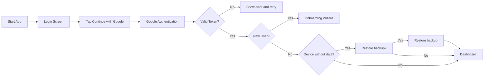

1. The person opens the application and sees the login screen.
2. Taps `Continue with Google`.
3. Completes Google authentication.
4. The system validates the session token.
5. If it fails, an error is shown and a retry is allowed.
6. If the token is valid, the system decides if the user is new or existing.
7. New user: enters onboarding.
8. Existing user: system verifies if the device has data.
   - If there is no data, it asks if the user wants to restore a backup.
   - If there is data or the backup is restored, the user accesses the dashboard.

## 2. Initial Setup (Onboarding 1→5)

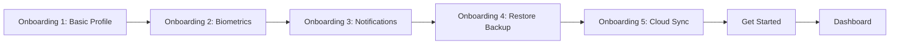

1. Requested to complete basic profile data.
2. Offered to enable biometric authentication.
3. Notification preferences are configured.
4. Proposed to restore a backup (file or cloud) or continue manually.
5. Offered to enable cloud synchronization.
6. The person confirms with `Get Started`.
7. The system redirects to the dashboard.

## 3. Main Navigation from Dashboard

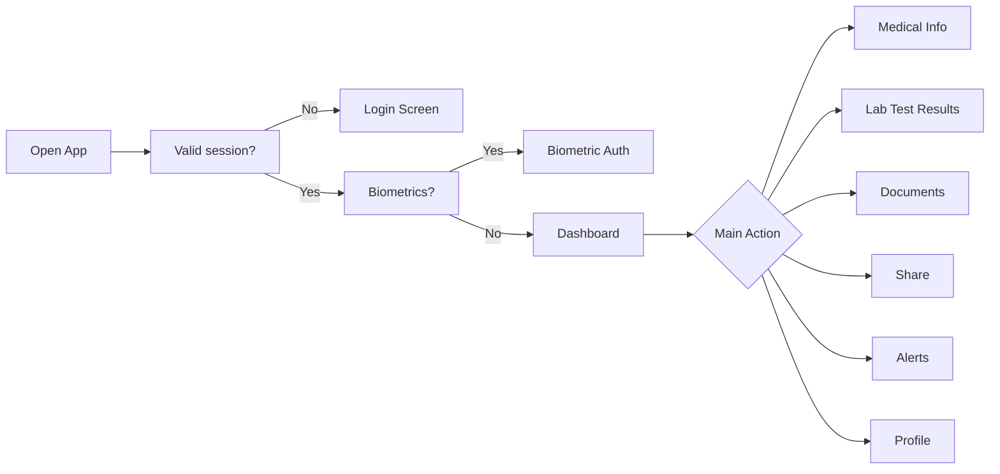

1. The person opens the app.
2. The system verifies if the session is valid.
3. If not valid, the login screen is shown.
4. If valid, it verifies if biometrics are enabled.
5. If biometrics are enabled, biometric authentication is requested.
6. If biometrics are not enabled or authentication is successful, the dashboard is accessed.
7. The person reaches the main dashboard.
8. Reviews a summarized medical status and recent activity.
9. Uses cards or the bottom bar to navigate.
10. Can enter `Medical Info` for clinical data.
11. Can enter `Lab Test Results` for analytics.
12. Can enter `Documents` for documentation.
13. Can enter `Share`, `Alerts`, or `Profile` depending on the objective.

## 4. Medical Information Management

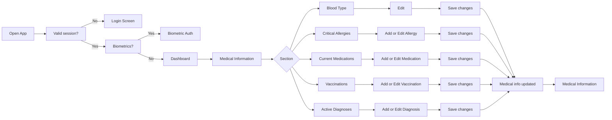

1. The person opens the app.
2. The system verifies if the session is valid.
3. If not valid, the login screen is shown.
4. If valid, it verifies if biometrics are enabled.
5. If biometrics are enabled, biometric authentication is requested.
6. If biometrics are not enabled or authentication is successful, the dashboard is accessed.
7. The person reaches the main dashboard.
8. The person enters `Medical Information`.
9. Selects a section: `Blood Type`, `Critical Allergies`, `Current Medications`, `Vaccinations`, or `Active Diagnoses`.
10. In `Blood Type`, `Critical Allergies`, `Current Medications`, or `Vaccinations`, they edit the information and save changes.
11. In `Active Diagnoses`, they can edit, delete, or add a diagnosis and then save changes.
12. The system shows `Medical info updated`.
13. The view returns to `Medical Information` with the updated data.

## 5. Lab Test Results Management

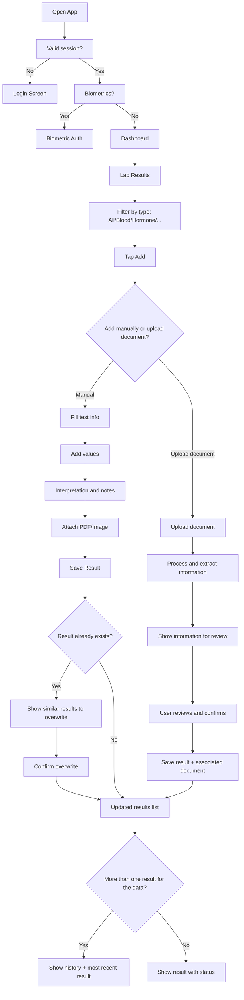

1. The person opens the app.
2. The system verifies if the session is valid.
3. If not valid, the login screen is shown.
4. If valid, it verifies if biometrics are enabled.
5. If biometrics are enabled, biometric authentication is requested.
6. If biometrics are not enabled or authentication is successful, the dashboard is accessed.
7. The person reaches the main dashboard.
8. The person enters `Lab Results`.
9. They can filter by type (All/Blood/Hormone/...).
10. Taps `Add` to create a new result.
11. The user can choose between adding a result manually or uploading a document to extract information.
12. If they choose to add manually:
    1. Fills in name, date, and category.
    2. Adds laboratory values and units.
    3. Adds interpretation/notes and attaches a document.
    4. Saves the result.
       - If the result already exists, an option showing similar results that will be overwritten is provided.
13. If they choose to upload a document, the system extracts the relevant information and shows it for review before saving.
    1. The system processes the document, extracts relevant info, and displays it for review.
    2. The user reviews and confirms the extracted information.
    3. The system saves the result and the associated document.
14. The system shows it in the list with its status.
15. If the data has more than one result, history and the most recent result are shown in the main view.

## 6. Document Management

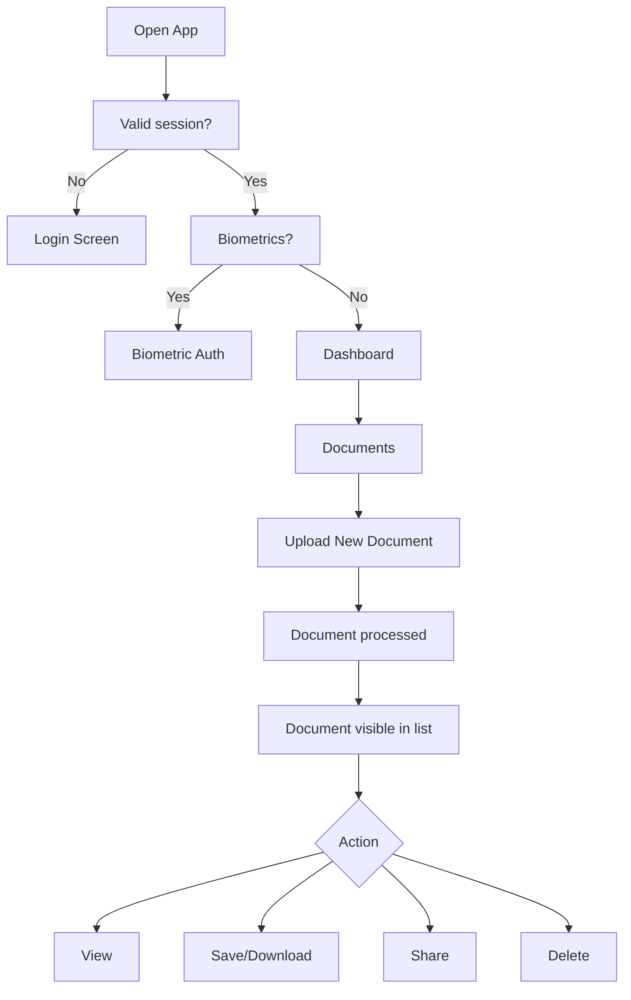

1. The person opens the app.
2. The system verifies if the session is valid.
3. If not valid, the login screen is shown.
4. If valid, it verifies if biometrics are enabled.
5. If biometrics are enabled, biometric authentication is requested.
6. If biometrics are not enabled or authentication is successful, the dashboard is accessed.
7. The person reaches the main dashboard.
8. The person opens `Documents`.
9. Uploads a new medical document.
10. The system asks the user if they want to process the document to extract information or just upload it as a file.
    1. If the user chooses to process the document, the system indexes it and extracts relevant information to display on the document details view.
    2. The system offers the user the option to add the extracted information to their medical profile.
11. The system indexes it and shows it in the list.
12. They can search by text.
13. For each document, they can view, download/save, share, or delete it.
14. If deleted, the system confirms and removes the document from the list.

## 7. Profile and Emergency Contacts

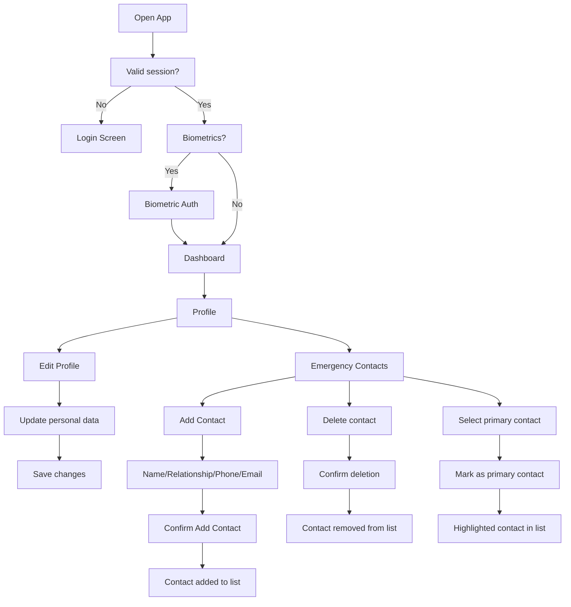

1. The person opens the app.
2. The system verifies if the session is valid.
3. If not valid, the login screen is shown.
4. If valid, it verifies if biometrics are enabled.
5. If biometrics are enabled, biometric authentication is requested.
6. If biometrics are not enabled or authentication is successful, the dashboard is accessed.
7. The person reaches the main dashboard.
8. The person enters `Profile`.
9. They can edit their personal information.
10. Saves profile changes.
11. Within the `Profile` section, they can consult their emergency contacts.
12. The user can add an emergency contact by pressing `Add`.
13. Completes name, relationship, phone, and email.
14. Confirms with `Add Contact`.
15. The new contact appears in the list.
16. The user can delete emergency contacts from the list.
17. If a contact is deleted, the system confirms and removes them from the list.
18. The user can select an emergency contact as the primary emergency contact; the system marks it as primary and highlights it in the list.

## 8. Alerts and Notification Preferences

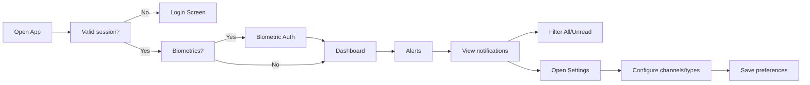

1. The person opens the app.
2. The system verifies if the session is valid.
3. If not valid, the login screen is shown.
4. If valid, it verifies if biometrics are enabled.
5. If biometrics are enabled, biometric authentication is requested.
6. If biometrics are not enabled or authentication is successful, the dashboard is accessed.
7. The person reaches the main dashboard.
8. The person accesses `Alerts`.
9. Consults access and activity events.
10. Filters by `All` or `Unread`.
11. Enters notification settings.
12. Toggles reception preferences on/off.
13. The system saves the configuration.

## 9. Sharing with Healthcare Professional (Regular Sharing)

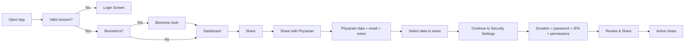

1. The person opens the app.
2. The system verifies if the session is valid.
3. If not valid, the login screen is shown.
4. If valid, it verifies if biometrics are enabled.
5. If biometrics are enabled, biometric authentication is requested.
6. If biometrics are not enabled or authentication is successful, the dashboard is accessed.
7. The person reaches the main dashboard.
8. The person enters `Share` and selects `Share with Physician`.
9. Enters the physician's information (name, email, notes).
10. Chooses what medical information to share.
11. Proceeds to `Security Settings`.
12. Configures duration, password, 2FA, and download permissions.
13. Reviews and confirms the share.
14. The system creates secure temporary access and logs it in activity.

### 9.1 Professional Access Flow

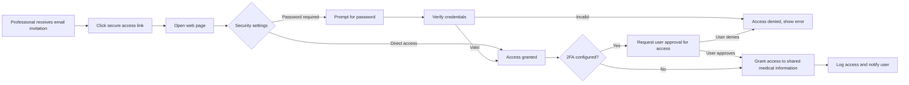

1. The healthcare professional receives an access invitation by email.
2. The professional clicks the secure access link.
3. The system shows a web page, and depending on security settings, grants direct access or prompts for a password.
4. The system verifies credentials and access permissions.
5. If 2FA is configured, it requests the user to approve the access attempt by the professional.
6. Once the user approves, the system grants access to the shared medical information.
7. The system logs the access and notifies the user.

## 10. Emergency Sharing (QR/Code)

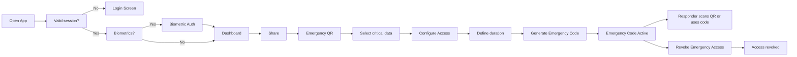

1. The person opens the app.
2. The system verifies if the session is valid.
3. If not valid, the login screen is shown.
4. If valid, it verifies if biometrics are enabled.
5. If biometrics are enabled, biometric authentication is requested.
6. If biometrics are not enabled or authentication is successful, the dashboard is accessed.
7. The person reaches the main dashboard.
8. The person enters `Share` and selects `Emergency QR`.
9. Selects the critical information for emergencies.
10. Configures access duration and security conditions.
11. Generates emergency code/QR.
12. The system shows the status as `Emergency Code Active`.
13. The emergency professional accesses via QR or code.
14. Accesses are logged and the user is notified.
15. If necessary, the user can revoke access immediately.

### 10.1. Emergency QR Access Flow

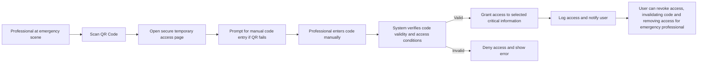

1. The emergency professional scans the QR code.
2. The system opens the default browser and redirects to a secure temporary access page.
3. The system prompts the professional to manually enter the emergency code (if scanning the QR fails).
4. The professional enters the code manually.
5. The system verifies the validity of the code and access conditions.
6. If the code is valid, access to the selected critical information is granted.
7. The system logs the access and notifies the user.
8. The user can revoke access at any time, invalidating the code and revoking access for the emergency professional.

## 11. Settings & Privacy

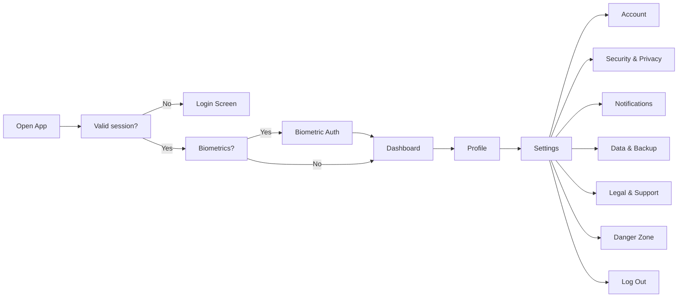

1. The person opens the app.
2. The system verifies if the session is valid.
3. If not valid, the login screen is shown.
4. If valid, it verifies if biometrics are enabled.
5. If biometrics are enabled, biometric authentication is requested.
6. If biometrics are not enabled or authentication is successful, the dashboard is accessed.
7. The person reaches the main dashboard.
8. The person enters `Profile` and then `Settings`.
9. Manages account options and credentials.
10. Adjusts security, biometrics, logs, and access management.
11. Reviews notification preferences.
12. Manages data backup/export.
13. Consults legal information and support.
14. Can delete data or log out.
