# MedVault — Flujos de interacción de usuario (ES)

Fuente: diseño `MedVault.make` y mockups exportados en `docs/PEC/PEC2/Mockups`.

## 1. Autenticación (Login con Google)

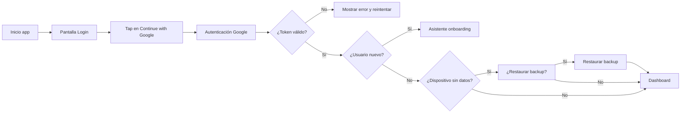

1. La persona abre la aplicación y ve la pantalla de login.
2. Pulsa `Continue with Google`.
3. Completa la autenticación en Google.
4. El sistema valida el token de sesión.
5. Si falla, se muestra error y se permite reintento.
6. Si el token es válido, el sistema decide si es usuario nuevo o existente.
7. Usuario nuevo: entra al onboarding.
8. Usuario existente: se verifica si el dispositivo tiene datos.
   - Si no hay datos, se pregunta si desea restaurar un backup.
   - Si hay datos o se restaura el backup, se accede al dashboard.

## 2. Configuración inicial (Onboarding 1→5)

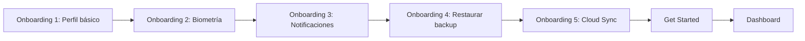

1. Se solicita completar datos básicos del perfil.
2. Se ofrece activar autenticación biométrica.
3. Se configuran preferencias de notificaciones.
4. Se propone restaurar backup (archivo o nube) o continuar manualmente.
5. Se ofrece activar sincronización en la nube.
6. La persona confirma con `Get Started`.
7. El sistema redirige al dashboard.

## 3. Navegación principal desde Dashboard

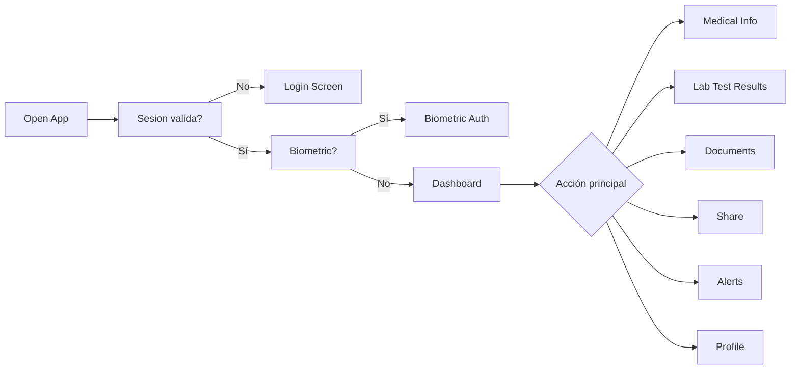

1. La persona abre la app.
2. El sistema verifica si la sesión es válida.
3. Si no es válida, se muestra pantalla de login.
4. Si es válida, se verifica si la biometría está activada.
5. Si la biometría está activada, se solicita autenticación biométrica.
6. Si la biometría no está activada o se autentica correctamente, se accede al dashboard.
7. La persona llega al dashboard principal.
8. Revisa estado médico resumido y actividad reciente.
9. Usa tarjetas o barra inferior para navegar.
10. Puede entrar en `Medical Info` para datos clínicos.
11. Puede entrar en `Lab Test Results` para analíticas.
12. Puede entrar en `Documents` para documentación.
13. Puede entrar en `Share`, `Alerts` o `Profile` según objetivo.

## 4. Gestión de información médica

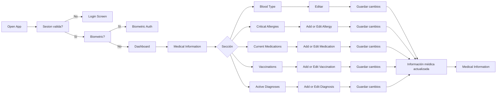

1. La persona abre la app.
2. El sistema verifica si la sesión es válida.
3. Si no es válida, se muestra pantalla de login.
4. Si es válida, se verifica si la biometría está activada.
5. Si la biometría está activada, se solicita autenticación biométrica.
6. Si la biometría no está activada o se autentica correctamente, se accede al dashboard.
7. La persona llega al dashboard principal.
8. La persona entra en `Medical Information`.
9. Selecciona una sección: `Blood Type`, `Critical Allergies`, `Current Medications`, `Vaccinations` o `Active Diagnoses`.
10. En `Blood Type`, `Critical Allergies`, `Current Medications` o `Vaccinations`, edita la información y guarda cambios.
11. En `Active Diagnoses`, puede editar, borrar o añadir diagnóstico y luego guardar cambios.
12. El sistema muestra `Información médica actualizada`.
13. La vista vuelve a `Medical Information` con los datos actualizados.

## 5. Gestión de resultados de pruebas

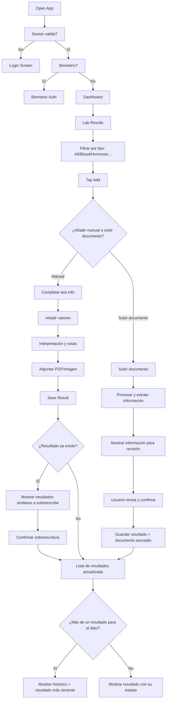

1. La persona abre la app.
2. El sistema verifica si la sesión es válida.
3. Si no es válida, se muestra pantalla de login.
4. Si es válida, se verifica si la biometría está activada.
5. Si la biometría está activada, se solicita autenticación biométrica.
6. Si la biometría no está activada o se autentica correctamente, se accede al dashboard.
7. La persona llega al dashboard principal.
8. La persona entra en `Lab Results`.
9. Puede filtrar por tipo (All/Blood/Hormone/...).
10. Pulsa `Add` para crear un nuevo resultado.
11. El usuario puede elgir entre añadir un resultado manualmente o subir un documento para extraer la información.
12. Si elige añadir manualmente
    1. Rellena nombre, fecha y categoría.
    2. Añade valores de laboratorio y unidades.
    3. Introduce interpretación/notas y adjunta documento.
    4. Guarda el resultado.
       - Si el resultado ya existe, se muestra opción de los resultados similares que se sobreescribiran.
13. Si elige subir un documento, el sistema extrae la información relevante y la muestra para revisión antes de guardar.
    1. El sistema procesa el documento, extra la información relevante y la muestra para revisión.
    2. El usuario revisa y confirma la información extraída.
    3. El sistema guarda el resultado y el documento asociado.
14. El sistema lo muestra en la lista con su estado.
15. Si el dato tiene mas de un resultado, se muestra el histórico y el resultado más reciente en la vista principal.

## 6. Gestión documental

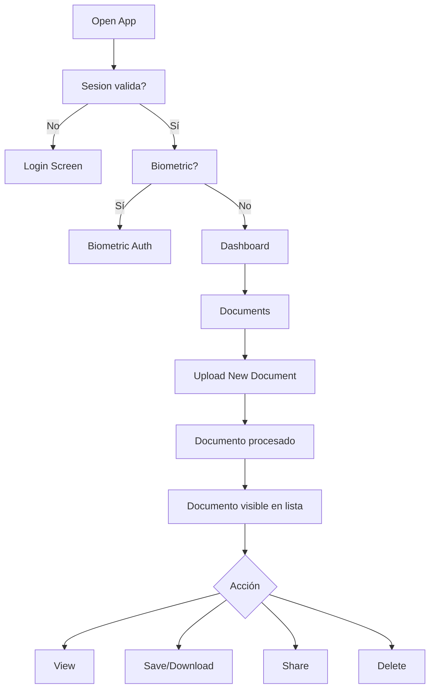

1. La persona abre la app.
2. El sistema verifica si la sesión es válida.
3. Si no es válida, se muestra pantalla de login.
4. Si es válida, se verifica si la biometría está activada.
5. Si la biometría está activada, se solicita autenticación biométrica.
6. Si la biometría no está activada o se autentica correctamente, se accede al dashboard.
7. La persona llega al dashboard principal.
8. La persona abre `Documents`.
9. Sube un nuevo documento médico.
10. El sistema pregunta al usuario si desea procesar el documento para extrar información o simplemente subirlo como archivo.
    1. Si el usuario elige procesar el documento, el sistema lo indexa y extrae la información relevante para mostrarla en la vista de detalles del documento.
    2. El sistema ofrece al usuario la opción de añadir la información extraída a su perfil médico.
11. El sistema lo indexa y lo muestra en la lista.
12. Puede buscar por texto.
13. Sobre cada documento puede ver, descargar/guardar, compartir o eliminar.
14. Si elimina, el sistema confirma y retira el documento de la lista.

## 7. Perfil y contactos de emergencia

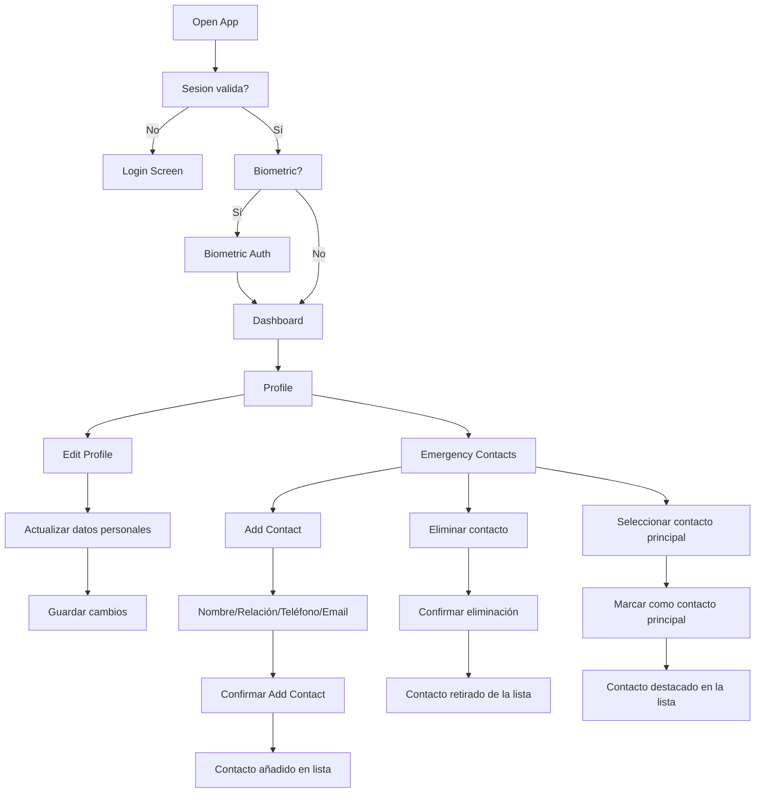

1. La persona abre la app.
2. El sistema verifica si la sesión es válida.
3. Si no es válida, se muestra pantalla de login.
4. Si es válida, se verifica si la biometría está activada.
5. Si la biometría está activada, se solicita autenticación biométrica.
6. Si la biometría no está activada o se autentica correctamente, se accede al dashboard.
7. La persona llega al dashboard principal.
8. La persona entra a `Profile`.
9. Puede editar su información personal.
10. Guarda los cambios del perfil.
11. Dentro de la seccion `Profile`, puede consultar los contactos de emergencia.
12. El usuario puede añadir un contcto de emergencia pulsando `Add`.
13. Completa nombre, relación, teléfono y correo.
14. Confirma con `Add Contact`.
15. El nuevo contacto aparece en la lista.
16. El usuario puede eliminar contactos de emergencia desde la lista.
17. Si elimina un contacto, el sistema confirma y lo retira de la lista.
18. El usuario puede seleccionar un contacto de emergencia como contacto principal para emergencias, el sistema lo marca como contacto de emergencia principal y lo muestra destacado en la lista.

## 8. Alertas y preferencias de notificación

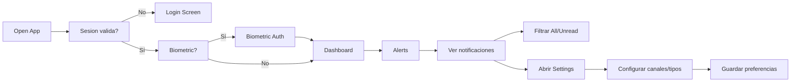

1. La persona abre la app.
2. El sistema verifica si la sesión es válida.
3. Si no es válida, se muestra pantalla de login.
4. Si es válida, se verifica si la biometría está activada.
5. Si la biometría está activada, se solicita autenticación biométrica.
6. Si la biometría no está activada o se autentica correctamente, se accede al dashboard.
7. La persona llega al dashboard principal.
8. La persona accede a `Alerts`.
9. Consulta eventos de acceso y actividad.
10. Filtra por `All` o `Unread`.
11. Entra en ajustes de notificaciones.
12. Activa/desactiva preferencias de recepción.
13. El sistema guarda la configuración.

## 9. Compartición con profesional sanitario (Regular Sharing)

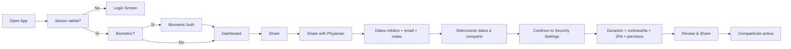

1. La persona abre la app.
2. El sistema verifica si la sesión es válida.
3. Si no es válida, se muestra pantalla de login.
4. Si es válida, se verifica si la biometría está activada.
5. Si la biometría está activada, se solicita autenticación biométrica.
6. Si la biometría no está activada o se autentica correctamente, se accede al dashboard.
7. La persona llega al dashboard principal.
8. La persona entra en `Share` y selecciona `Share with Physician`.
9. Introduce datos del profesional (nombre, email, notas).
10. Elige qué información médica compartirá.
11. Pasa a `Security Settings`.
12. Configura duración, contraseña, 2FA y permiso de descarga.
13. Revisa y confirma la compartición.
14. El sistema crea acceso seguro temporal y lo registra en actividad.

### 9.1 Flujo de acceso por parte del profesional sanitario

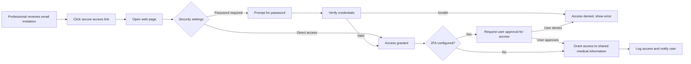

1. El profesional sanitario recibe una invitación de acceso por email.
2. El profesional pulsa el enlace seguro de acceso.
3. El sistema mustra una web y dependiendo de la configuración de seguridad accede directamente o solicita una contraeña.
4. El sistema verifica las credenciales y permisos de acceso.
5. Si el sistema tiene 2FA configurado, solicita al usuario que acepte la solicitud de acceso por parte del profesional sanitario.
6. Una vez el usuario acepta, el sistema concede acceso a la información médica compartida.
7. El sistema registra el acceso y notifica a la persona usuaria.

## 10. Compartición de emergencia (QR/Código)

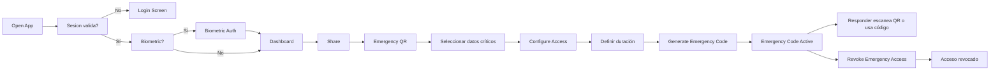

1. La persona abre la app.
2. El sistema verifica si la sesión es válida.
3. Si no es válida, se muestra pantalla de login.
4. Si es válida, se verifica si la biometría está activada.
5. Si la biometría está activada, se solicita autenticación biométrica.
6. Si la biometría no está activada o se autentica correctamente, se accede al dashboard.
7. La persona llega al dashboard principal.
8. La persona entra en `Share` y elige `Emergency QR`.
9. Selecciona la información crítica para emergencias.
10. Configura duración del acceso y condiciones de seguridad.
11. Genera código/QR de emergencia.
12. El sistema muestra estado `Emergency Code Active`.
13. El profesional de emergencias accede por QR o código.
14. Se registran accesos y se notifica a la persona usuaria.
15. Si hace falta, la persona revoca el acceso inmediatamente.

### 10.1. Flujo de acceso por código QR en emergencia

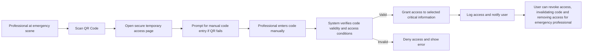

1. El profesional de emergencias escanea el código QR
2. El sitema abre el navegador por defecto y redirige a una página segura de acceso temporal.
3. El sistema solicita al profesional que introduzca el código de emergencia manualmente (en caso de no poder escanear el QR).
4. El profesional introduce el código manualmente.
5. El sistema verifica la validez del código y las condiciones de acceso.
6. Si el código es válido, se concede acceso a la información crítica seleccionada.
7. El sistema registra el acceso y notifica a la persona usuaria.
8. La persona usuaria puede revocar el acceso en cualquier momento, lo que invalidará el código y retirará el acceso al profesional de emergencias.

## 11. Configuración y privacidad (Settings)

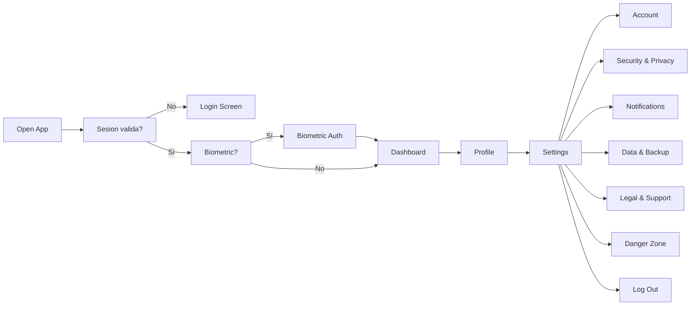

1. La persona abre la app.
2. El sistema verifica si la sesión es válida.
3. Si no es válida, se muestra pantalla de login.
4. Si es válida, se verifica si la biometría está activada.
5. Si la biometría está activada, se solicita autenticación biométrica.
6. Si la biometría no está activada o se autentica correctamente, se accede al dashboard.
7. La persona llega al dashboard principal.
8. La persona entra en `Profile` y luego en `Settings`.
9. Gestiona opciones de cuenta y credenciales.
10. Ajusta seguridad, biometría, logs y gestión de accesos.
11. Revisa preferencias de notificación.
12. Gestiona backup/exportación de datos.
13. Consulta información legal y soporte.
14. Puede eliminar datos o cerrar sesión.
