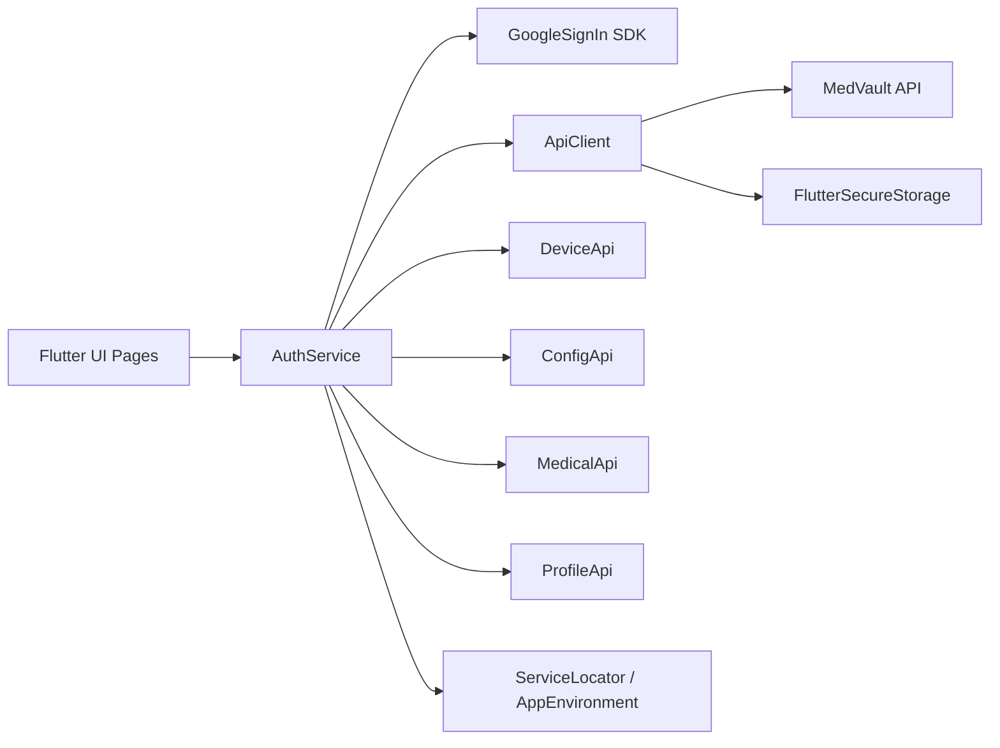
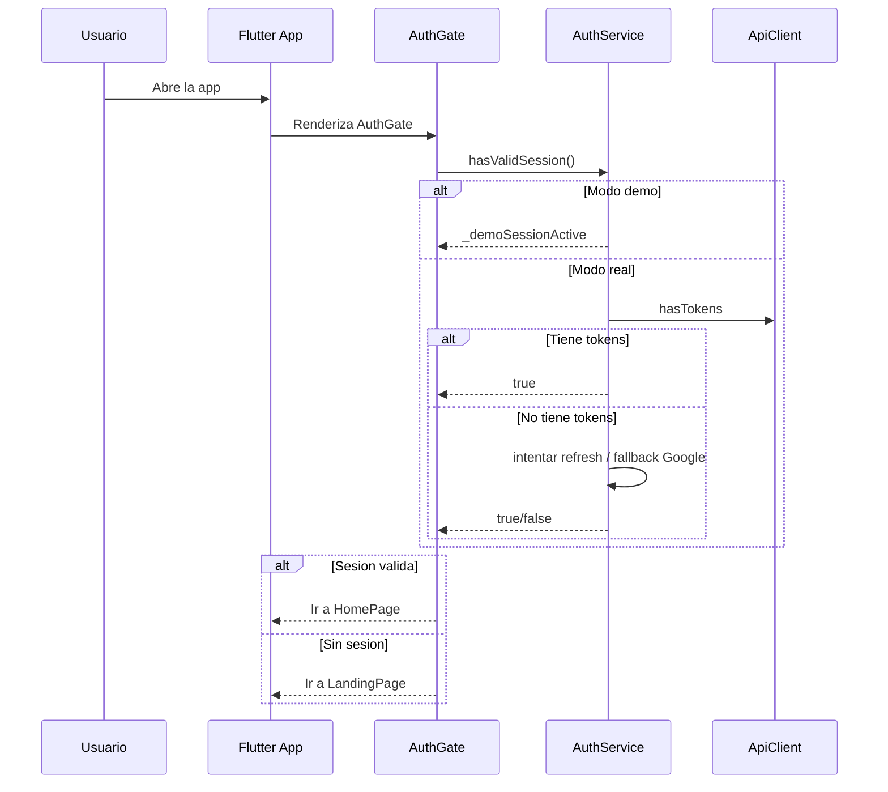
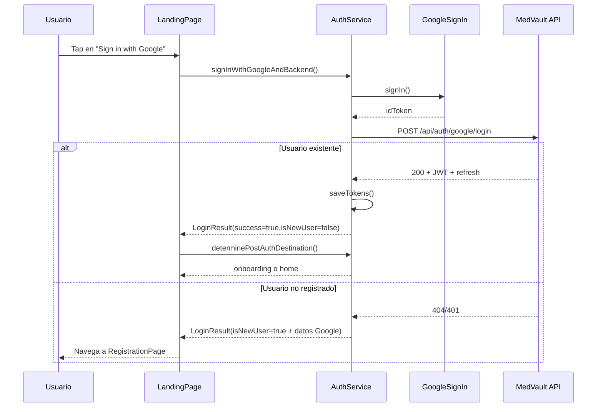
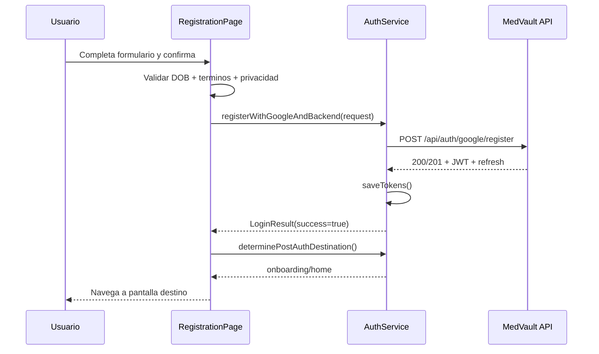
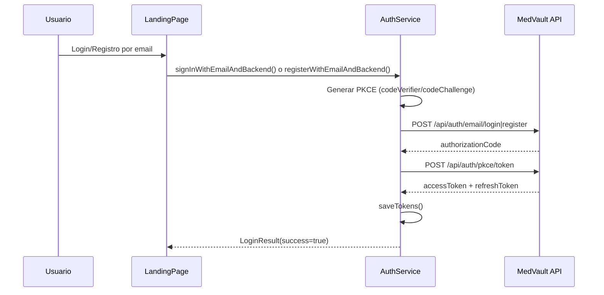
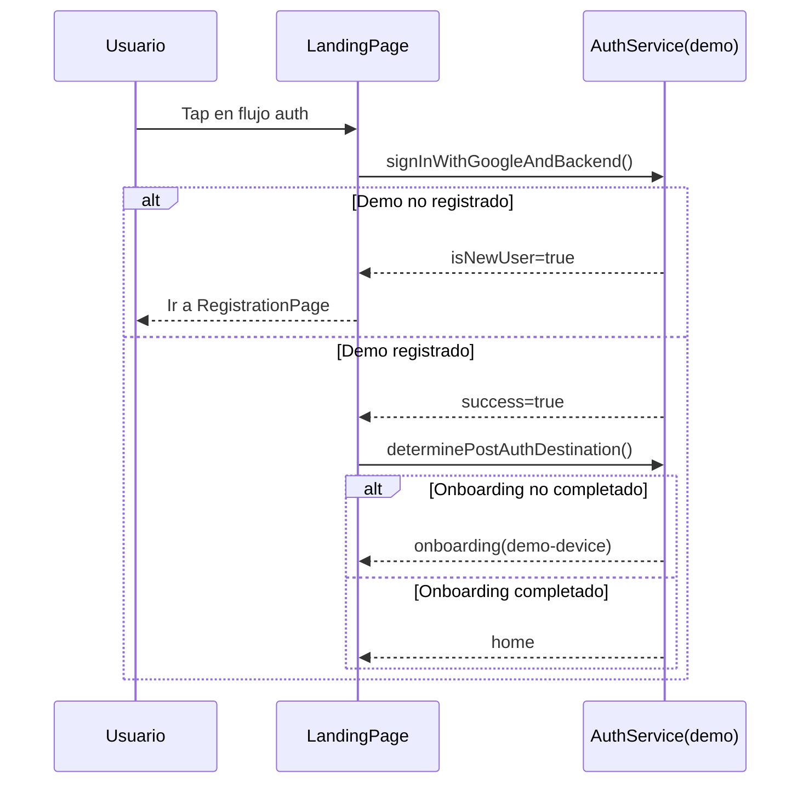
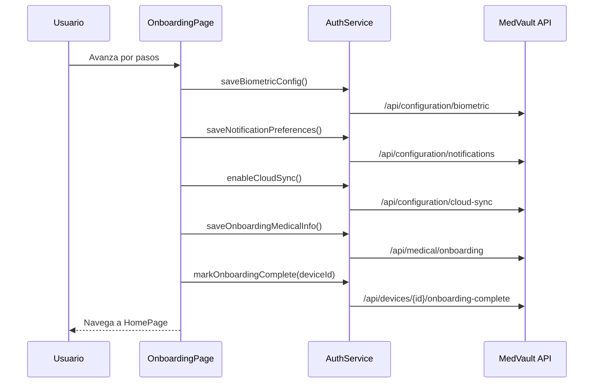
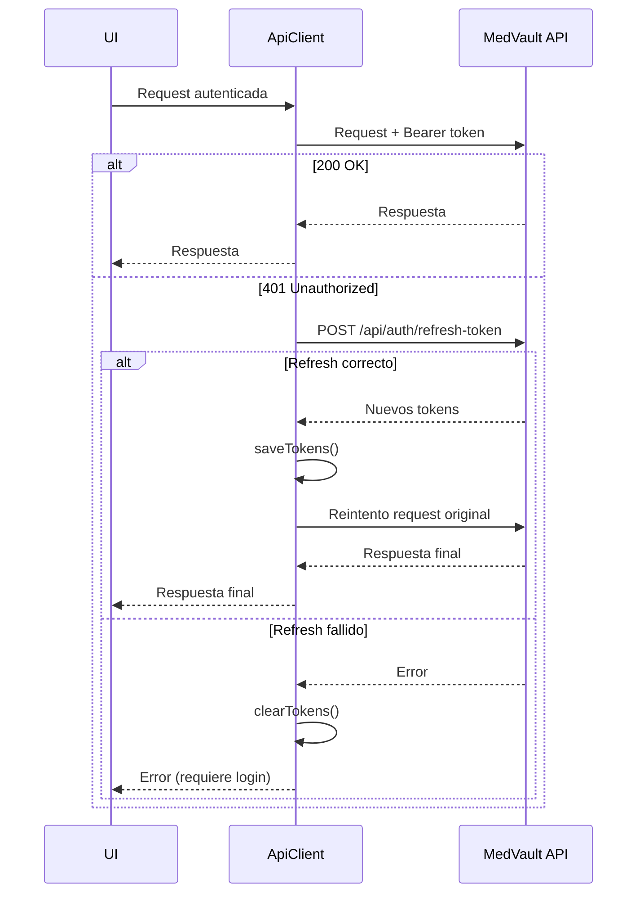
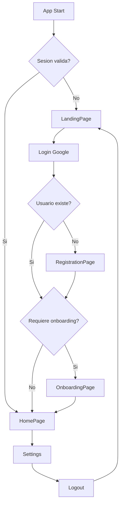
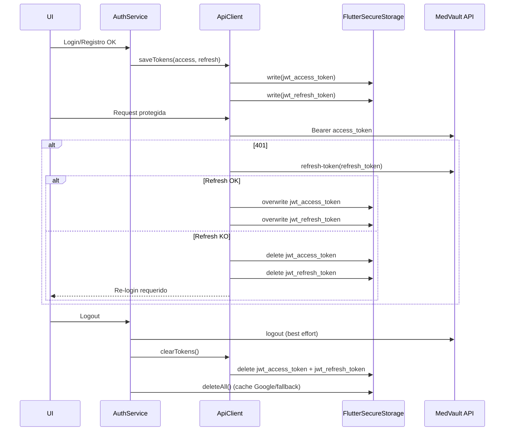

# PEC3 - Memoria de implementacion

**Proyecto:** MedVault  
**Fase:** PEC3 - Desarrollo e implementacion  
**Fecha:** 07/04/2026  
**Autor:** Proyecto TFM MedVault

---

## 1. Resumen ejecutivo

En esta fase se ha implementado y validado el flujo completo de autenticacion para la app movil MedVault en Flutter, incluyendo:

- Inicio de sesion con Google y autenticacion contra API.
- Registro guiado cuando el usuario no existe en backend.
- Flujo alternativo de email (login y registro con PKCE).
- Modo demo funcional para pruebas sin dependencia real de Google/API.
- Enrutado post-login a onboarding o home segun estado de dispositivo/configuracion.
- Gestion de sesion JWT y refresh token.
- Cierre de sesion con limpieza segura de credenciales.
- Internacionalizacion de textos visibles en pantallas de auth/onboarding.
- Pruebas unitarias y de widget para validar los recorridos criticos.

El objetivo principal de PEC3 en este bloque ha sido asegurar una experiencia MVP robusta para acceso, alta de usuario y primera configuracion del dispositivo.

---

## 2. Alcance implementado

### 2.1 Alcance funcional

- AuthGate en arranque de app con verificacion de sesion valida.
- Login Google + backend JWT.
- Registro Google con datos complementarios (DOB, terminos, privacidad).
- Login/registro por email con intercambio PKCE.
- Decision de destino post-login:
  - Onboarding en primer acceso/dispositivo no configurado.
  - Home para usuario con configuracion completa.
- Demo mode con estado interno de sesion/registro/onboarding.
- Logout en modo real y demo.

### 2.2 Alcance tecnico

- Refactor de AuthService para centralizar reglas de orquestacion.
- Integracion por DI usando ServiceLocator y AppEnvironment.
- Wrappers de configuracion/onboarding en AuthService para desacoplar UI de APIs concretas.
- Localizacion de textos visibles para Landing, Registration y Onboarding.
- Cobertura de pruebas enfocada en caminos de navegacion de auth.

---

## 3. Arquitectura de la solucion

## 3.1 Componentes principales

- UI Layer (Flutter pages)
  - LandingPage
  - RegistrationPage
  - OnboardingPage
  - HomePage
- Service Layer
  - AuthService (orquestador principal de autenticacion)
  - ApiClient (cliente HTTP + adjuncion JWT + refresh automatico)
- API wrappers
  - AuthApi, DeviceApi, ConfigApi, MedicalApi, ProfileApi
- Infrastructure
  - FlutterSecureStorage para tokens
  - GoogleSignIn para identidad federada
  - ServiceLocator para composicion del runtime

## 3.2 Diagrama de interaccion de componentes

## 3.3 Responsabilidades por archivo

- src/apps/mobile/medvault/lib/main.dart
  - Arranque, parseo de entorno y AuthGate.
- src/apps/mobile/medvault/lib/core/di/service_locator.dart
  - Inyeccion de AuthService con demoMode segun entorno.
- src/apps/mobile/medvault/lib/services/auth_service.dart
  - Logica principal de auth, modo demo, enrutado post-auth, wrappers onboarding.
- src/apps/mobile/medvault/lib/services/api_client.dart
  - Persistencia JWT/refresh y reintentos en 401.
- src/apps/mobile/medvault/lib/pages/landing_page.dart
  - Pantalla de entrada y disparadores de login/registro.
- src/apps/mobile/medvault/lib/pages/registration_page.dart
  - Completar alta de usuario nuevo.
- src/apps/mobile/medvault/lib/pages/onboarding_page.dart
  - Asistente de configuracion inicial.

---

## 4. Workflows implementados

## 4.1 Arranque de app y validacion de sesion

1. App inicia y resuelve entorno APP_ENV.
2. ServiceLocator inicializa AuthService con demoMode si corresponde.
3. AuthGate ejecuta hasValidSession().
4. Si hay sesion valida, navega a HomePage.
5. Si no hay sesion valida, navega a LandingPage.

### Secuencia

## 4.2 Login Google + decision de destino

1. Usuario pulsa continuar con Google.
2. AuthService solicita identidad a GoogleSignIn.
3. App envia idToken a /api/auth/google/login.
4. Si usuario existe, backend retorna JWT + refresh.
5. AuthService guarda tokens en storage.
6. AuthService determina destino post-auth:
   - Registro de dispositivo.
   - Lectura de estado de configuracion.
7. Navegacion a onboarding o home.

### Secuencia (existente / nuevo)

## 4.3 Registro de nuevo usuario con Google

1. RegistrationPage recibe googleIdToken y datos pre-rellenados.
2. Usuario completa datos obligatorios (incluye DOB, terminos, privacidad).
3. App envia RegisterRequest a /api/auth/google/register.
4. Backend retorna JWT + refresh.
5. AuthService guarda tokens y decide destino post-auth.
6. Navegacion a onboarding (primera vez) o home.

### Secuencia

## 4.4 Flujo por email con PKCE

1. Usuario abre dialogo de email.
2. Login email:
   - /api/auth/email/login devuelve authorizationCode.
   - /api/auth/pkce/token intercambia codeVerifier y retorna tokens.
3. Registro email:
   - /api/auth/email/register devuelve authorizationCode.
   - /api/auth/pkce/token retorna tokens.
4. AuthService guarda tokens y continua con decision de destino.

### Secuencia

## 4.5 Modo demo

1. ServiceLocator habilita demoMode en entorno demo.
2. AuthService evita llamadas reales a backend/Google para operaciones clave.
3. Estado interno simula:
   - usuario registrado/no registrado
   - sesion activa
   - onboarding completado
4. Permite probar navegacion end-to-end sin dependencias externas.

### Secuencia

## 4.6 Onboarding inicial del dispositivo

1. OnboardingPage presenta 4 pasos.
2. Cada paso persiste configuracion (modo real) o simula (modo demo).
3. Paso final marca onboarding completo.
4. Navega a HomePage.

### Pasos funcionales

- Paso 1: Biometria.
- Paso 2: Notificaciones.
- Paso 3: Backup cloud.
- Paso 4: Informacion medica basica.

### Secuencia

## 4.7 Refresh de token y continuidad de sesion

1. ApiClient adjunta bearer token a cada request.
2. Si responde 401:
   - intenta /api/auth/refresh-token con refreshToken.
   - si refresca, reintenta request original una vez.
3. Si refresh falla, borra tokens y fuerza reautenticacion.

### Secuencia

## 4.8 Logout

1. Settings invoca signOut().
2. Modo real:
   - best effort /api/auth/logout.
   - desconexion Google.
   - limpieza de tokens y secure storage.
3. Modo demo:
   - reset de estado interno.
4. Navegacion a Landing.

---

## 5. Diagrama de navegacion e interaccion entre pantallas

---

## 6. Detalles de implementacion relevantes

## 6.1 AuthService como orquestador unico

Se consolida en una sola clase la regla de negocio de autenticacion para evitar logica duplicada en UI:

- Login federado y email.
- Registro federado y email.
- Determinacion de destino post-auth.
- Wrapper de operaciones de onboarding.
- Lectura/actualizacion de perfil.
- Abstraccion de usuario actual para dashboard.

Beneficio: UI mas simple y desacoplada de endpoints concretos.

## 6.2 Inyeccion por entorno

ServiceLocator inyecta AuthService con demoMode segun AppEnvironment.

- demo => sin dependencia real de servicios externos.
- development/production => flujos reales con API/Google.

## 6.3 Seguridad de sesion

- Tokens en FlutterSecureStorage.
- Adjuncion de bearer token por ApiClient.
- Refresh automatico en 401.
- Limpieza de credenciales al fallar refresh.
- Logout con revocacion best effort en backend.

### 6.3.1 Detalle de almacenamiento de sesion

La implementacion actual usa dos espacios de almacenamiento seguro para credenciales:

- Espacio JWT (ApiClient):
  - jwt_access_token
  - jwt_refresh_token
- Espacio legado Google/AuthService (fallback de compatibilidad):
  - google_access_token
  - google_id_token
  - signed_in_at

En flujo normal, los endpoints de autenticacion del backend devuelven access token + refresh token y estos se persisten en FlutterSecureStorage mediante saveTokens().

En flujo Google, ademas se cachean id/access token de Google para compatibilidad con comprobaciones silenciosas de sesion (signInSilently / fallback).

### 6.3.2 Ciclo de vida de la sesion

1. Login/registro exitoso
   - Se escriben jwt_access_token y jwt_refresh_token.
2. Uso de APIs protegidas
   - ApiClient adjunta Authorization: Bearer <token>.
3. Expiracion de access token
   - Si hay 401, se intenta refresh con jwt_refresh_token.
4. Refresh exitoso
   - Se reemplazan ambos tokens por los nuevos.
5. Refresh fallido
   - Se borran tokens JWT y se obliga a reautenticar.
6. Logout
   - Se intenta revocar sesion en backend.
   - Se limpian tokens JWT y almacenamiento seguro de AuthService.

### 6.3.3 Politica de clearing (limpieza)

La limpieza de sesion ocurre en tres escenarios principales:

- Logout explicito de usuario:
  - AuthService.signOut() llama authApi.logout() (best effort).
  - Luego ejecuta apiClient.clearTokens() y \_secureStorage.deleteAll().
- Refresh de token fallido:
  - ApiClient.\_tryRefreshToken() ejecuta clearTokens() antes de devolver fallo.
- Modo demo:
  - No se persisten credenciales reales.
  - signOut() reinicia flags internos (\_demoSessionActive, \_demoRegistered, \_demoOnboardingComplete, \_demoUser).

### 6.3.4 Diagrama de almacenamiento y clearing

### 6.3.5 Consideraciones de seguridad y mejora

- El borrado total en logout reduce riesgo de reutilizacion de tokens en dispositivo compartido.
- El borrado selectivo en refresh fallido evita estados semiautenticados.
- Como mejora futura:
  - Unificar en una sola estrategia de sesion (JWT-only) para reducir complejidad de fallback.
  - Añadir metrica de causas de logout y fallo de refresh para observabilidad de seguridad.

## 6.4 Internacionalizacion

Se eliminaron textos hardcodeados visibles para usuario en Landing, Registration y Onboarding.

- Nuevas claves en app_en.arb y app_es.arb.
- Uso consistente de AppLocalizations en botones, labels, mensajes y pasos.

---

## 7. Pruebas realizadas

## 7.1 Unit tests

Archivo: src/apps/mobile/medvault/test/services/auth_service_demo_test.dart

Cobertura principal:

- Sesion inicial inactiva en demo.
- Login demo no registrado devuelve isNewUser=true.
- Registro demo activa sesion.
- Decision onboarding/home segun estado.
- signOut reinicia estado.

## 7.2 Widget tests

Archivo: src/apps/mobile/medvault/test/pages/auth_flow_widget_test.dart

Cobertura principal:

- Landing -> Registration para usuario demo no registrado.
- Landing -> Onboarding para usuario demo registrado.
- Registration valida DOB obligatoria y continua al completar.

## 7.3 Validacion estatica

- flutter analyze ejecutado en el modulo movil.
- Estado final sin issues en el analisis.

---

## 8. Riesgos, decisiones y trade-offs

- El modo demo facilita validacion temprana, pero requiere disciplina para no mezclarlo con reglas de produccion.
- El fallback de sesion via GoogleSignIn se mantiene por compatibilidad; en futuras iteraciones conviene converger hacia JWT como fuente unica de verdad.
- La deteccion de primer login depende de registro de dispositivo y estado de configuracion; ante fallos de red se prioriza no bloquear al usuario.

---

## 9. Pendientes recomendados (siguientes iteraciones)

- Ampliar tests de localizacion para widgets que dependen de textos traducidos.
- Añadir pruebas de integracion para refresh token real contra entorno de test.
- Endurecer observabilidad (logs de auth y metricas de conversion login/registro).
- Revisar criterios de seguridad adicionales (rotacion de refresh token y expiracion forzada por inactividad).

---

## 10. Conclusion

La implementacion de PEC3 cumple el objetivo de disponer de un flujo de autenticacion MVP completo, verificable y mantenible, con soporte real y modo demo, enrutado de primera experiencia (onboarding), gestion segura de sesion y cobertura de pruebas para recorridos clave.

La solucion deja la base preparada para evolucionar hacia integraciones mas avanzadas sin reescribir la capa de presentacion.
