# Implementación

Durante la fase de implementación, se ha llevado a cabo el desarrollo del proyecto utilizando diversas herramientas, frameworks y servicios. A continuación, se presenta una descripción general de los aspectos más relevantes de esta fase.

## Descripción general

La implementación del proyecto se ha centrado en la creación de una aplicación móvil utilizando Flutter, junto con un backend desarrollado en ASP.NET Core. La aplicación móvil se encarga de la interacción con el usuario, mientras que el backend gestiona la lógica de negocio, la autenticación y el acceso a datos.

Actualmente, el proyecto se compone de 4 grandes bloques:

- Aplicación móvil Flutter
- ASP.Net Core Service (API y ASP.NET Core Application)
- Base de datos SQL Server
- Servicios externos

En el siguiente bloque se describen las herramientas, frameworks y servicios utilizados durante la implementación del proyecto.

## Herramientas de desarrollo

- Visual Studio Code: editor principal utilizado para el desarrollo y mantenimiento del código. Es la herramienta principal para el desarrollo de la aplicación movil Flutter, asi como para la documentación y otros aspectos del proyecto.
- Visual Studio 2026: IDE empleado para el desarrollo de la API/Portal Web en ASP.NET Core, junto con los test de integración y unitarios asociados.
- Android Studio: entorno utilizado para compilar, depurar y ejecutar la aplicación móvil. El uso de este ha sido minimo y ccomplementario al uso de Visual Studio Code.
- GitHub: plataforma de control de versiones y seguimiento del desarrollo.
- SQL Server Management Studio: herramienta utilizada para administrar y revisar la base de datos SQL Server.
- Docker: utilizado para levantar la base de datos SQL Server en local junto con los TestContainers durante la fase de desarrollo y pruebas.
- Aspire AppHost: orquestación local de servicios y contenedores durante el desarrollo. Inicialmente se planteo una solución basada en 2 API y un Portal Web, pero finalmente las dos APIs se unificaron en una sola y el portal web se unificó con la API.
- Github Copilot Student: asistente de programación basado en IA utilizado para acelerar el desarrollo y mejorar la calidad del código.

### Frameworks y bibliotecas utilizadas

#### Aplicación móvil

- Flutter: framework principal de la aplicación móvil.
- Dart SDK: lenguaje de programación de la app móvil.
- Drift: capa ORM y de acceso a datos local.
- SQLCipher / sqlcipher_flutter_libs: base para almacenamiento SQLite cifrado.
- Google Sign-In: inicio de sesión con Google.
- Firebase Messaging: integración con Firebase y notificaciones push.

#### API backend

- ASP.NET Core: framework principal del backend y el Portal Web.
- .NET 10: plataforma de ejecución y compilación del backend y los proyectos asociados.
- Razor Pages: framework para el desarrollo del Portal Web integrado en la API.
- Entity Framework Core: ORM utilizado para persistencia y consultas sobre SQL Server.
- Microsoft.AspNetCore.Authentication.JwtBearer: autenticación basada en JWT.
- Microsoft.AspNetCore.Authentication.Google y Google.Apis.Auth: autenticación e intercambio de tokens con Google.
- FirebaseAdmin: integración con servicios de Firebase desde el servidor.
- FluentValidation: validación de comandos, DTOs y modelos de entrada.
- Swashbuckle.AspNetCore / OpenAPI: documentación interactiva de la API.

#### Inteligencia documental y automatización

- Microsoft.Agents.AI y Microsoft.Agents.AI.OpenAI: orquestación de agentes y prompts.
- Azure.AI.OpenAI y OpenAI: proveedores LLM compatibles con el módulo documental.
- Microsoft.Extensions.AI.Ollama: soporte para ejecución local con Ollama.
- PdfPig: extracción de texto desde documentos PDF.
- Tesseract: OCR para documentos escaneados e imágenes.

#### Soporte transversal y desarrollo

- Aspire.AppHost y Aspire.Hosting.NodeJs: orquestación local y hosting de servicios.
- Microsoft.NET.Test.Sdk, xUnit, xunit.runner.visualstudio y Moq: tests automatizados del backend.
- Testcontainers.MsSql y Microsoft.AspNetCore.Mvc.Testing: pruebas de integración con infraestructura real.
- Flutter Test, integration_test, drift_dev, build_runner, flutter_launcher_icons y flutter_native_splash: pruebas y generación de artefactos de la app móvil.

### Servicios

- Firebase Cloud Messaging: servicio utilizado para notificaciones push en la aplicación móvil.
- Google Identity Services: autenticación con Google para usuarios de la plataforma.
- Microsoft Azure: plataforma de servicios en la nube utilizada para el despliegue y gestión de los recursos. Su objetivo principal es el despliegue de la API, el Portal Web y la base de datos SQL Server.

## Vision general de la arquitectura

Durante la base de concepción y diseño del proyecto, se definió una arquitectura que ha evolucionado a lo largo del desarrollo, adaptándose a las necesidades y desafíos encontrados. La arquitectura actual se basa en una estructura de capas, con una clara separación entre la aplicación móvil, el backend y la base de datos.

Incialmente se planto la siguiente arquictura:

Diagrama de arquitectura de alto nivel:

**Referencia a PEC2**

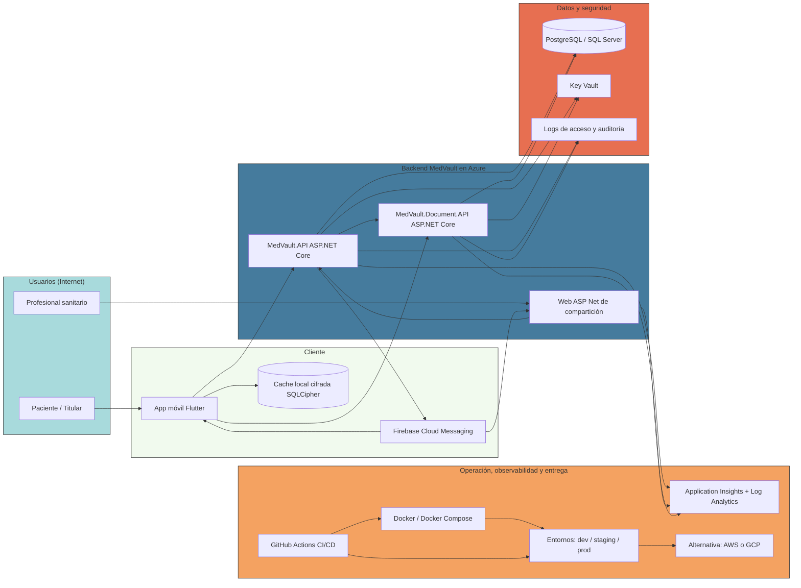

Durante el desarrollo y con idea de agilizar la implementación, se han tomado varias decisiones de diseño que han llevado a una evolución de la arquitectura inicial. Entre los cambios más relevantes se encuentran:

- Unificación de las APIs y el Portal Web: Durante las fases iniciales se planteo una solución basada en 2 APIs (MedVault.API y MedVault.Document.API) y un Portal Web de compartición. Sin embargo, para simplificar el desarrollo y reducir la complejidad, se decidió unificar las dos APIs en una sola y fusionar el Portal Web con la API, utilizando Razor Pages para la parte web.
  - Entre sus mayores ventajas se encuentran la reducción de la complejidad arquitectónica, la simplificación del despliegue y la mejora en la experiencia de desarrollo al tener una única base de código para el backend y el portal web. Además, evitamos tener que gestionar la comunicación y sincronización entre dos APIs distintas, lo que agiliza el desarrollo y reduce posibles puntos de fallo.
- Observabilidad y monitoreo: Se han eliminado de esta primera fase debido a limitaciones de tiempo, pero se han dejado las puertas abiertas para su futura implementación. En su lugar, se han utilizado herramientas de logging y monitoreo locales durante el desarrollo para asegurar la calidad y el correcto funcionamiento del sistema.
- Key Vault y gestión de secretos: Al igual que con la observabilidad, se ha pospuesto la implementación de un sistema de gestión de secretos como Key Vault. Durante el desarrollo, las claves y secretos se han gestionado de forma local y segura, con la intención de migrar a una solución más robusta en el futuro.

En conclusión, la arquitectura del proyecto ha evolucionado de una estructura más compleja con múltiples APIs y un portal web separado, a una solución más integrada y simplificada que facilita el desarrollo y despliegue. Esta evolución ha sido guiada por la necesidad de agilizar la implementación y reducir la complejidad, sin perder de vista la escalabilidad y mantenibilidad del sistema a largo plazo.

El diseño final de la arquitectura se refleja en el siguiente diagrama:
Diagrama de arquitectura de alto nivel:

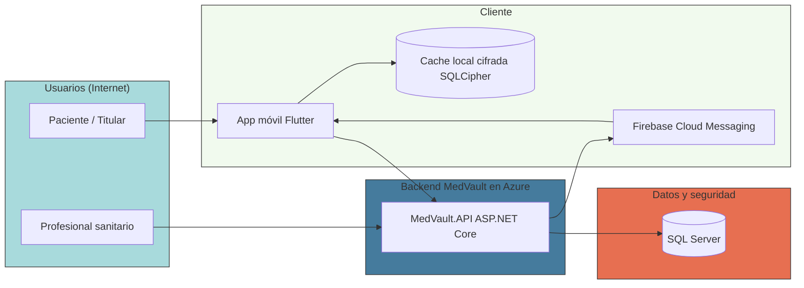

## Aspectos funcionales implementados

MedVault tenia como objetivo principal proporcionar a los usuarios una plataforma segura y fácil de usar para gestionar sus registros médicos sin delegar el control de sus datos a terceros. Con lo cual, es el usuario quien tiene el control total sobre sus datos, con quien los comparte, durante cuanto tiempo, etc. Para lograr dicho objetivo, se han tomado las siguientes decisiones de diseño e implementación:

- Control total del usuario sobre sus datos: Los datos solo salen del dispositivo cuando esto es estrictamente necesario (por ejemplo, para compartir un registro médico con un profesional sanitario). En todo momento, el usuario tiene la capacidad de decidir qué datos compartir, con quién y durante cuánto tiempo.
- Cifrado de datos en reposo: Para garantizar la seguridad de los datos almacenados localmente en el dispositivo, se ha implementado una solución de cifrado utilizando SQLCipher. Esto asegura que los datos estén protegidos incluso si el dispositivo se pierde o es robado.

Dicha implementación siempre ha buscado un equilibrio entre la seguridad, la privacidad y la usabilidad, asegurando que los usuarios puedan gestionar sus registros médicos de manera eficiente sin comprometer la seguridad de sus datos.

Esto ha creado una necesidad de futuro de implementar mecanismos de copia de seguridad y recuperación de datos, para garantizar que los usuarios no pierdan su información en caso de pérdida o daño del dispositivo. Además, se ha dejado la puerta abierta para futuras integraciones con servicios en la nube que permitan a los usuarios sincronizar sus datos entre dispositivos de manera segura, siempre manteniendo el control total sobre su información.

Otro aspecto funcional relevante ha sido, como proporcionar un acceso rapido y seguro a los registros médicos para los profesionales sanitarios, sin comprometer la privacidad de los usuarios. Para ello, se ha implementado un sistema de compartición basado en tokens de acceso temporales, que permiten a los usuarios compartir sus registros médicos con profesionales sanitarios de manera controlada y segura.

Para los flujos de emergencias no se han implementado ninguna funcionalidad especifica pero si se ha deshabilitado la compartición de documentos, para evitar que en situaciones de emergencia se compartan datos sensibles sin el consentimiento del usuario. En futuras iteraciones, se podría considerar la implementación de un sistema de acceso de emergencia que permita a los usuarios designar contactos de confianza que puedan acceder a sus registros médicos en caso de emergencia, siempre con medidas de seguridad adecuadas para proteger la privacidad de los usuarios, sin perder de vista el objetivo principal de este mecanismo, que es proporcionar acceso a la información médica mas relevante en situaciones críticas que requiren agilidad.

En el caso de la compartición con medicos, se han implementado dos sistemas de seguridad complementarios (siempre voluntarios y configurables por el usuario) para garantizar que los datos compartidos con los profesionales sanitarios estén protegidos:

- Un sistema basado en password que require al usuario que acceda a la información compartida a introducir una contraseña previamente establecida por el usuario. Esto añade una capa adicional de seguridad, asegurando que solo las personas autorizadas puedan acceder a los registros médicos compartidos.
- Un sistema de doble verificación, similar al que se utiliza en bancos para autorizar transacciones, donde el usuario siempre debe aprobar cada acceso a la información compartida, incluso si el usuario que intenta acceder a la información ya ha introducido la contraseña correcta. Esto garantiza que el usuario tenga un control total sobre quién accede a su información médica, incluso en situaciones donde la contraseña pueda haber sido comprometida.

Todo esto se ha implementado bajo el paraguas de la auditoria, es decir, el usuario siempre tiene el control total sobre sus datos, pudiendo revocar el acceso a su información médica compartida en cualquier momento, y siempre tiene un registro de quién ha accedido a su información y cuándo, para garantizar la transparencia y la confianza en la plataforma.

Otra funcionalidad relevante es la integración con sistemas de inteligencia artificial para mejorar la gestión documental y proporcionar a los usuarios herramientas avanzadas para interactuar con sus registros médicos. Se ha implementado un módulo de inteligencia documental que utiliza modelos de lenguaje para extraer información relevante de los documentos médicos, responder preguntas de los usuarios sobre su información médica y proporcionar resúmenes automáticos de los registros médicos. Esta funcionalidad tiene como objetivo mejorar la experiencia del usuario y facilitar la gestión de su información médica, sin comprometer la seguridad y privacidad de sus datos. Este módulo, es por ahora un modulo experimental, pero se han sentado las bases para su futura evolución e integración con otros servicios y funcionalidades de la plataforma.

Cabe destacar que, aparte de las funcionalidades mencionadas, se han implementado otras características adicionales que contribuyen a mejorar la experiencia del usuario y la seguridad de la plataforma, como por ejemplo:

- Integración con servicios de notificaciones push para mantener a los usuarios informados sobre eventos relevantes relacionados con sus registros médicos, como accesos a su información compartida o recordatorios de citas médicas.
- Implementación de un sistema de autenticación con Google para facilitar el acceso a la plataforma y mejorar la experiencia del usuario, sin comprometer la seguridad de sus datos.
- Integración con servicios de autenticación biométrica del dispositivo para proporcionar una capa adicional de seguridad al acceder a la aplicación móvil, asegurando que solo el usuario autorizado pueda acceder a su información médica.
- Sistema multi idioma para la aplicación móvil, permitiendo a los usuarios seleccionar su idioma preferido y mejorar la accesibilidad de la plataforma a nivel global. (Actualmente soporta español e inglés, pero se han dejado las puertas abiertas para añadir más idiomas en el futuro).
- Diseño de una interfaz de usuario intuitiva y fácil de usar, con el objetivo de proporcionar una experiencia agradable y accesible para usuarios de todas las edades y niveles de experiencia tecnológica.
- Soporte de tema oscuro y claro en la aplicación móvil, permitiendo a los usuarios personalizar la apariencia de la plataforma según sus preferencias y mejorar la experiencia de uso en diferentes condiciones de iluminación.

Las siguientes capturas de pantalla muestran algunas de las funcionalidades implementadas en la aplicación móvil:

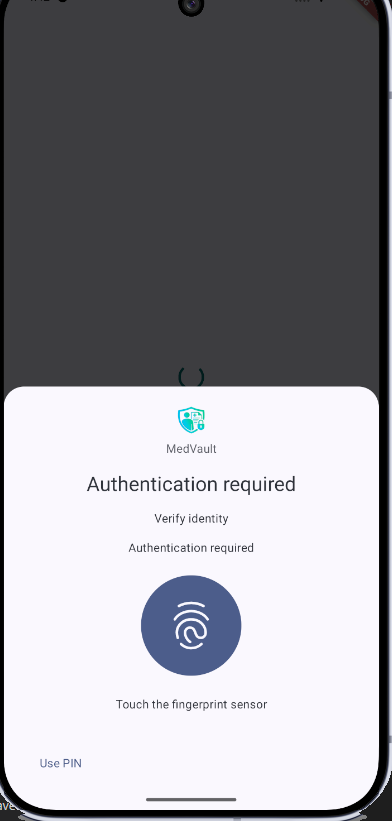

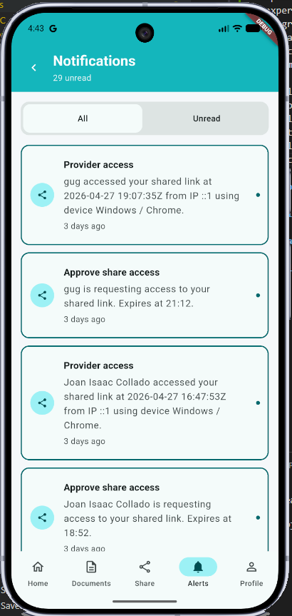

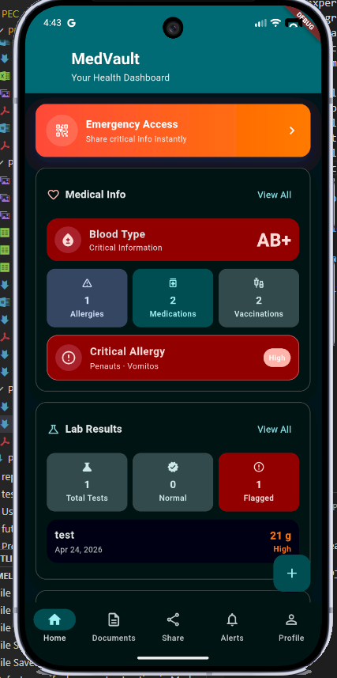

Por ultimo, es importante destacar que durante la aplicación movil se han implementado diversas medidas de seguridad para proteger la información médica de los usuarios, como el cifrado de datos en reposo, la autenticación biométrica, el uso de tokens de acceso temporales para la compartición de registros médicos y la implementación de un sistema de doble verificación para garantizar que solo las personas autorizadas puedan acceder a la información médica compartida. Estas medidas de seguridad han sido diseñadas para proporcionar a los usuarios un control total sobre su información médica, sin comprometer la usabilidad y la experiencia del usuario.

## Flujos relevantes

En esta sección se describen algunos de los flujos más relevantes implementados en la aplicación móvil, que reflejan las funcionalidades clave de la plataforma y cómo los usuarios interactúan con ella para gestionar sus registros médicos de manera segura y eficiente.

### Flujo de registro e inicio de sesión

1. El usuario descarga e instala la aplicación móvil desde la tienda de aplicaciones.
2. Al abrir la aplicación por primera vez, se le presenta una pantalla de bienvenida con la opción de iniciar sesión con google.
3. El usuario selecciona la opción de iniciar sesión con Google y es redirigido a la pantalla de autenticación de Google.
4. Si el usuario no se ha registrado previamente, se le solicita que proporcione algunos datos básicos para completar su perfil, como su nombre y fecha de nacimiento.
5. Una completado el registro, el usuario es redirigido al onboarding de la aplicación, donde se le presentan las principales funcionalidades y características de la plataforma.
6. El usuario puede configurar opciones de seguridad adicionales, como la autenticación biométrica o un PIN de acceso, para proteger su información médica.
7. Una vez completado el onboarding, el usuario accede al dashboard principal de la aplicación, donde puede ver un resumen de su información médica, acceder a sus registros médicos, compartir información con profesionales sanitarios y utilizar el módulo de inteligencia documental.

Este flujo de registro se traduce en:

1. El usuario accede a la aplicación móvil y selecciona la opción de iniciar sesión con Google.
2. La aplicación móvil redirige al usuario a la pantalla de autenticación de Google, donde introduce sus credenciales de Google.
3. Google autentica al usuario y devuelve un token de acceso a la aplicación móvil.
4. La aplicación móvil utiliza el token de acceso para solicitar un token JWT a la API backend, que se utiliza para autenticar las solicitudes posteriores del usuario.
5. Si el usuario es nuevo, se devuelve un error indicando que el usuario no existe, y la aplicación móvil solicita al usuario que complete su perfil con algunos datos básicos.
6. Una vez completado el perfil y el registro del usuario, se crea el registro en el backend y se devuelve un token JWT válido para el usuario.
7. Este token JWT se almacena de forma segura en el dispositivo del usuario y se utiliza para autenticar todas las solicitudes posteriores a la API backend, garantizando que solo el usuario autorizado pueda acceder a su información médica.
8. El usuario es redirigido al onboarding de la aplicación, donde se le presentan las principales funcionalidades y características de la plataforma.
9. El usuario completa el onboarding y accede al dashboard principal de la aplicación, donde puede gestionar su información médica, compartir datos con profesionales sanitarios y utilizar el módulo de inteligencia documental.

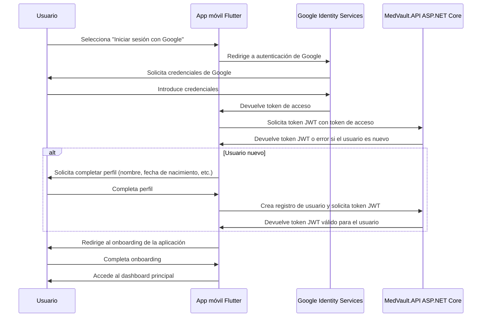

### Flujo de inicio de sesión

1. El usuario abre la aplicación móvil.
2. Si existe un token JWT válido almacenado en el dispositivo, se utiliza el refresh token para obtener un nuevo token JWT de la API backend y se accede directamente al dashboard principal.
3. Si no existe un token JWT válido, se presenta la pantalla de inicio de sesión con Google.
4. El usuario selecciona la opción de iniciar sesión con Google y es redirigido a la pantalla de autenticación de Google.
5. Google autentica al usuario y devuelve un token de acceso a la aplicación móvil.
6. La aplicación móvil utiliza el token de acceso para solicitar un token JWT a la API backend.
7. Si el token JWT es válido, se almacena de forma segura en el dispositivo del usuario y se accede al dashboard principal de la aplicación.
8. Si el usuario tenia configurada la autenticación biométrica o un PIN de acceso, se solicita al usuario que complete la autenticación adicional antes de acceder al dashboard principal.
9. Una vez autenticado, el usuario accede al dashboard principal de la aplicación, donde puede gestionar su información médica, compartir datos con profesionales sanitarios y utilizar el módulo de inteligencia documental.

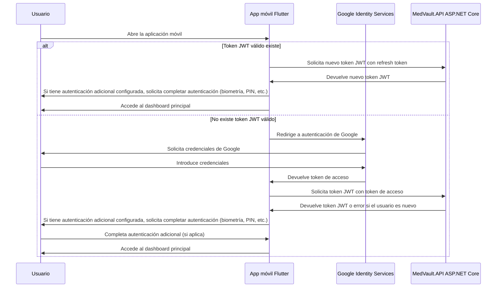

### Flujo de gestión de registros médicos

Partiendo del dashboard principal, el usuario puede acceder a la sección de registros médicos, donde puede ver un listado de sus registros médicos almacenados localmente en su dispositivo. Desde esta sección, el usuario tiene varias opciones para gestionar sus registros médicos. En este sentido, el usuario es capaz de:

- Visualizar sus registros médicos, tales como resultados de laboratorio (con un dialogo especifico para ellos), diagnosticos, alergias, vacunas, medicaciones, etc.
- Añadir nuevos registros médicos, ya sea introduciendo la información manualmente o subiendo documentos médicos (como informes de laboratorio, diagnósticos, etc.) que luego son procesados por el módulo de inteligencia documental para extraer la información relevante y estructurarla de manera adecuada.
- Editar o eliminar registros médicos existentes, para mantener su información médica actualizada y precisa.

### Flujo de compartición de registros médicos con profesionales sanitarios

Un aspecto clave de la plataforma es la capacidad de los usuarios para compartir sus registros médicos con profesionales sanitarios de manera segura y controlada.

Existen varios flujos de compartición, dependiendo del contexto y las necesidades del usuario. A continuación, se describen algunos de los flujos más relevantes:

- Compartir un nuevo registro de emergencias
- Compartir un registro médico específico con un profesional sanitario
- Revocar el acceso a un registro médico previamente compartido
- Acceso a un registro médico compartido por parte de un profesional sanitario autorizado.
- Mantenimiento automatico de los registros compartidos.

#### **Compartir un nuevo registro de emergencias:**

1. El usuario accede al Dashboard principal de la aplicación móvil.
2. El usuario selecciona la opción de compartir un nuevo registro de emergencias (tambien puede acceder desde el menu de compartir).
3. El usuario selecciona la informción médica que desea compartir en caso de emergencia, como alergias, medicaciones, condiciones médicas preexistentes, etc.
4. El usuario selecciona la duración del acceso a esta información en caso de emergencia (por ejemplo, 24 horas, 48 horas, etc.).
5. El usuario confirma la compartición del registro de emergencias.
6. La aplicación envia toda la información necesaria a la API para alamcenar dicha información y generar un token de acceso temporal.
7. El backend almacena toda la información relacionada de forma segura y encriptada en la base de datos, y genera un token de acceso temporal que se asocia al registro de emergencias compartido.
8. Se devuelve el token de acceso temporal al usuario, junto con un enlace o código QR que puede ser utilizado por los profesionales sanitarios para acceder a la información médica compartida en caso de emergencia.
9. El usuario obtiene un QR.

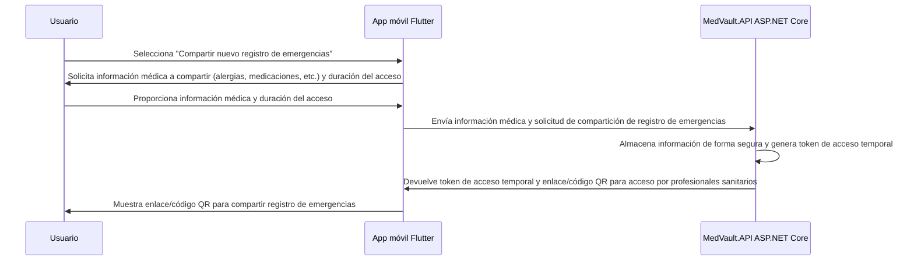

#### **Compartir un registro médico específico con un profesional sanitario:**

1. El usuario accede al dashboard principal de la aplicación móvil.
2. El usuario selecciona la opción de menu "compartir"
3. El usuario selecciona "Compartir con profesional sanitario".
4. El usuario añade los datos del profesional sanitario con el que desea compartir la información médica, como su nombre, correo electrónico, especialidad, etc.
5. El usuario selecciona la información médica específica que desea compartir, como un resultado de laboratorio, un diagnóstico, una alergia, etc.
6. El usuario configura las opciones de seguridad para la compartición, como establecer una contraseña de acceso y habilitar la doble verificación.
7. El usuario confirma la compartición del registro médico con el profesional sanitario.
8. El usuario debe aceptar la compartición en un dialogo de confirmación (doble verificación).
9. La aplicación móvil envía toda la información necesaria a la API para almacenar la compartición y generar un token de acceso temporal.
10. El backend almacena toda la información relacionada de forma segura y encriptada en la base de datos, y genera un token de acceso temporal que se asocia a la compartición del registro médico.
11. Se devuelve un enlace al usuario.
12. La aplicación móvil muestra el dialogo nativo para compatir mensajes, permitendo al usuario compartir el enlace de acceso al registro médico con el profesional sanitario a través de diferentes canales, como correo electrónico, aplicaciones de mensajería, etc.

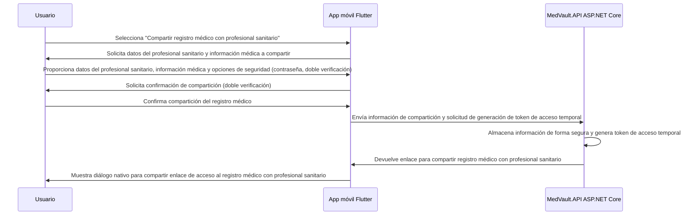

#### **Revocar el acceso a un registro médico previamente compartido:**

Para evitar que usuarios hagan un mal uso de la funcionalidad de compartición, se ha implementado un sistema de revocación de acceso a los registros médicos compartidos, junto con un limite de registros compartidos activos por usuario. Esto permite a los usuarios mantener un control total sobre su información médica compartida y garantizar que solo las personas autorizadas tengan acceso a sus datos.

1. El usuario accede al dashboard principal de la aplicación móvil.
2. El usuario selecciona la opción de menu "compartir"
3. El usuario selecciona "Administración de acceso"
4. El sistema pide a la API un listado de los registros médicos compartidos activos del usuario.
5. El sistema carga todos los registros compartidos activos del usuario.
6. El usuario selecciona "revocar acceso" en un registro médico compartido específico.
7. El sistema envia la petición a la API para revocar el acceso a dicho registro médico compartido.
8. El backend actualiza el estado de la compartición en la base de datos, marcándola como revocada y asegurando que el token de acceso temporal asociado a esa compartición ya no sea válido.
9. Se devuelve una confirmación al usuario de que el acceso al registro médico compartido ha sido revocado exitosamente.

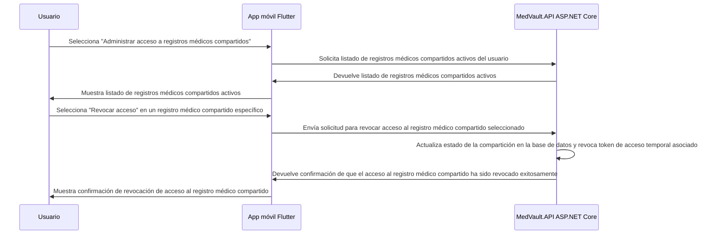

#### **Acceso a un registro médico compartido por parte de un profesional sanitario autorizado:**

1. El profesional sanitario recibe el enlace para acceder al registro médico compartido por parte del usuario.
2. El profesional sanitario hace clic en el enlace y es redirigido a la aplicación web.
3. El sistema muestra una web con un formulario de verificación.
4. Se muestra un campo para introducir el nombre del profesional sanitario.
5. Si el usuario habilito la contraseña, se muestra un campo para introducir la contraseña de acceso.
6. El profesional sanitario envia el formulario con los datos requiridos al servidor.
7. Si el enlace esta configurado con doble verificación:
   1. El servidor envia una notificación a traves de FCM al usuario.
   2. El servidor devuelve un formulario de espera al profesional sanitario, indicando que se esta a la espera de la aprobación del usuario.
   3. La app móvil del usuario recibe la notificación y muestra un dialogo solicitando al usuario que apruebe o rechace el acceso al registro médico compartido.
   4. El usuario aprueba el acceso al registro médico compartido.
   5. El servidor recibe la aprobación del usuario.
   6. El servidor usa SignalR para notificar al profesional sanitario que el acceso ha sido aprobado, y el profesional sanitario puede proceder a acceder al registro médico compartido.
8. El servidor muestra el registro médico compartido al profesional sanitario, permitiéndole visualizar la información médica compartida por el usuario de manera segura y controlada.
9. El servidor registra el acceso al registro médico compartido en los logs de auditoría, incluyendo información sobre quién accedió a la información médica y cuándo, para garantizar la transparencia y la confianza en la plataforma.

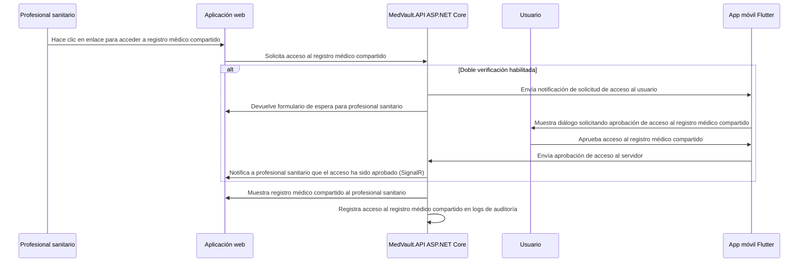

#### **Mantenimiento automatico de los registros compartidos:**

Para garantizar la seguridad y privacidad de los usuarios, se ha implementado un sistema de mantenimiento automático de los registros compartidos, que se encarga de revocar el acceso a los registros médicos compartidos una vez que ha expirado el tiempo de acceso configurado por el usuario durante el proceso de compartición. Este sistema funciona de la siguiente manera:

1. El sistema lanza un proceso cada 60 minutos (configurable).
2. El proceso consulta la base de datos para identificar los registros médicos compartidos que han expirado, es decir, aquellos cuyo tiempo de acceso ha superado la duración configurada por el usuario o que han sido revocados manualmente por el usuario.
3. El sistema borra los registros de la base de datos que han expirado, asegurando que el acceso a la información médica compartida ya no sea posible para los profesionales sanitarios que tenían acceso a esos registros.

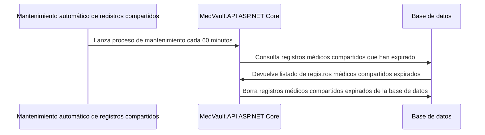

### Flujo de gestión documental con inteligencia artificial

En esta sección se describe el flujo de gestión documental implementado en la aplicación móvil, que utiliza un módulo de inteligencia documental basado en modelos de lenguaje para mejorar la experiencia del usuario al interactuar con sus registros médicos.

En esta primera iteración, el módulo de inteligencia documental se ha implementado de manera experimental, con el objetivo de sentar las bases para su futura evolución e integración con otros servicios y funcionalidades de la plataforma.

Por tanto, podrimos decribir el flujo de gestión documental en diferentes areas:

- Crear/Añadir un nuevo registro documental.
- Consultar/Editar un registro documental existente.
- Extraer información relevante de un documento médico utilizando el módulo de inteligencia documental.

Seguidamente se describe el flujo para cada una de estas áreas:

1. El usuario accede al dashboard principal de la aplicación móvil.
2. El usuario selecciona la opción de añadir un nuevo registro documental.
3. La app muestra un selector para seleccionar el origen (cámara, galería, etc.) del documento médico que desea añadir.
4. El usuario selecciona o captura el documento médico que desea añadir.
5. La App muestra un formulario donde permite al usuario añadir decripciones, tags, etc. para ayudar a organizar y categorizar sus registros médicos.
6. El usuario completa el formulario con la información relevante y confirma la creación del nuevo registro documental.
7. La aplicación móvil crea un nuevo registro documental con la información básica del documento, como el nombre del archivo, la fecha de creación, etc., y almacena el documento de forma segura en el dispositivo del usuario.
8. El usuario hace clic en extrar información relevante del documento médico utilizando el módulo de inteligencia documental.
9. La app envia los ficheros del documento médico al modulo de inteligencia documental, que procesa el documento utilizando modelos de lenguaje para extraer la información relevante y estructurarla de manera adecuada.
10. El módulo de inteligencia documental devuelve la información extraída al usuario, que puede visualizarla en un formato estructurado y fácil de entender, como por ejemplo, un resumen del documento, una lista de diagnósticos, resultados de laboratorio, etc.
11. La app detecta si hay información relevante extraída del documento médico que pueda ser añadida como un nuevo registro médico (por ejemplo, un nuevo diagnóstico, un resultado de laboratorio, etc.) y muestra una notificación al usuario indicando que se ha detectado nueva información relevante.
12. El usuario puede revisar la información extraída y decidir si desea añadirla como un nuevo registro médico en su dashboard principal, o simplemente mantenerla como parte del registro documental original.
13. Si el usuario decide añadir la información extraída como un nuevo registro médico, la aplicación móvil crea un nuevo registro médico con la información relevante extraída del documento, y lo almacena de forma segura en el dispositivo del usuario, permitiéndole gestionar su información médica de manera más eficiente y organizada.

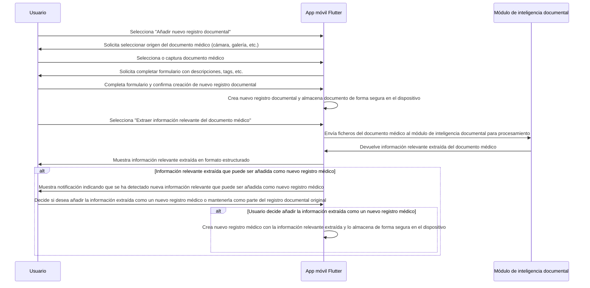

## Cambios funcionales y de diseño

Como se ha mencionado anteriormente, durante el desarrollo de la aplicación móvil se han realizado algunos cambios funcionales y de diseño respecto a lo inicialmente planteado en la fase de diseño. Estos cambios han sido motivados por diferentes razones, como la necesidad de mejorar la experiencia del usuario, garantizar la seguridad y privacidad de los datos médicos, o simplemente por decisiones de diseño basadas en el feedback recibido durante el proceso de desarrollo.

A continuación, se describen algunos de los cambios funcionales y de diseño más relevantes que se han implementado durante el desarrollo de la aplicación móvil:

- Se han añadido restricciones de uso para la gestion documental, de forma que solo se pueden añadir un maximo de N ficheros por documento.
- Se ha implementado un Flag para habilitar o deshabilitar la extracción de información mediante IA.
- Se ha implementado la posibilidad de habilitar/deshabilitar la compartición de registros médicos, para permitir a los usuarios tener un control total sobre su información médica compartida.
- Se ha limtado el numero de links activos de compartición por usuario, para evitar que los usuarios hagan un mal uso de la funcionalidad de compartición y garantizar que solo las personas autorizadas tengan acceso a su información médica compartida.
- Se ha limitado el numero de documentos que se pueden compartir con profesionales sanitarios debido a problemas de escalabilidad detectados durante la fase de pruebas, para garantizar un rendimiento óptimo de la plataforma y evitar posibles problemas de seguridad o privacidad asociados con un uso excesivo de la funcionalidad de compartición.
- Se ha implementado el Modo Oscuro.
- Se ha simplificado el onboarding inicial de la aplicación, para mejorar la experiencia del usuario y facilitar el acceso a las funcionalidades clave de la plataforma desde el primer momento.
- Se ha eliminado el permiso de allow download.
- Se ha simplificado los ajustes de la aplicación, principalmente las notificaciones.

En cuanto a la extracción de datos con IA, se ha decidido implementar esta funcionalidad de manera experimental junto con Ollama, para sentar las bases de esta funcionalidad y permitir su evolución e integración con otros servicios y funcionalidades de la plataforma en el futuro. En esta primera iteración, el módulo de inteligencia documental no estara disponible, solo para development, pero se han dejado las puertas abiertas para su futura evolución e integración con otros servicios y funcionalidades de la plataforma, como por ejemplo, la posibilidad de utilizar modelos de lenguaje más avanzados o integrar esta funcionalidad con otros módulos de la plataforma, como el módulo de compartición de registros médicos, para permitir a los usuarios compartir no solo sus registros médicos, sino también la información relevante extraída de esos registros mediante inteligencia artificial.

## Definición de la fase de pruebas

Durante la fase de pruebas, se han llevado a cabo diferentes tipos de pruebas para garantizar la calidad, seguridad y usabilidad de la aplicación móvil. Estas pruebas han incluido:

- Pruebas unitarias: Se han implementado pruebas unitarias para verificar el correcto funcionamiento de los diferentes componentes y funcionalidades de la aplicación móvil, asegurando que cada parte de la aplicación funcione de manera aislada y cumpla con los requisitos establecidos.
- Pruebas de integración: Se han realizado pruebas de integración para verificar que los diferentes componentes y funcionalidades de la aplicación móvil funcionen correctamente cuando se integran entre sí, asegurando que la aplicación funcione como un todo de manera coherente y sin errores.
- Test cases manuales para testear la funcionalidad.

Seguidamente se describen los test cases manuales que se han llevado a cabo durante la fase de pruebas.

### TC-FE-001: Primera apertura y login con Google exitoso

**Precondiciones:**

- Dispositivo con Android
- Conexión a Internet activa (WiFi o datos móviles)
- Cuenta de Google válida configurada en el dispositivo
- Aplicación MedVault descargada e instalada
- Primera apertura de la aplicación (sin sesión previa)

**Pasos de Ejecución:**

1. Presionar el icono de MedVault para abrir la aplicación
2. Esperar a que cargue la pantalla inicial (Splash screen o Welcome)
3. Se solicitan permisos necesarios para el funcionamiento de la aplicación (si es la primera apertura), como acceso a almacenamiento, cámara, etc.
4. Observar la pantalla de bienvenida con opciones de autenticación
5. Presionar el botón "Continuar con Google" o "Sign in with Google"
6. El sistema abre el selector de cuenta de Google del SO
7. Seleccionar la cuenta de Google deseada
8. Leer y aceptar los permisos solicitados por la app (acceso a información básica)
9. Completar el formulario de registro si es un usuario nuevo (nombre, fecha de nacimiento, etc.)
10. Completar el onboarding de la aplicación, navegando por las pantallas informativas y presionando "Siguiente" o "Continuar" hasta finalizar el proceso

**Escenario de Éxito:**

- Se redirige automáticamente a la pantalla principal/Dashboard
- La pantalla de perfil muestra el nombre del usuario y un resumen de su información del usuario.
- No hay errores visibles en pantalla
- La sesión queda activa y persistida localmente

### TC-FE-002: Auto-login

**Precondiciones:**

- Sesión previa completada y activa (token JWT válido almacenado localmente)
- Aplicación no fue desinstalada ni datos borrados
- Conexión a Internet disponible
- Login Biometrico activado (opcional, dependiendo de la configuración del usuario)

**Pasos de Ejecución:**

1. Matar completamente la aplicación desde el administrador de tareas/multitarea
2. Volver a abrir MedVault
3. No hacer nada - solo observar

**Escenario de Éxito:**

- La app detecta la sesión previa válida
- Si el login biométrico está activado, se solicita la autenticación biométrica (huella, rostro, etc.)
- Salta directamente al Dashboard sin mostrar pantalla de login
- Los datos del usuario se cargan automáticamente
- Token se renueva silenciosamente en background (si estaba próximo a expirar)
- Transición suave sin splash screen visible

### TC-FE-003: Completar información de perfil tras primer login

**Precondiciones:**

- Cuenta de Google válida configurada en el dispositivo
- Aplicación MedVault descargada e instalada
- La app está en el Dashboard vacío (sin datos médicos)
- Hay un wizard/guía inicial para completar el perfil

**Pasos de Ejecución:**

1. El usuario parte del dashboard
2. El usuario navega a 'Medical Info' o 'Información Médica' desde el menú principal
3. El usuario edita información medica como:
   - Grupo sanguíneo
   - Añade alergias
   - Añade medicaciones
   - Añade dignósticos
   - ...
4. El usuario guarda los cambios para cada una de las secciones
5. El usuario cierra la aplicación y vuelve a abrirla para verificar que los datos persisten correctamente

**Escenario de Éxito:**

- El guardado de cada sección muestra un mensaje de éxito (toast, snackbar, etc.)
- Al volver a abrir la aplicación, toda la información médica editada se muestra correctamente en el dashboard y en las secciones correspondientes
- No hay errores visibles durante el proceso de edición y guardado
- La informacion se muestra en el dashboard principal de forma clara y organizada
- Se muetra la actividad reciente en el dashboard, indicando que se han añadido nuevos datos médicos al perfil
- En la vista de "Medical Info" se muestra un resumen de la información médica editada, con opciones para editar o eliminar cada sección.

### TC-FE-004: Añadir documento PDF y extraer información inteligentemente

**Precondiciones:**

- Usuario autenticado
- Conexión a Internet disponible
- PDF de análisis de sangre descargado en el dispositivo (tamaño < 5MB)
- Acceso a la sección "Documentos" de la app

**Pasos de Ejecución:**

1. Navegar a la pestaña "Documentos"
2. Presionar botón "Añadir Documento" o "+"
3. Presionar "Seleccionar archivo"
4. Navegar al PDF de hemograma y seleccionarlo
5. Guardar el documento con el fichero PDF seleccionado
6. Click en "Extraer información"
7. La app envía el PDF al módulo de inteligencia documental para su procesamiento
8. Se abre formulario pre-llenado con datos extraídos:
   - Tipo de documento: "Análisis de Sangre"
   - Fecha del análisis: "25/04/2026"
   - Datos Extraidos dependiendo del tipo dedocument.
9. Usuario revisa los valores extraídos
10. El usuario confirma si quiere añadir los valores extraídos a su historial médico, o simplemente guardar el documento sin añadir los valores al historial médico. (checkbox o toggle)
11. Presionar "Confirmar y Guardar"

**Escenario de Éxito:**

- No hay errores de parsing del PDF
- Toast verde: "Documento y valores guardados exitosamente"
- El documento aparece listado en la sección "Documentos"
- Aparece un tag: "Análisis de Sangre - 25/04/2026"
- Los valores se integran en el historial médico si se selecciona la opción

### TC-FE-005: Subir documento que excede límite de tamaño

**Precondiciones:**

- Usuario en pantalla de carga de documentos
- Tiene un PDF > 10MB en el dispositivo

**Pasos de Ejecución:**

1. Ir a "Documentos" > "Añadir"
2. Guardar el documento con el fichero PDF seleccionado
3. Seleccionar opción "Analizar con IA"
4. Escoger un archivo PDF de 15 MB
5. Sistema valida el tamaño

**Escenario de Éxito:**

- Aparece alerta roja: "El archivo supera el tamaño máximo de 10MB"
- No comienza la carga
- Usuario puede volver e intentar otro archivo
- No se consume ancho de banda innecesariamente
- La app no crashea

### TC-FE-006: Generar código QR temporal para profesional clínico de emergencias

**Precondiciones:**

- Usuario autenticado con datos médicos completados
- Navegador o segundo dispositivo disponible
- Conexión a Internet

**Pasos de Ejecución:**

1. Presionar pestaña "Compartir" en la barra inferior
2. Presionar botón "QR de Emergencia"
3. Pantalla de configuración de acceso:
   - Información Personal ✓
   - Alergias ✓
   - Medicaciones ✓
   - Condiciones Médicas ✓
4. Seleccionar duración del acceso: "1 hora" (dropdown o slider)
5. Presionar "Generar Código QR"
6. Sistema genera y muestra código QR grande en pantalla
7. Se ve también el enlace directo en texto pequeño
8. Presionar "Compartir" para abrir opciones nativas de compartir (WhatsApp, Email, etc.)

**Escenario de Éxito:**

- Se genera un código QR visualmente claro (sin distorsión)
- El QR se puede compartir facilmente.
- Al escanear el QR, se muestra la información médica seleccionada en un formato legible y organizado
- El acceso a la información médica compartida expira correctamente después de la duración seleccionada
- El usuario recibe una notificación cuando el acceso al QR es accedido.
- Una vez expirado el acceso, al acceder al enlace o escanear no se muestra nada.

### TC-FE-007: Revocar código QR temporal para profesional clínico de emergencias

**Precondiciones:**

- Usuario autenticado con datos médicos completados
- Navegador o segundo dispositivo disponible
- Conexión a Internet

**Pasos de Ejecución:**

1. Presionar pestaña "Compartir" en la barra inferior
2. Presionar botón "QR de Emergencia"
3. Pantalla de configuración de acceso:
   - Información Personal ✓
   - Alergias ✓
   - Medicaciones ✓
   - Condiciones Médicas ✓
4. Seleccionar duración del acceso: "1 hora" (dropdown o slider)
5. Presionar "Generar Código QR"
6. Sistema genera y muestra código QR grande en pantalla
7. Se ve también el enlace directo en texto pequeño
8. Presionar "Compartir" para abrir opciones nativas de compartir (WhatsApp, Email, etc.)
9. Validar que el QR funciona correctamente accediendo desde otro dispositivo o navegador
10. Revocar el acceso al QR desde la misma pantalla del QR o desde la pantalla de compartir.

**Escenario de Éxito:**

- Una vez revocado el acceso, al acceder al enlace no se muestra nada.

### TC-FE-008: Generar enlace temporal para profesional clínico

**Precondiciones:**

- Usuario autenticado con datos médicos completados
- Navegador o segundo dispositivo disponible
- Conexión a Internet

**Pasos de Ejecución:**

1. Presionar pestaña "Compartir" en la barra inferior
2. Presionar botón "Compartir con profesional sanitario"
3. Pantalla de configuración de acceso:
   - Añadir datos del profesional sanitario (nombre, email, especialidad, etc.)
   - Información Personal ✓
   - Alergias ✓
   - Medicaciones ✓
   - Condiciones Médicas ✓
4. Seleccionar duración del acceso: "1 dia" (dropdown o slider)
5. Configurar opciones de seguridad (contraseña, doble verificación)
6. Presionar "Continuar"
7. Aceptar el disclaimer.
8. Sistema genera y muestra el sistema para compartir el enlace mediante opciones nativas

### TC-FE-008-01: Generar enlace temporal para profesional clínico con doble verificación

**Precondiciones:**

- Usuario autenticado con datos médicos completados
- Navegador o segundo dispositivo disponible
- Conexión a Internet

**Pasos de Ejecución:**

1. Presionar pestaña "Compartir" en la barra inferior
2. Presionar botón "Compartir con profesional sanitario"
3. Pantalla de configuración de acceso:
   - Añadir datos del profesional sanitario (nombre, email, especialidad, etc.)
   - Información Personal ✓
   - Alergias ✓
   - Medicaciones ✓
   - Condiciones Médicas ✓
4. Seleccionar duración del acceso: "1 dia" (dropdown o slider)
5. Configurar opciones de seguridad doble verificación: ACTIVAR
6. Presionar "Continuar"
7. Aceptar el disclaimer.
8. Sistema genera y muestra el sistema para compartir el enlace mediante opciones nativas
9. Acceder al enlace desde otro dispositivo o navegador
10. Rellena la información requerida (nombre del profesional sanitario, contraseña si se configuró, etc.)
11. Haz clic en "Solicitar acceso"
12. En la app móvil del usuario, se muestra una notificación indicando que un profesional sanitario está solicitando acceso a la información médica compartida, con opciones para aprobar o rechazar la solicitud.
13. El usuario aprueba la solicitud de acceso del profesional sanitario.
14. Una vez aceptada la solicitud, el boton de acceso a la información médica compartida se habilita para el profesional sanitario, permitiéndole acceder a la información médica compartida de manera segura y controlada.

**Escenario de Éxito:**

- Se genera un mensaje con un enlace para acceder a la información médica compartida, con el nombre del profesional sanitario y la duración del acceso claramente indicados.
- Al acceder al enlace, se muestra la información médica seleccionada en un formato legible y organizado
- El acceso a la información médica compartida expira correctamente después de la duración seleccionada
- El usuario recibe una notificación cuando el acceso al QR es accedido.
- Una vez expirado el acceso, al acceder al enlace o escanear no se muestra nada.
- Si se han configurado opciones de seguridad, se solicitan correctamente al acceder al enlace (contraseña, doble verificación, etc.) y se valida su correcto funcionamiento.

### TC-FE-009: Habilitar biometría y acceder con huella dactilar

**Precondiciones:**

- Usuario autenticado
- Dispositivo con lector biométrico (huella o facial)
- App en foreground o recién iniciada

**Pasos de Ejecución:**

1. Presionar pestaña "Ajustes"
2. Presionar "Ajustes"
3. Toggle "Login Biometrico": ACTIVAR
4. El sistema abre el prompt nativo del SO solicitando autenticación
5. El usuario coloca el dedo en el sensor (o presenta el rostro)
6. Autenticación exitosa por parte del SO

**Escenario de Éxito:**

- Toast: "Biometría habilitada exitosamente"
- Configuración se guarda en el Keychain/SecureStorage
- En próximos cierres y reaperturas de app, el prompt biométrico aparece antes del dashboard
- Usuario puede acceder con huella/rostro sin ingresar contraseña

### TC-FE-010: Cambiar tema a modo oscuro/modo claro

**Precondiciones:**

- Usuario autenticado
- App en foreground o recién iniciada

**Pasos de Ejecución:**

1. Presionar pestaña "Perfil"
2. Presionar "Ajustes"
3. Toggle "Modo Oscuro": ACTIVAR
4. Observar el cambio inmediato al modo oscuro
5. Toggle "Modo Oscuro": DESACTIVAR
6. Observar el cambio inmediato al modo claro

**Escenario de Éxito:**

- El tema de la aplicación cambia inmediatamente al modo oscuro al activar el toggle, y vuelve al modo claro al desactivarlo.

### TC-FE-011: Cambiar idioma de la aplicación

**Precondiciones:**

- Usuario autenticado
- App en foreground o recién iniciada
- El sistema tiene soporte para múltiples idiomas (por ejemplo, inglés y español)

**Pasos de Ejecución:**

1. Abre la aplicación.
2. Observa que el idioma predeterminado es el configurado en el sistema operativo (por ejemplo, español).
3. Cambiar el idioma del sistema operativo a inglés.
4. Cierra completamente la aplicación y vuelve a abrirla.
5. Observa que el idioma de la aplicación se ha actualizado automáticamente al inglés.
6. Navega por diferentes secciones de la aplicación para verificar que todo el texto se muestra correctamente en inglés.

**Escenario de Éxito:**

- La aplicación detecta el cambio de idioma del sistema operativo y actualiza automáticamente el idioma de la interfaz de usuario sin necesidad de reiniciar la aplicación.
- Todo el texto de la aplicación se muestra correctamente en el nuevo idioma seleccionado.

### TC-FE-012: Notificaciones push

**Precondiciones:**

- Usuario autenticado
- App en foreground o recién iniciada
- Conexión a Internet disponible

**Pasos de Ejecución:**

1. Abre la aplicación.
2. Genera un codigo QR temporal para emergencias.
3. Accede a "Perfil" > "Ajustes" y habilita las notificaciones push.
4. Desde otro dispositivo, accede al enlace del código QR generado.
5. Observa que el usuario recibe una notificación push indicando que su código QR ha sido accedido por un profesional sanitario.
6. Presiona la notificación para abrir la aplicación y verificar que se muestra un mensaje indicando que el código QR ha sido accedido, junto con detalles como la fecha y hora del acceso.
7. Accede a "Perfil" > "Ajustes" y deshabilita las notificaciones push.
8. Desde otro dispositivo, accede nuevamente al enlace del código QR generado.
9. Observa que el usuario no recibe ninguna notificación push esta vez.

**Escenario de Éxito:**

- Observa que el usuario recibe una notificación push cuando su código QR temporal es accedido por un profesional sanitario, y que al deshabilitar las notificaciones push, el usuario deja de recibir estas notificaciones cuando se accede al código QR.

### TC-FE-013: Acceso con enlace/QR expirado

**Precondiciones:**

- Usuario autenticado
- Existe un enlace o QR de compartición con duración corta (por ejemplo, 5 minutos)
- Segundo dispositivo o navegador disponible

**Pasos de Ejecución:**

1. Generar un enlace o QR temporal de compartición.
2. Acceder correctamente al enlace antes de la expiración para validar que está activo.
3. Esperar hasta que el tiempo de validez expire.
4. Volver a acceder al mismo enlace o QR desde el navegador/dispositivo.

**Escenario de Éxito:**

- El sistema muestra un estado de acceso expirado y no expone datos médicos.
- El intento queda registrado en auditoría como acceso denegado por expiración.

### TC-FE-014: Acceso con contraseña incorrecta repetida

**Precondiciones:**

- Usuario autenticado
- Enlace de compartición con protección por contraseña habilitada
- Segundo dispositivo o navegador disponible

**Pasos de Ejecución:**

1. Generar enlace con contraseña.
2. Abrir el enlace en otro dispositivo.
3. Introducir una contraseña incorrecta de forma repetida (por ejemplo, 5 intentos).
4. Intentar nuevamente con contraseña correcta.

**Escenario de Éxito:**

- El sistema limita intentos fallidos y aplica bloqueo temporal o desafío adicional según la política definida.
- No se revela si el recurso existe más allá del mensaje genérico de error.
- El evento se registra en auditoría como intento fallido de autenticación.

### TC-FE-015: Revocación de acceso mientras el profesional sanitario tiene sesión abierta

**Precondiciones:**

- Enlace de compartición activo
- Profesional sanitario ya visualizando la información compartida en navegador

**Pasos de Ejecución:**

1. El profesional sanitario accede al enlace y abre la ficha compartida.
2. Desde la app móvil, el usuario revoca el acceso de ese enlace.
3. En el navegador del profesional sanitario, refrescar la página o intentar navegar a otra sección del registro compartido.

**Escenario de Éxito:**

- El acceso se corta de forma inmediata tras la revocación.
- Cualquier nueva petición devuelve estado de acceso revocado/denegado.
- Se registra en auditoría la revocación y los intentos posteriores.

### TC-FE-016: Doble aprobación concurrente en enlaces con doble verificación

**Precondiciones:**

- Enlace con doble verificación habilitada
- Dos profesionales sanitarios intentan acceder al mismo enlace en paralelo

**Pasos de Ejecución:**

1. Compartir un enlace con doble verificación activa.
2. Abrir el mismo enlace desde dos navegadores/dispositivos distintos casi al mismo tiempo.
3. Enviar solicitud de acceso en ambos dispositivos.
4. Aprobar una de las solicitudes desde la app móvil.
5. Verificar el comportamiento del segundo intento.

**Escenario de Éxito:**

- El sistema aplica reglas de concurrencia consistentes (por ejemplo, una aprobación válida por ventana temporal o token).
- No se producen accesos duplicados no autorizados.
- El historial de auditoría refleja claramente ambas solicitudes y su resultado.

### TC-FE-017: Carga de documentos en un enlance compartido

**Precondiciones:**

- Usuario autenticado con datos médicos completados
- Navegador o segundo dispositivo disponible
- Conexión a Internet

**Pasos de Ejecución:**

1. Presionar pestaña "Compartir" en la barra inferior
2. Presionar botón "Compartir con profesional sanitario"
3. Pantalla de configuración de acceso:
   - Añadir datos del profesional sanitario (nombre, email, especialidad, etc.)
   - Información Personal ✓
   - Alergias ✓
   - Medicaciones ✓
   - Condiciones Médicas ✓
   - Añade documentos ✓
4. Seleccionar duración del acceso: "1 dia" (dropdown o slider)
5. Configurar opciones de seguridad (contraseña, doble verificación)
6. Presionar "Continuar"
7. Aceptar el disclaimer.
8. Sistema genera y muestra el sistema para compartir el enlace mediante opciones nativas

**Escenario de Éxito:**

- La carga de los documentos se realiza bajo demanda.
- La carga de la web no se ve afectada por la carga de los documentos.
- El profesional sanitario puede acceder a los documentos compartidos sin problemas.

### TC-FE-019: Gestión de contactos de emergencia

**Precondiciones:**

- Usuario autenticado
- App en foreground o recién iniciada
- Conexión a Internet disponible

**Pasos de Ejecución:**

1. Presionar pestaña "Perfil"
2. Scroll hasta sección "Contactos de Emergencia"
3. Presionar "Añadir Contacto de Emergencia"
4. Rellenar formulario con:
   - Nombre del contacto
   - Relación (padre, madre, amigo, etc.)
   - Número de teléfono
   - Email (opcional)
5. Guardar el contacto de emergencia
6. Repetir el proceso para añadir varios contactos de emergencia
7. Verificar que los contactos de emergencia añadidos se muestran correctamente en la sección correspondiente del perfil
8. Marcar un contacto de emergencia como contacto principal
9. Editar un contacto de emergencia existente y guardar los cambios
10. Eliminar un contacto de emergencia y verificar que se elimina correctamente de la lista
11. Verificar que los contactos de emergencia se incluyen correctamente en la información médica compartida cuando se genera un código QR o enlace temporal.

**Escenario de Éxito:**

- Los contactos de emergencia se añaden, editan y eliminan correctamente, y se muestran de manera clara y organizada en el perfil del usuario.
- Al generar un código QR o enlace temporal para compartir información médica, los contactos de emergencia se incluyen correctamente en la información compartida, permitiendo a los profesionales sanitarios acceder a esta información crucial en situaciones de emergencia.
- La gestión de contactos de emergencia funciona sin errores y mejora la experiencia del usuario al permitirle mantener su información de contacto de emergencia actualizada y fácilmente accesible tanto para él como para los profesionales sanitarios en caso de necesidad.
- La funcionalidad de contactos de emergencia se integra de manera coherente con el resto de la aplicación, y no presenta problemas de rendimiento o usabilidad durante su uso.

---

## Resultados de las pruebas

| Test Case ID | Descripción                                                             | Resultado | Notas                                                                  |
| ------------ | ----------------------------------------------------------------------- | --------- | ---------------------------------------------------------------------- |
| TC-FE-001    | Primera apertura y login con Google exitoso                             | Éxito     |                                                                        |
| TC-FE-002    | Auto-login                                                              | Éxito     |                                                                        |
| TC-FE-003    | Completar información de perfil tras primer login                       | Éxito     |                                                                        |
| TC-FE-004    | Añadir documento PDF y extraer información inteligentemente             | Fallido   | El modulo de IA no está funcionando correctamente                      |
| TC-FE-005    | Subir documento que excede límite de tamaño                             | Éxito     |                                                                        |
| TC-FE-006    | Generar código QR temporal para profesional clínico de emergencias      | Éxito     |                                                                        |
| TC-FE-007    | Revocar código QR temporal para profesional clínico de emergencias      | Éxito     |                                                                        |
| TC-FE-008    | Generar enlace temporal para profesional clínico                        | Éxito     |                                                                        |
| TC-FE-008-01 | Generar enlace temporal para profesional clínico con doble verificación | Éxito     |                                                                        |
| TC-FE-009    | Habilitar biometría y acceder con huella dactilar                       | Éxito     |                                                                        |
| TC-FE-010    | Cambiar tema a modo oscuro/modo claro                                   | Éxito     |                                                                        |
| TC-FE-011    | Cambiar idioma de la aplicación                                         | Éxito     |                                                                        |
| TC-FE-012    | Notificaciones push                                                     | Éxito     |                                                                        |
| TC-FE-013    | Acceso con enlace/QR expirado                                           | Pendiente |                                                                        |
| TC-FE-014    | Acceso con contraseña incorrecta repetida                               | Pendiente |                                                                        |
| TC-FE-015    | Revocación de acceso con sesión web activa                              | Pendiente |                                                                        |
| TC-FE-016    | Doble aprobación concurrente con doble verificación                     | Pendiente |                                                                        |
| TC-FE-017    | Carga de documentos en un enlace compartido                             | Fallido   | El sistema es extremadamente lento a la hora de cargar los documentos. |
| TC-FE-019    | Gestión de contactos de emergencia                                      | Éxito     |                                                                        |
