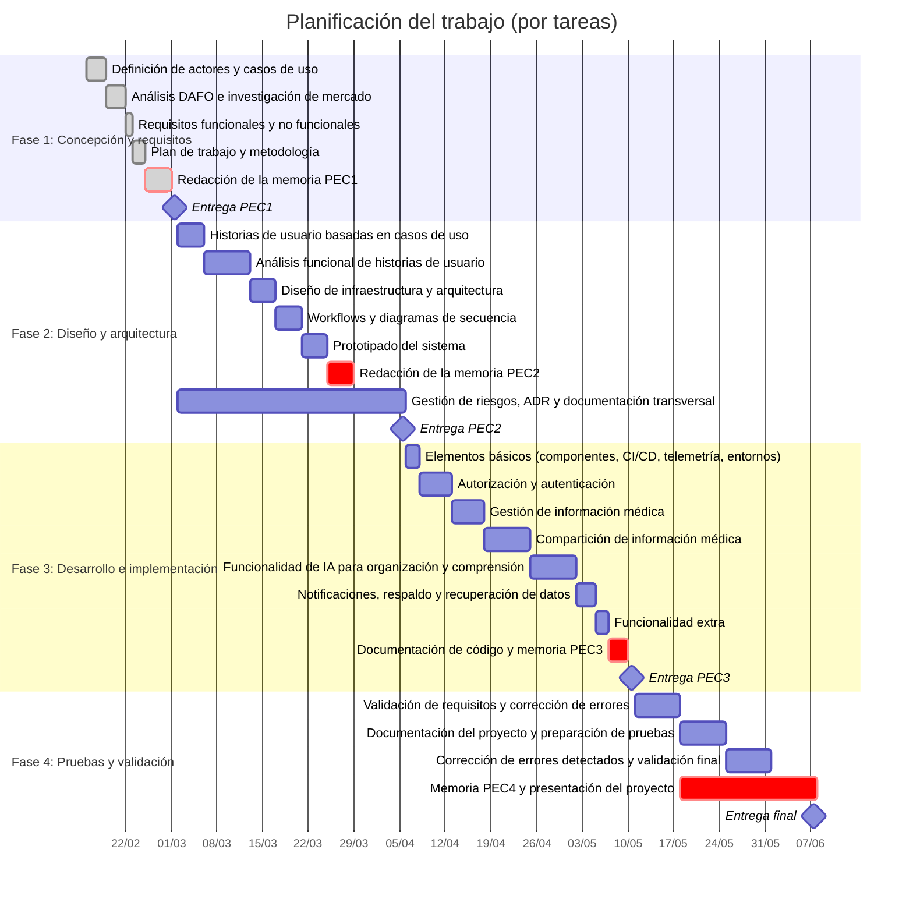

# Resultados

En esta seccion se presentan los resultados obtenidos, es decir, principalmente analizaremos el estado actual del proyecto en cuanto a su desarrollo.

## Planificación original

## Estado actual del proyecto

Actualmente, el proyecto se encuentra en la fase de desarrollo e implementación, específicamente en la etapa de "Elementos básicos (componentes, CI/CD, telemetría, entornos)". Se han completado las tareas relacionadas con la planificación y diseño, y se ha avanzado significativamente en la implementación de los elementos básicos del sistema.

| Fase                                | Tarea                                                        | Estado                  | Notas                                                                                               |
| ----------------------------------- | ------------------------------------------------------------ | ----------------------- | --------------------------------------------------------------------------------------------------- |
| Fase 1: Concepción y requisitos     | Definición de actores y casos de uso                         | Completada              |                                                                                                     |
| Fase 1: Concepción y requisitos     | Análisis DAFO e investigación de mercado                     | Completada              |                                                                                                     |
| Fase 1: Concepción y requisitos     | Requisitos funcionales y no funcionales                      | Completada              |                                                                                                     |
| Fase 1: Concepción y requisitos     | Plan de trabajo y metodología                                | Completada              |                                                                                                     |
| Fase 1: Concepción y requisitos     | Redacción de la memoria PEC1                                 | Completada              |                                                                                                     |
| Fase 1: Concepción y requisitos     | Entrega PEC1                                                 | Completada              |                                                                                                     |
| Fase 2: Diseño y arquitectura       | Historias de usuario basadas en casos de uso                 | Completada              |                                                                                                     |
| Fase 2: Diseño y arquitectura       | Análisis funcional de historias de usuario                   | Completada              |                                                                                                     |
| Fase 2: Diseño y arquitectura       | Diseño de infraestructura y arquitectura                     | Completada              |                                                                                                     |
| Fase 2: Diseño y arquitectura       | Workflows y diagramas de secuencia                           | Completada              |                                                                                                     |
| Fase 2: Diseño y arquitectura       | Prototipado del sistema                                      | Completada              |                                                                                                     |
| Fase 2: Diseño y arquitectura       | Redacción de la memoria PEC2                                 | Completada              |                                                                                                     |
| Fase 2: Diseño y arquitectura       | Gestión de riesgos, ADR y documentación transversal          | Completada              |                                                                                                     |
| Fase 2: Diseño y arquitectura       | Entrega PEC2                                                 | Completada              |                                                                                                     |
| Fase 3: Desarrollo e implementación | Elementos básicos (componentes, CI/CD, telemetría, entornos) | En progreso             | La telemetria y CD no estan implementados                                                           |
| Fase 3: Desarrollo e implementación | Autorización y autenticación                                 | Completada              |                                                                                                     |
| Fase 3: Desarrollo e implementación | Gestión de información médica                                | Completada              |                                                                                                     |
| Fase 3: Desarrollo e implementación | Compartición de información médica                           | Completada              |                                                                                                     |
| Fase 3: Desarrollo e implementación | Funcionalidad de IA para organización y comprensión          | Parcialmente completada | Gestión con Ollama completado, falta interación completa con AzureOpenAI debido a falta de recursos |
| Fase 3: Desarrollo e implementación | Notificaciones, respaldo y recuperación de datos             | Completado              |                                                                                                     |
| Fase 3: Desarrollo e implementación | Funcionalidad extra                                          | Completado              |                                                                                                     |
| Fase 3: Desarrollo e implementación | Documentación de código y memoria PEC3                       | Completado              |                                                                                                     |
| Fase 3: Desarrollo e implementación | Entrega PEC3                                                 | Completado              |                                                                                                     |
| Fase 4: Pruebas y validación        | Validación de requisitos y corrección de errores             | En Progreso             |                                                                                                     |
| Fase 4: Pruebas y validación        | Documentación del proyecto y preparación de pruebas          | En Progreso             |                                                                                                     |
| Fase 4: Pruebas y validación        | Corrección de errores detectados y validación final          | En Progreso             |                                                                                                     |
| Fase 4: Pruebas y validación        | Memoria PEC4 y presentación del proyecto                     | En Progreso             |                                                                                                     |
| Fase 4: Pruebas y validación        | Entrega final                                                | Pendiente               |                                                                                                     |

# Depligue en Test y Producción

Actualmente, el proyecto se en encuntroba deplegado en Azure App Service, pero debido a la limitiación de recursos este depligue se encuenta On Hold hasta tomar una decisión sobre el futuro del proyecto, ya que el depligue en Azure App Service es costoso y no se cuenta con los recursos necesarios para mantenerlo activo.

Se procedera a analizar alternativas de despliegue más económicas, como el uso de servicios de hosting gratuitos o de bajo costo, o incluso la posibilidad de desplegar el proyecto en un entorno local para pruebas y demostraciones. Se evaluarán las opciones disponibles y se tomará una decisión informada sobre el futuro del despliegue del proyecto, teniendo en cuenta factores como el costo, la facilidad de uso y la escalabilidad

# 4.3. Decisiones y medidas correctivas aplicadas

Como ya se explica en el punto 3.6 (Cambios funcionales y de diseño), para poder entregar el proyecto a tiempo siendo funcionalmente completo se tomaron diferentes acciones para reducir el alcance del proyecto, como eliminar funcionalidades no esenciales y centrarse en las funcionalidades principales. Además, se priorizaron las tareas. Se eliminaron funcionalidades como la integración con Azure OpenAI, y se centró el desarrollo en la integración con Ollama, que es una solución de IA local que no requiere recursos adicionales para su uso. Esto permitió avanzar en el desarrollo de la funcionalidad de IA sin depender de servicios externos costosos.

Ademas, con el fin de poder alcanzar un estado funcional del proyecto a tiempo, se cambiaron prioridades, dando mayor importancia a las tareas relacionadas con la compartición de información médica y la gestión de información médica, que son funcionalidades clave para el proyecto. Esto permitió asegurar que el proyecto cumpliera con los requisitos funcionales esenciales y estuviera listo para su entrega a tiempo, aunque con un alcance reducido en comparación con la planificación original.

# 5. Conclusiones y trabajos futuros

El proyecto ha avanzado significativamente en su desarrollo dando alcance a funcionalidades clave como la gestión y compartición de información médica, así como la integración con una solución de IA local para mejorar la organización y comprensión de la información médica. Sin embargo, debido a limitaciones de recursos, se han tenido que tomar decisiones para reducir el alcance del proyecto y centrarse en las funcionalidades principales, lo que ha permitido entregar un proyecto funcional a tiempo.

Siendo asi, desde un punto de vista de negocio, el proyecto no ha logrado alcanzar su máximo potencial inicialmente previsto y se deberá evaluar cuales son las funcionalidades adicionales que se deberian implementar en las siguientes fases de desarrollo para poder ofrecer un producto más completo y competitivo en el mercado. Desde un punto de vista técnico, el proyecto ha logrado implementar funcionalidades clave y ha demostrado ser una solución viable para la gestión y compartición de información médica, aunque se deberán evaluar las opciones de despliegue más económicas para asegurar la sostenibilidad del proyecto a largo plazo. En general, el proyecto ha sido un éxito en términos de desarrollo y entrega, aunque se deberán tomar medidas para asegurar su sostenibilidad y crecimiento en el futuro.

En el Anexo, se pueden encontrar casos de usos adicionales que se podrían implementar en futuras fases de desarrollo para mejorar la funcionalidad y competitividad del proyecto, así como un análisis de las opciones de despliegue más económicas para asegurar la sostenibilidad del proyecto a largo plazo, pero prioritariamente se deberian evaluar las siguientes funcionalidades adicionales para implementar en futuras fases de desarrollo:

- Terminar la integración con Azure OpenAI para ofrecer una solución de IA más completa y robusta.
- Implementar funcionalidades de copia de seguridad y recuperación de datos para mejorar la seguridad y confiabilidad del sistema.
- Mejorar el acceso a la información compartida.
- Habilitar el uso de compartición Standares del sector salud, como HL7 FHIR, para mejorar la interoperabilidad con otros sistemas de salud y facilitar la integración con servicios externos.
- Incluir algun tipo de asistente virtual o chatbot para mejorar la experiencia del usuario y ofrecer soporte adicional en la gestión de la información médica.

Por otro lado, se debe seguir trabajando en areas no funcionales criticas del proyecto:

- Realizar las auditorias legales necesarias para asegurar el cumplimiento de normativas de privacidad y seguridad de datos, como GDPR o HIPAA, dependiendo del mercado objetivo del proyecto.
- Buscar el mejor proveedr de hosting para el despliegue del proyecto, evaluando opciones de hosting gratuitos o de bajo costo, o incluso la posibilidad de desplegar el proyecto en un entorno local para pruebas y demostraciones, con el fin de asegurar la sostenibilidad del proyecto a largo plazo.
- Iniciar el depligue del proyecto en Android Store
- Abrir el testing del proyecto a un grupo de usuarios externos para obtener feedback y validar la funcionalidad y usabilidad del sistema en un entorno real, lo que permitirá identificar áreas de mejora y asegurar que el proyecto cumpla con las necesidades y expectativas de los usuarios finales.
- Mejorar el performance de algunas funcionalidades del proyecto, como la gestión de documentos pesados.
- Continuar trabajando en la implementación de telemetría para poder monitorizar el uso del sistema y detectar posibles problemas o áreas de mejora, lo que permitirá mejorar la calidad y confiabilidad del proyecto a largo plazo.
- Continuar trabajando en la implementación de CI/CD para mejorar el proceso de desarrollo y despliegue del proyecto, lo que permitirá acelerar el ciclo de desarrollo y asegurar una entrega continua de nuevas funcionalidades y mejoras.
- Continuar trabajando en la implementación de pruebas automatizadas para mejorar la calidad y confiabilidad del proyecto, lo que permitirá detectar errores y problemas de manera temprana en el proceso de desarrollo y asegurar que el proyecto cumpla con los requisitos funcionales y no funcionales establecidos.
