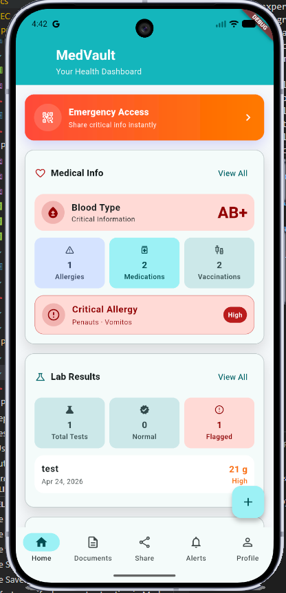
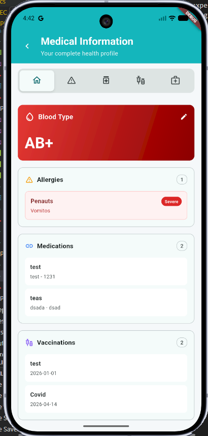
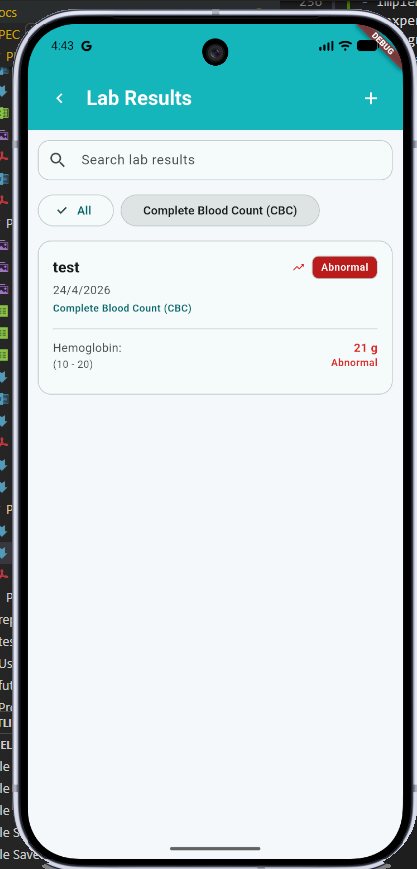
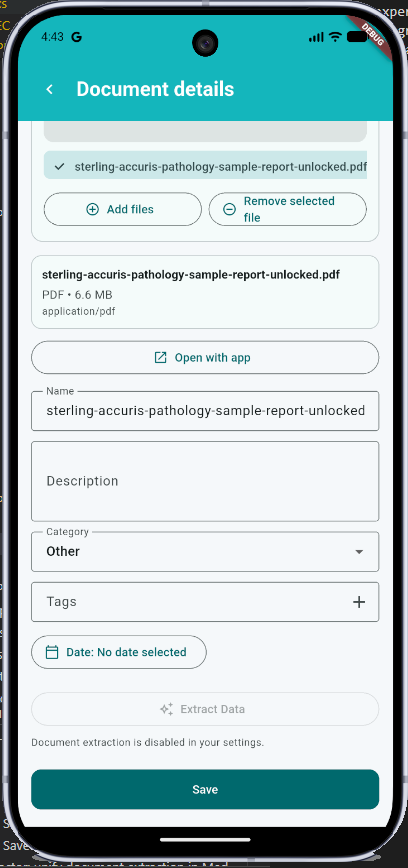
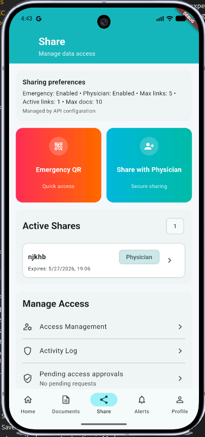
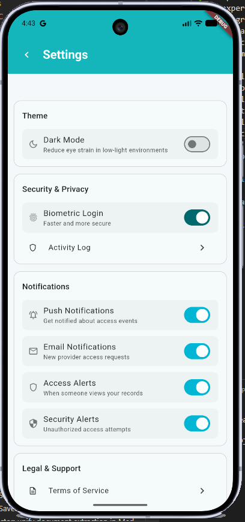

# Manual de Usuario

Este documento proporciona una guía simple para que los usuarios entiendan como usar la aplicación MedVault.

## Requisitos Previos

- Dispositivo móvil con sistema operativo Android
- Conexión a Internet
- Cuenta de Google para autenticación

## Principales funcionalidades disponibles

- Gestionar y almacenar información médica personal
- Compartir información médica con profesionales de la salud
- Gestionar documentos médicos.
- Gestionar información personal y de contacto
- Configurar preferencias de privacidad y seguridad

## Configuración Inicial

Una vez el usuario haya descargado e instalado la aplicación, usando su cuenta de google podira iniciar sesión y registrarse en el sistema, ademas, Medvault ofrece un sistema de "On Boarding" para guiar a los usuarios en la configuración inicial de la aplicación.

## Uso de la Aplicación

### Gestión de Información Médica Personal

Los usuarios pueden, a traves del dashboard principal acceder a su información médica personal y realizar las siguientes acciones:

- Agregar nueva información médica
- Editar información médica existente
- Eliminar información médica

Los usuarios pueden gestionar diferentes tipos de información médica, incluyendo:

- Grupo sanguíneo
- Alergias
- Medicamentos
- Vacunas
- Diagnósticos médicos

Ademas, los usuarios pueden gestionar resultados de laboratorio, añadiendo, editando o eliminando resultados de laboratorio, incluyendo:

- Tipo de prueba
- Fecha de la prueba
- Resultados de la prueba
- Notas adicionales

Los resultados pueden ser añadidos manualmente por el usuario o importados a través de la función de escaneo de documentos.

### Gestión de Documentos Médicos

Los usuarios pueden añadir documentos médicos a su perfil desde la camara, la galeria o desde el sistema de ficheros del dispositivo. Los documentos pueden ser organizados en categorías y etiquetados para facilitar su búsqueda y acceso.

Además, los usuarios pueden usar la función de extraer información de documentos para escanear documentos médicos y extraer información relevante, como resultados de laboratorio, diagnósticos o medicamentos.

Estos datos siempre serán revisados por el usuario antes de ser añadidos a su perfil para garantizar la precisión de la información.

La aplicación ni diagnostica ni trata ninguna información médica, simplemente almacena y organiza la información proporcionada por el usuario.

### Compartir Información Médica

El sistema de compartición de información médica permite a los usuarios compartir su información médica con profesionales de la salud de manera segura y controlada. Los usuarios pueden seleccionar qué información compartir y con quién compartirla, estableciendo permisos específicos para cada profesional de la salud.

Principalmente, existen dos sistemas:

- Compartición de emergencia: Permite a los usuarios compartir su información médica con profesionales de la salud en situaciones de emergencia, proporcionando acceso rápido a información crítica como alergias, medicamentos y grupo sanguíneo.
- Compartición regular: Permite a los usuarios compartir su información médica con profesionales de la salud para consultas regulares, proporcionando acceso a información detallada como diagnósticos, resultados de laboratorio y documentos médicos.

En el primero caso, no se ha implementado barreras de seguridad ya que se supone que el acceso a la información ha de ser rapido y sin complicaciones y ha de ser responsabilidad del usuario compartir esta información con profesionales de la salud de confianza. En el segundo caso, se han implementado barreras de seguridad para garantizar que solo los profesionales de la salud autorizados puedan acceder a la información compartida.

Basicamente existen dos formas de asegurar el acceso a la información compartida:

- A traves de un password de accesso.
- A traves de un sistma de autorización similar a las transacciones de los bancos, donde el susuario ha de autorizar cada acceso a su información médica compartida desde la aplicación.

En ambos casos, cada vez que alguien accede a la información médica compartida, el usuario recibe una notificación en su dispositivo móvil para informarle sobre el acceso y permitirle revisar la información compartida.

### Gestión de Información Personal y de Contacto

Los usuarios pueden gestionar su información personal y de contacto, incluyendo:

- Nombre completo
- Fecha de nacimiento
- Género
- Número de teléfono
- Dirección de correo electrónico
- Dirección física
- Contactos de emergencia

### Configuración de Privacidad y Seguridad

Por ultimo, los usuarios pueden configurar sus preferencias de privacidad y seguridad para controlar la aplicación y las notificaciones.

Es importante destacar que toda la información médica se almacena de manera segura en el dispositivo del usuario y solo cuando el usuario decide compartirla, esta información se comparte con profesionales de la salud autorizados. La aplicación no comparte ni vende información médica a terceros.

Ademas, una vez la información compartida expira o es revocada por el usuario, el sistema garantiza que dicha información es eliminada de los sistemas de MedVault.
