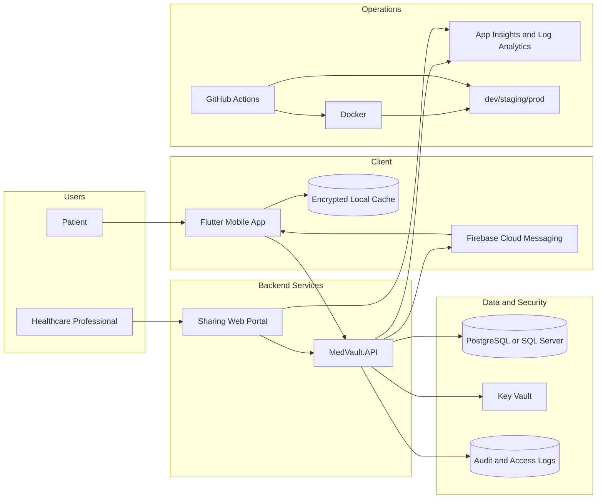

# MedVault System Architecture

## Document Control

- Version: 1.0
- Date: 2026-04-06
- Derived from: `docs/PEC/PEC2/TF_memoria_pec2.md` (Section 2.6)
- Audience: architects, backend/mobile engineers, DevOps, security reviewers

## 1. Scope

This document defines the target architecture for MedVault MVP and its near-term evolution path. It covers:

- Logical components and responsibilities.
- Data ownership and boundaries.
- Security and compliance controls.
- Deployment and operations baseline.
- Non-functional architecture requirements.

## 2. Architecture Drivers

### Functional drivers

- Portable medical profile managed by the patient.
- Secure sharing with healthcare professionals.
- Emergency access path with strict controls.
- AI-assisted extraction of medical document data.
- End-to-end auditability of access and changes.

### Non-functional drivers

- Security and privacy for sensitive health data.
- Sub-minute readability in emergency contexts.
- Offline usability for critical data.
- Maintainable service boundaries and code organization.
- Scalable document-processing workloads.

## 3. High-Level Architecture

## 4. Component Responsibilities

### 4.1 Flutter mobile application

Responsibilities:

- Primary patient interaction channel.
- Local profile and medical data management.
- Sharing setup and emergency code generation.
- Notification handling.

Internal architectural style:

- Layered separation (`presentation`, `domain`, `data`).
- Feature modules (auth, profile, medical info, documents, sharing, alerts).
- Offline-first handling for critical data.

Mobile security baseline:

- Secure token storage via platform key stores.
- Encrypted local database cache.
- Session lock/re-authentication for sensitive actions.
- No clinical payload in local logs.

### 4.2 MedVault.API

Responsibilities:

- Identity/session management and token lifecycle.
- Profile and structured medical data CRUD.
- Sharing policy enforcement and secure link handling.
- Access and change audit events.

Recommended backend style:

- Layered architecture (`API`, `Application`, `Domain`, `Infrastructure`).
- Command/query separation where useful.
- Robust request validation and explicit API versioning.

### 4.3 Document extraction module (inside MedVault.API)

Responsibilities:

- Medical document intake.
- OCR and AI-assisted structured extraction.
- Confidence-scored extraction response.

Critical rule:

- Extracted clinical information is never auto-committed to patient records without explicit user confirmation.

### 4.4 Sharing web portal

Responsibilities:

- Scoped and expiring access for healthcare professionals.
- Read-optimized view for fast clinical interpretation.
- Access event traceability and security feedback.

MVP rationale:

- Server-rendered web approach reduces first-load time and simplifies security control paths.

## 5. Data Architecture

## 5.1 Core domains

- Identity and profile data.
- Structured medical profile data.
- Sharing configurations and access logs.
- Document metadata and extraction outputs.
- Audit events for security and compliance.

### 5.2 Storage principles

- Relational model for consistency and traceability.
- Explicit separation of identifying data and sensitive clinical fields.
- Encryption in transit and at rest.
- Backup, retention, and restore tested operationally.

### 5.3 On-device data model

- Encrypted cache for critical emergency data.
- Pending-change queue for offline operations.
- Deterministic conflict strategy (latest user-confirmed value wins).
- Synchronization status visibility in UI.

## 6. Security Architecture

## 6.1 Identity and access

- Federated sign-in for user identity bootstrap.
- JWT-based API access with refresh lifecycle.
- Policy-based authorization and least-privilege access.
- Time-bounded sharing links with optional additional validation.

### 6.2 Data protection

- TLS on all transport links.
- Encrypted persistence for sensitive data.
- Secret material managed outside source code.
- Strong controls on downloadable shared artifacts.

### 6.3 Audit and trust

- Track who accessed what, when, and through which sharing mechanism.
- Notify patient on relevant sharing access events.
- Expose last-update metadata to improve clinical trust in data freshness.

## 7. Operational Architecture

### 7.1 Containerization

- Separate containers for `MedVault.API` and sharing web.
- Multi-stage builds for smaller images and reduced attack surface.
- Local orchestration using `devops/docker/docker-compose.yml`.

### 7.2 CI/CD

- Build/test pipelines for each push and pull request.
- Container image build and publication on protected branches/releases.
- Automated deployment by environment.
- Immutable tags for release traceability and rollback safety.

### 7.3 Hosting baseline

Azure-first deployment shape:

- App services or container platform for backend/web services.
- Managed relational database service.
- Private object storage for documents.
- Managed secrets and centralized monitoring.

Equivalent cloud deployment patterns are valid if they preserve the same boundaries and controls.

## 8. Quality Attributes And Verification

### 8.1 Availability and resilience

- Health checks for all services.
- Observability-driven incident response.
- Environment isolation and safe promotion.

### 8.2 Performance

- Prioritize emergency-view rendering speed.
- Keep shared-view payload minimal and clinically focused.
- Scale MedVault.API to absorb both transactional and extraction traffic.

### 8.3 Maintainability

- Clear module boundaries and ownership.
- ADR-backed decision history.
- Contract-driven API evolution.

### 8.4 Test strategy (architecture level)

- Mobile: unit, widget, and flow-level integration tests.
- Backend: unit and integration tests with security-focused cases.
- End-to-end: representative auth, sharing, and emergency access paths.

## 9. Risks And Mitigations

- Risk: trust in user-supplied data quality.
  - Mitigation: show update timestamps, confidence indicators, and source provenance where possible.

- Risk: emergency flow complexity under time pressure.
  - Mitigation: optimize for minimal steps, high-contrast critical summaries, strict access expiry.

- Risk: AI extraction errors.
  - Mitigation: mandatory review-and-confirm UX before commit.

- Risk: security drift across environments.
  - Mitigation: infrastructure as code, policy checks, and environment parity controls.

## 10. ADR Cross-Reference

- `docs/adr/ADR-0001-flutter-mobile-platform.md`
- `docs/adr/ADR-0002-dotnet-core-backend.md`
- `docs/adr/ADR-0003-separate-document-ai-api.md`
- `docs/adr/ADR-0004-aspnet-core-server-rendered-sharing-web.md`
- `docs/adr/ADR-0005-encrypted-local-mobile-database.md`
- `docs/adr/ADR-0006-docker-containerization.md`
- `docs/adr/ADR-0007-azure-primary-hosting-platform.md`
- `docs/adr/ADR-0008-github-actions-cicd.md`
